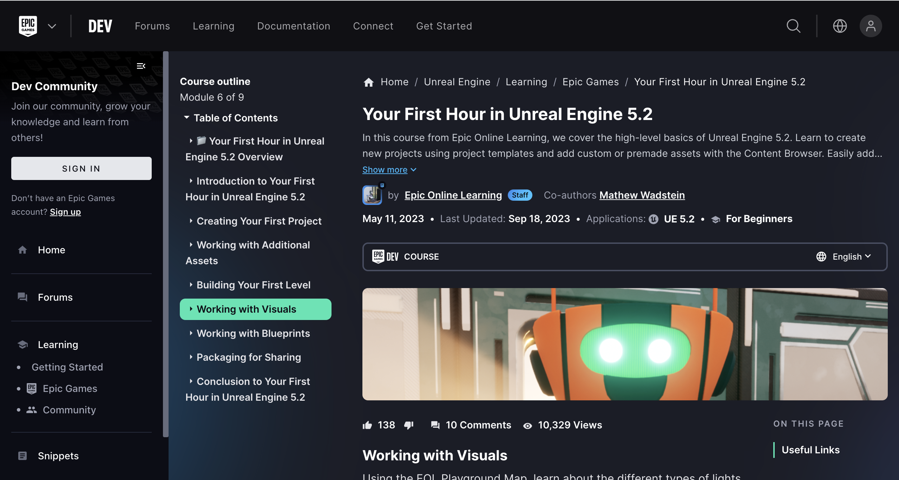
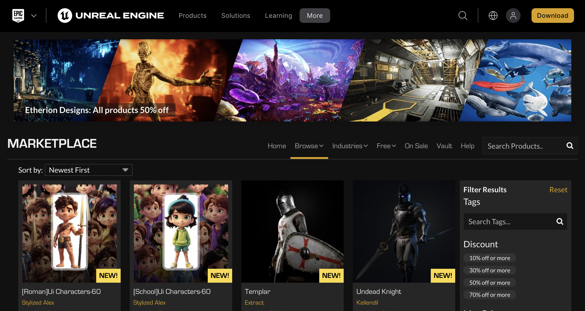

# # 🎮 Lab 1: Unreal Engine

# 

<iframe allowfullscreen="" frameBorder="0" height="100%" src="https://giphy.com/embed/hmlpo8x0EvCPPDmke7/video" style="left:0;position:absolute;top:0" width="100%"></iframe>

# **The goals of this week's lab is to:**

# * Compare and contrast game engines for your development needs

# * Set up Perforce 

# * Get started with Unreal Engine

# * Explore the Unreal Engine Asset Store

# It is a lot more fun to do your assignments with your classmates! Please work on this assignment with a lab partner. 
# ## So which game engine?

# In this course, we explore Godot, Unreal Engine, and Unity. Each game engine has its own superpower. The best game engine is the one that meets your needs and you feel comfortable learning in. You might default to one but also use various game engines for specific purposes. We will be having a discussion during class about game engines. Please read the following before class:

# * [Why game engines aren’t enough to meet the needs of modern developers](https://techcrunch.com/sponsor/unity/why-game-engines-arent-enough-to-meet-the-needs-of-modern-developers/)

# * [Unity vs Unreal vs GoDot? (Why did I pick ..?)](https://www.youtube.com/watch?v=zI0NAiYfaH0&list=LL&index=22&ab_channel=JasonWeimann)

# * [Embedded Generative AI Will Power Game Characters](https://spectrum.ieee.org/generative-game-ai#toggle-gdpr)

# ## Perforce Setup

# We will be walking through Perforce together in class together. But, feel free to get started first [here](https://docs.google.com/document/d/1XGa5oCsxEOub3HmCulPOLt7udbcNJm_WvMSjznOUZvc/edit).

# ## Unreal Engine

# We are now ready to start learning Unreal Engine! Please try to do as much of this tutorial before class. If you don't finish, that is okay - it is more important to learn and understand the concepts. You will have time to continue the tutorial during lab.

# !!! note "Tutorial: Your First Hour in Unreal Engine 5.0"

#     Complete the Unreal Engine ["Your First Hour in Unreal Engine 5.0" tutorial](https://dev.epicgames.com/community/learning/courses/3ke/your-first-hour-in-unreal-engine-5-2/Wp7K/unreal-engine-working-with-visuals).

#     

# ## Unreal Engine Marketplace

# A great way to start creating your own game is with starter templates. There are many free and for-sale templates that you can find. Check out the Unreal Engine Marketplace.

# !!! note "Unreal Templates and Assets"

#     Visit the [Unreal Engine Marketplace](https://www.unrealengine.com/marketplace/en-US/content-cat/assets/blueprints?count=20&sortBy=effectiveDate&sortDir=DESC&start=0) and the [Templates Reference](https://docs.unrealengine.com/5.2/en-US/unreal-engine-templates-reference/).

#     