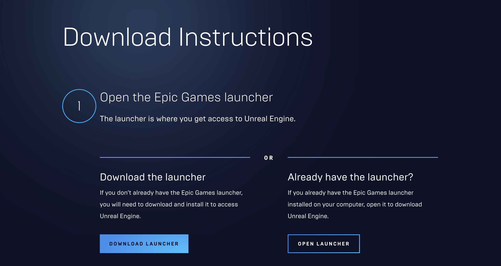

# 🧰 HW 0: Getting Started

In our next two class sessions, we will be learning Godot and Unreal Engine with the Perforce as our primary source control tool. 

## Perforce
Perforce is known for its roots with version control. However, Perforce as a whole does much more than create version control tools. Perforce is ideal for large files and binaries that have a lot of assets. Perforce also allows users to lock certain files which is helpful in collaborating on projects. Within the game industry, Perforce is the industry standard tool for version control and code-sharing at the enterprise level. To use it, you'll have to download the Helix Visual Client (P4V) from the Perforce website.

**Why is Perforce the industry standard?**
You may have used other version control software in the past, like Git or SVN. These are great options because they're free to use.
In an enterprise environment, there's something much more valuable than the cost of subscription software: access to support.

There are a couple other reasons to prefer Perforce over Git.

* Perforce handles binary files differently than Git in ways that are especially important in game development.
* Perforce stores version history on a central server, which means each developer only needs the latest version on their computer.

If you need help accessing or using Perforce for class, you can email [creativetech@cinema.usc.edu](creativetech@cinema.usc.edu).

!!! note "Download Perforce"

    Download [Perforce Helix Visual Client (P4V)](https://www.perforce.com/downloads/helix-visual-client-p4v).

     

!!! note "Sign in"

    Sign in with your USC credentials.

     

## GitHub
GitHub is a platform and cloud-based service for software development and version control using Git. In order to use GitHub for large files, we must also download Git Large File Storage (LFS)

!!! note "Create a GitHub account"

    [Apply for GitHub Education](https://education.github.com/) and create an [account](https://github.com/).

     

!!! note "Install Git"

    [Install Git](https://git-scm.com/).

     

!!! note "Install Git LFS"

    [Download Git LFS](https://git-lfs.com/).

     

## Unity Engine
Unity is a cross-platform game engine for mobile, desktop, web, console, and headset games. In this course, we will be working primarily in Unity. If you do not have a Unity account, make sure to sign up with you usc.edu email to get access to Unity's Student Plan.

!!! note "Install Unity Hub (Student)"

    Install the latest version of [Unity Hub](https://unity.com/products/unity-student).
    Below is a screenshot of the latest Unity Hub. Check your version by going to `UnityHub/ About Unity Hub`.

     

!!! note "Install Unity"

    Install Unity Editor Version 2021.3.29f1 or above.
    Make sure to also unclude the `WebGL Build Support` module.

     

!!! note "Download the LEGO Microgame"

    Download the LEGO Microgame template. We will be experimenting with the [Lego Microgame](https://learn.unity.com/project/lego-template) in future labs. 

     

## Godot Engine
Godot is a cross-platform game engine for 2D and 3D games. The cool part of Godot is that it is free and open source! If you're interested, you can contribute to the Godot Engine community on GitHub!

!!! abstract "Reading: Godot Docs"

    In the next class, we will be walking through your first Godot 2D and 3D game. Please read the `Getting Started/Introduction` section before class.

    

!!! note "Install Godot"

    Install Godot Engine .NET [Version 4.1.1](https://godotengine.org/download/macos/).

    

## Unreal Engine
Unreal Engine is a game engine specifically designed for advanced real-time 3D creations and graphics. Unreal Engine is ideal for photoreal visuals and immersive experiences. 

!!! note "Download Epic Games launcher"

    Follow the download [instructions](https://www.unrealengine.com/en-US/download).

    

!!! note "Install Unreal Engine"

    Download [Unreal Engine 5.2](https://www.unrealengine.com/en-US/tech-blog/unreal-engine-5-2-brings-native-support-for-apple-silicon-and-other-developments-for-macos). This version brings native support to Apple Silion and other developments for macOS.
    
    
