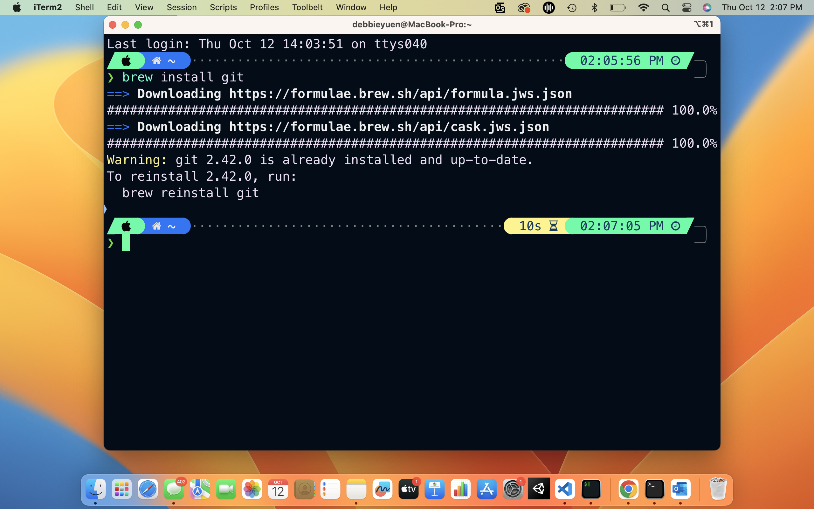

# 🧰 HW 0: Getting Started

!!! tip "Assignment Deadline"
    Please have the setup done by the beginning of the second week of classes. The optional [Gradescope](https://www.gradescope.com/) assignment is due **Friday, January 12th, 2024**.

    [Submit :fontawesome-solid-paper-plane:](https://www.gradescope.com/courses/696965/assignments/3876752/){ .md-button .md-button--primary }

<iframe src="https://giphy.com/embed/tZU2GT1fL08xi" width="100%" height="100%" style="position:absolute" frameBorder="0" class="giphy-embed" allowFullScreen></iframe>

<a href="https://giphy.com/gifs/vevo-vevo-tZU2GT1fL08xi">via GIPHY</a>

This assignment explains how to setup your computer to complete assignments. If you need help at any time, please feel free to attend office hours or post on `Discord`. The setup is necessary in completing class labs, homework, and projects. While this lab is required, it is not a graded assignment. If you joined the course late, you can request an extension. 

Here's a breakdown of the major parts of the assignment:

- [x] **Setup:** Setting up the essential software for the course. This will require several components, listed below.
- [x] **Source Control:** Install `Perforce` and create a `GitHub Education` account. We will be using Perforce for all projects and GitHub for homework assignments.
- [x] **Install a Terminal:** Install a terminal so you can use `Git` and `Jupyter Notebook`. If you have a terminal on your computer and feel comfortable using it, you can skip this part.
- [x] **Install C# .NET Core:** Install the .NET SDK to your computer. If you already have .NET 6.0 or higher you can skip this part.
- [x] **Install a Text Editor:** Install software to edit .cs files for this course (e.g. VSCode, Visual Studio, Rider JETBrains, Atom, etc.). You can skip this part if you already have a text editor you like.
- [x] **Walkthrough: Using the Terminal:** This walks you through how to use the terminal. If you already feel comfortable with both of these you do not need to read this section.
- [x] **Game Engines:** You must complete an installation for Unity in order to make the most out of this course. Godot and Unreal will be optional.
- [x] **Gradescope:** In future homework assignments, you must complete this section to get points for the assignment. This will walk you through how to turn in your work after completing the previous section and how to verify that your work is turned in on Gradescope.

## IDE and Text Editors
We will spending most of our time in class writing C# scripts in a text editor. Visual Studio Code (VSCode), Visual Studio, and Rider are the most popular choices amongst Unity game developers. There are a couple of catches.

* VSCode does not have Intellisense for Unity working on most computers. If you figure out how to get Unity C# Intellisense working -- please let me know! 
* Visual Studio for Mac is different from the Visual Studio for Windows. They have the same name but they are different. The version for Mac has limited features and extensions you can use.
* Rider is a .NET IDE by JetBrains. You must pay to use it.

We highly recommend using **Visual Studio** and **Terminal** for this class. This will help us support you best since it has Intellisense and Copilot available for the Unity Engine. Please do not use word processors such as Microsoft Word to edit programs. Word processors can add extra content to documents that will confuse the interpreter.

For your reference, here are some other text editors:

* Atom: A more lightweight desktop editor.
* Vim: A command-line editor.
* Emacs: A command-line editor.
* PyCharm: A desktop editor designed for Python.
* Sublime Text: A text editor that works with code.

## Terminal
The terminal is a program that allows you to interact with your computer by entering commands. You already have a program called `Terminal` or `Command Line` or something similar on your computer. Open that up and you should be good to go. When I am working on my MacBook, I default to `iTerm`. On my Windows, I default to `Command Line`.

## Source Control

What is source control? Source control and version control can used interchangeably. However, source control is specific to source code. Version control also covers large binary files and digital assets. Source control is important for maintaining a single source of truth for development teams. Using it helps facilitate collaboration and accelerates release velocity. Source control is a vital component of the development process with source code management systems allowing you to track your code change, see a revision history for your code, and revert to previous versions of a project when needed. With source code management systems, you can collaborate on code with your team, isolate your work until it is ready, and quickly trouble-shoot issues by identifying who made changes and what the changes were. Source code management systems help streamline the development process and provide a centralized source for all your code.

Some benefits of source control are:

* It allows multiple developers to work on the same codebase.
* Developers can commit and merge code without conflicts.
* Developers can edit shared code without unknowingly overwriting each other’s work.

 

### Perforce
Perforce is known for its roots with version control. However, Perforce as a whole does much more than create version control tools. Perforce is ideal for large files and binaries that have a lot of assets. Perforce also allows users to lock certain files which is helpful in collaborating on projects. Within the game industry, Perforce is the industry standard tool for version control and code-sharing at the enterprise level. To use it, you'll have to download the Helix Visual Client (P4V) from the Perforce website.

**Why is Perforce the industry standard?**
You may have used other version control software in the past, like Git or SVN. These are great options because they're free to use.
In an enterprise environment, there's something much more valuable than the cost of subscription software: access to support.

There are a couple other reasons to prefer Perforce over Git.

* Perforce handles binary files differently than Git in ways that are especially important in game development.
* Perforce stores version history on a central server, which means each developer only needs the latest version on their computer.

If you need help accessing or using Perforce for class, you can email [creativetech@cinema.usc.edu](creativetech@cinema.usc.edu) or join USC's `Perforce Support Discord` channel.

!!! note "Download Perforce"

    Download [Perforce Helix Visual Client (P4V)](https://www.perforce.com/downloads/helix-visual-client-p4v).

     

!!! note "Sign in"

    Sign in with your USC NetID credentials and follow the [Setting Up Perforce for Unity](https://docs.google.com/document/d/11HlB3eySUYSPJsy0d9rvQhqTV6lCz00ypQGFg92ZCn8/edit#heading=h.tcv6ud1pa7p) Guide by [Aaron Cheney](https://cinema.usc.edu/directories/profile.cfm?id=65408&first=&last=&title=&did=18&referer=%2Finteractive%2Ffaculty%2Ecfm&startpage=1&startrow=1).

     

### GitHub
GitHub is a platform and cloud-based service for software development and version control using Git. In order to use GitHub for large files, we must also download Git Large File Storage (LFS). In class, we will be learning how to use `Git` with the terminal and with [GitHub Desktop](https://desktop.github.com/).

!!! note "Create a GitHub account"

    [Apply for GitHub Education](https://education.github.com/) and create an [account](https://github.com/).

     

!!! note "Install Git"

    [Install Git](https://git-scm.com/).

     

!!! note "Install Git LFS"

    [Download Git LFS](https://git-lfs.com/).

     

## Game Engines

### Unity Engine
Unity is a cross-platform game engine for mobile, desktop, web, console, and headset games. In this course, we will be working primarily in Unity. If you do not have a Unity account, make sure to sign up with you usc.edu email to get access to Unity's Student Plan.

!!! note "Install Unity Hub (Student)"

    Install the latest version of [Unity Hub](https://unity.com/products/unity-student).
    Below is a screenshot of the latest Unity Hub. Check your version by going to `UnityHub/ About Unity Hub`.

     

!!! note "Install Unity"

    Install Unity Editor Version 2021.3.29f1 or above.
    Make sure to also unclude the `WebGL Build Support` module.

     

### Godot Engine
Godot is a cross-platform game engine for 2D and 3D games. The cool part of Godot is that it is free and open source! If you're interested, you can contribute to the Godot Engine community on GitHub!

!!! abstract "Reading: Godot Docs"

    If you are intersted in learning Godot, reading the `Getting Started/Introduction` would be a great place to start!

    

!!! note "Install Godot (Optional)"

    Install Godot Engine .NET [Version 4.1.1](https://godotengine.org/download/macos/).

    

### Unreal Engine
Unreal Engine is a game engine specifically designed for advanced real-time 3D creations and graphics. Unreal Engine is ideal for photoreal visuals and immersive experiences. 

!!! note "Download Epic Games launcher (Optional)"

    Follow the download [instructions](https://www.unrealengine.com/en-US/download).

    

!!! note "Install Unreal Engine (Optional)"

    Download [Unreal Engine 5.2](https://www.unrealengine.com/en-US/tech-blog/unreal-engine-5-2-brings-native-support-for-apple-silicon-and-other-developments-for-macos). This version brings native support to Apple Silion and other developments for macOS.
    
    

## Gradescope

We will be using [Gradescope](https://www.gradescope.com/) in addition to [Blackboard](https://blackboard.usc.edu/) to keep track of our assignments. Each homework will require you to submit the assignment via [Gradescope](https://www.gradescope.com/).
!!! note "Gradescope Account"

    Please create a Gradescope account with your USC email address. Then, request the invitation code from one of the instructors.
    
    

## Resources and Links

* [Terminal]()
* [Source Control]()
* []

## Submission

!!! note "Download the LEGO Microgame"

    Download the LEGO Microgame template. We will be experimenting with the [Lego Microgame](https://learn.unity.com/project/lego-template) in future labs. 

     