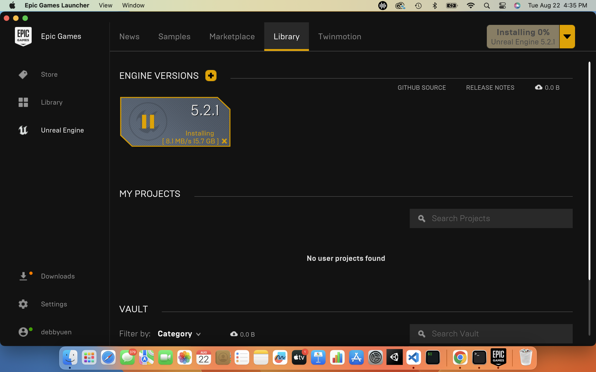
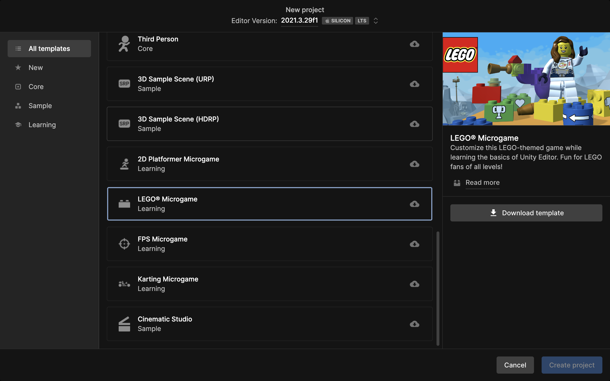

# ⭐️ HW 1: Getting Started

!!! tip "Assignment Deadline"
    This assignment is due **Friday, August 30th** on [Brightspace](https://brightspace.usc.edu/)

    [Submit :fontawesome-solid-paper-plane:](https://brightspace.usc.edu/){ .md-button .md-button--primary }

<iframe src="https://giphy.com/embed/tZU2GT1fL08xi" width="100%" height="100%" style="position:absolute" frameBorder="0" class="giphy-embed" allowFullScreen></iframe>

<a href="https://giphy.com/gifs/vevo-vevo-tZU2GT1fL08xi">via GIPHY</a>

This assignment explains how to setup your computer to complete assignments. If you need help at any time, please feel free to attend office hours or post on `Discord`. The setup is necessary in completing class labs, homework, and projects. While this lab is required, it is not a graded assignment. If you joined the course late, you can request an extension. 

Here's a breakdown of the major parts of the assignment:

- [x] **Setup:** Setting up the essential software for the course. This will require several components, listed below.
- [x] **Source Control:** Install `Perforce` and create a `GitHub Education` account. We will be using Perforce for all projects and GitHub for homework assignments.
- [x] **Install a Terminal:** Install a terminal so you can use `Git` and `Jupyter Notebook`. If you have a terminal on your computer and feel comfortable using it, you can skip this part.
- [x] **Install C# .NET Core:** Install the .NET SDK to your computer. If you already have .NET 6.0 or higher you can skip this part.
- [x] **Install a Text Editor:** Install software to edit .cs files for this course (e.g. VSCode, Visual Studio, Rider JETBrains, Atom, etc.). You can skip this part if you already have a text editor you like.
- [x] **Walkthrough: Using the Terminal:** This walks you through how to use the terminal. If you already feel comfortable with both of these you do not need to read this section.
- [x] **Game Engines:** You must complete an installation for Unity in order to make the most out of this course. Godot and Unreal will be optional.
- [x] **Gradescope:** In future homework assignments, you must complete this section to get points for the assignment. This will walk you through how to turn in your work after completing the previous section and how to verify that your work is turned in on Gradescope.

## IDE and Text Editors
We will spending most of our time in class writing C# scripts in a text editor. Visual Studio Code (VSCode), Visual Studio, and Rider are the most popular choices amongst Unity game developers. There are a couple of catches.

* VSCode does not have Intellisense for Unity working on most computers. If you figure out how to get Unity C# Intellisense working -- please let me know! 
* Visual Studio for Mac is different from the Visual Studio for Windows. They have the same name but they are different. The version for Mac has limited features and extensions you can use.
* Rider is a .NET IDE by JetBrains. You must pay to use it.

We highly recommend using **Visual Studio** and **Terminal** for this class. This will help us support you best since it has Intellisense and Copilot available for the Unity Engine. Please do not use word processors such as Microsoft Word to edit programs. Word processors can add extra content to documents that will confuse the interpreter.

For your reference, here are some other text editors:

* Atom: A more lightweight desktop editor.
* Vim: A command-line editor.
* Emacs: A command-line editor.
* PyCharm: A desktop editor designed for Python.
* Sublime Text: A text editor that works with code.

## Terminal
The terminal is a program that allows you to interact with your computer by entering commands. You already have a program called `Terminal` or `Command Line` or something similar on your computer. Open that up and you should be good to go. When I am working on my MacBook, I default to `iTerm`. On my Windows, I default to `Command Line`.

## Source Control

What is source control? Source control and version control can used interchangeably. However, source control is specific to source code. Version control also covers large binary files and digital assets. Source control is important for maintaining a single source of truth for development teams. Using it helps facilitate collaboration and accelerates release velocity. Source control is a vital component of the development process with source code management systems allowing you to track your code change, see a revision history for your code, and revert to previous versions of a project when needed. With source code management systems, you can collaborate on code with your team, isolate your work until it is ready, and quickly trouble-shoot issues by identifying who made changes and what the changes were. Source code management systems help streamline the development process and provide a centralized source for all your code.

Some benefits of source control are:

* It allows multiple developers to work on the same codebase.
* Developers can commit and merge code without conflicts.
* Developers can edit shared code without unknowingly overwriting each other’s work.

 

### Perforce
Perforce is known for its roots with version control. However, Perforce as a whole does much more than create version control tools. Perforce is ideal for large files and binaries that have a lot of assets. Perforce also allows users to lock certain files which is helpful in collaborating on projects. Within the game industry, Perforce is the industry standard tool for version control and code-sharing at the enterprise level. To use it, you'll have to download the Helix Visual Client (P4V) from the Perforce website.

**Why is Perforce the industry standard?**
You may have used other version control software in the past, like Git or SVN. These are great options because they're free to use.
In an enterprise environment, there's something much more valuable than the cost of subscription software: access to support.

There are a couple other reasons to prefer Perforce over Git.

* Perforce handles binary files differently than Git in ways that are especially important in game development.
* Perforce stores version history on a central server, which means each developer only needs the latest version on their computer.

If you need help accessing or using Perforce for class, you can email [creativetech@cinema.usc.edu](creativetech@cinema.usc.edu) or join USC's `Perforce Support Discord` channel.

!!! note "Download Perforce"

    Download [Perforce Helix Visual Client (P4V)](https://www.perforce.com/downloads/helix-visual-client-p4v).

     

!!! note "Sign in"

    Sign in with your USC NetID credentials and follow the [Setting Up Perforce for Unity](https://docs.google.com/document/d/11HlB3eySUYSPJsy0d9rvQhqTV6lCz00ypQGFg92ZCn8/edit#heading=h.tcv6ud1pa7p) Guide by [Aaron Cheney](https://cinema.usc.edu/directories/profile.cfm?id=65408&first=&last=&title=&did=18&referer=%2Finteractive%2Ffaculty%2Ecfm&startpage=1&startrow=1).

     

### GitHub
GitHub is a platform and cloud-based service for software development and version control using Git. In order to use GitHub for large files, we must also download Git Large File Storage (LFS). In class, we will be learning how to use `Git` with the terminal and with [GitHub Desktop](https://desktop.github.com/).

!!! note "Create a GitHub account"

    [Apply for GitHub Education](https://education.github.com/) and create an [account](https://github.com/).

     

!!! note "Install Git"

    [Install Git](https://git-scm.com/).

     

!!! note "Install Git LFS"

    [Download Git LFS](https://git-lfs.com/).

     

## Game Engines

### Unity Engine
Unity is a cross-platform game engine for mobile, desktop, web, console, and headset games. In this course, we will be working primarily in Unity. If you do not have a Unity account, make sure to sign up with you usc.edu email to get access to Unity's Student Plan.

!!! note "Install Unity Hub (Student)"

    Install the latest version of [Unity Hub](https://unity.com/products/unity-student).
    Below is a screenshot of the latest Unity Hub. Check your version by going to `UnityHub/ About Unity Hub`.

     

!!! note "Install Unity"

    Install Unity Editor Version 2021.3.29f1 or above.
    Make sure to also unclude the `WebGL Build Support` module.

     

### Godot Engine
Godot is a cross-platform game engine for 2D and 3D games. The cool part of Godot is that it is free and open source! If you're interested, you can contribute to the Godot Engine community on GitHub!

!!! abstract "Reading: Godot Docs"

    If you are intersted in learning Godot, reading the `Getting Started/Introduction` would be a great place to start!

    

!!! note "Install Godot (Optional)"

    Install Godot Engine .NET [Version 4.1.1](https://godotengine.org/download/macos/).

    

### Unreal Engine
Unreal Engine is a game engine specifically designed for advanced real-time 3D creations and graphics. Unreal Engine is ideal for photoreal visuals and immersive experiences. 

!!! note "Download Epic Games launcher (Optional)"

    Follow the download [instructions](https://www.unrealengine.com/en-US/download).

    

!!! note "Install Unreal Engine (Optional)"

    Download [Unreal Engine 5.2](https://www.unrealengine.com/en-US/tech-blog/unreal-engine-5-2-brings-native-support-for-apple-silicon-and-other-developments-for-macos). This version brings native support to Apple Silion and other developments for macOS.
    
    

### Publishing Builds with Unity
<!-- 
<iframe src="https://giphy.com/embed/1K64ALJFeedkcwUc6C" width="100%" height="100%" style="position:absolute" frameBorder="0" class="giphy-embed" allowFullScreen></iframe>

<a href="https://giphy.com/gifs/build-built-memeland-1K64ALJFeedkcwUc6C">via GIPHY</a>
 -->

During class, we have been running our projects within the Unity Editor. This is a great way to quickly test things and iterate. Now we want players to experience our games! In order to publish your game or any program you create, we will need to take our compiled program. Then, we want to put it into the form we want to deliver it in and make it available to other playeers. The form you publish your game as is heavily depenedntly on what type of project you are working on. In Unity, a `WebGL` build allows you to publish to a web server like a website so that players can access it through their browsers. A mobile app typically goes through a store like Google Play or Apple's App Store. A `desktop` build might be published on Steam. The starting point shares a common theme - complile the code and then package the compiled code and files together. 

What is a **build**? A **build** is a standalone version of your game, so our players don't need to open our projects in Unity. They can double-click on the program to run the game. The term **Build** is used interchangeably with **application** or **executable**. They all mean the same thing. 

It isn't possible to run a Windows application on an OSX device. Same goes for a PlayStation game on an iPhone. Each requires its own special format. The operating system the player is using is referred to as a platform or within Unity, a **build target**. Some examples include:

* PS5
* Windows 10
* Oculus Quest 2
* Android 11
* iOS16

Unity allows developers to build games for a variety of platforms. Exporting your game to some platform is an important part of game development, a task that every game developer will have to do at least once during their career! To test your projects, create a build. To release your game to the public, create development builds by checking the `Development Builds` box.

**Important notes:**

* Install optional modules in Unity Hub
* Easily switch between different platforms but code may look different for each platform
* Must accomodate designing for different platforms and adjust the input system to reflect so
* Create a new folder for your builds. Do not push these buils to GitHub and Perforce
* Sometimes the game within your editor will not look and feel the same as your built game
* It is not recommended to rename the folder name that was automatically generated for you. It might break things. If you want to change the name, make a whole new and separate build
* Be careful and precise as you follow the steps, including all punctuation and capitalization

After you build your Unity game, don't forget to publish and deploy! Publishing assembles the ouutput into the desired format but does not deploy the prog ram. Deployment doesn't have to be complicatd. Putting everything into a *.zip* file or another archive format and then email the file or place it on a website for people to download is a fast way of deploying your gae. 

#### Rendering Quality
For each device or platform you build to, it is important to consider the quality and the rendering settings of the game. Feel free to adjust and set a certain quality level for different platforms and levels within the game. This will take some experimentation to get to a setting that works best for your game. Edit the settings under `Edit/Project Settings/Quality`.

#### Player Settings
You may also have different build settings for each player. Under `Edit/Project Settings/Player`, you may modify player icons, cursors, and names. You can also modify the splash screen animation!

#### Marketing
In 2022, Unity merged with ironSource. ironSource helps bring apps and user experiences by focusing on the app's business expansion in relation to the app economy. ironSource helps with monetization, marketing, analytics, and discovery capabilities that help developers scale their app-based businesses. Unity recommends ironSource  to help you monetize and market your game.

## Resources and Links

* [Python Console](https://trinket.io/console)
* [Python Tutor](https://pythontutor.com/)
* [Terminal Mac Cheatsheet](https://github.com/0nn0/terminal-mac-cheatsheet)
* [SS64](https://ss64.com/)
* [Mac Terminal User Guide](https://support.apple.com/guide/terminal/welcome/2.13/mac/13.3.1)
* [The Linux Command Line](https://nostarch.com/tlcl2)
* [OhMyZsh](https://ohmyz.sh/)
* [Unity Manual: Publishing Builds](https://docs.unity3d.com/Manual/PublishingBuilds.html)
* [Unity Learn: Create and publish WebGL builds](https://learn.unity.com/tutorial/creating-and-publishing-webgl-builds)
* [YouTube: Create and Publish WebGL Build in Unity](https://www.youtube.com/watch?v=X8Njwk4IRo0&ab_channel=DALAB)
* [YouTube: Publish your Unity game on Google Play Store](https://www.youtube.com/watch?v=UXl_C3ZnRLc&ab_channel=CocoCode)
* [YouTube: How to publish a Unity project to itch.io](https://www.youtube.com/watch?v=fPBv5aflE6Y&ab_channel=MERLINDEV%7CUnityTutorials%26HowTo)
* [How to Consistently Make Profitable Indie Games](https://www.youtube.com/watch?v=LlAc5sBtGkc&t=506s&ab_channel=BraceYourselfGames)
* [How to Market a Game, Chris Zukowski](https://howtomarketagame.com/)

## Submission

!!! note "LEGO Microgame"

    Download the LEGO Microgame template. As part of HW0, you will be experimenting with the [Lego Microgame](https://learn.unity.com/project/lego-template). Please complete the entire tutorial and take a screenshot of the completed tasks. 

     

!!! note "Roll-a-Ball"

    Complete Unity's [Roll-a-Ball](https://learn.unity.com/project/roll-a-ball) tutorial then take a screenshot of your final game.

     