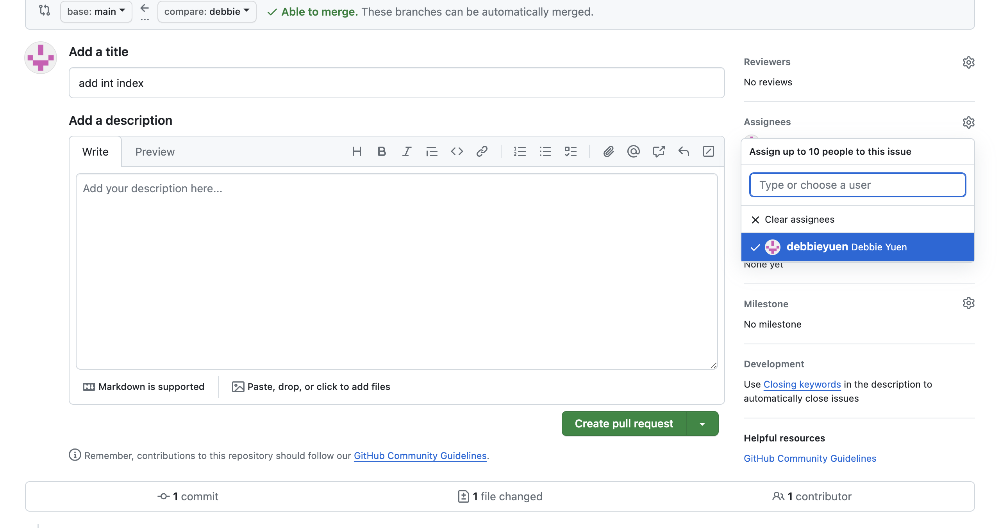

# 🐙 HW 2: Classes & Coroutines

!!! tip "Assignment Deadline"
    This assignment is due **Friday, September 6th** on [Brightspace](https://brightspace.usc.edu/)

    [Submit :fontawesome-solid-paper-plane:](https://brightspace.usc.edu/){ .md-button .md-button--primary }

<div style="width:100%;height:0;padding-bottom:56%;position:relative;"><iframe src="https://giphy.com/embed/29irwFioHzxeyjGLQ0" width="100%" height="100%" style="position:absolute" frameBorder="0" class="giphy-embed" allowFullScreen></iframe></div><p><a href="https://giphy.com/gifs/Dumativa-jogo-shieldmaiden-remix-edition-29irwFioHzxeyjGLQ0">via GIPHY</a></p>

## Classes
Being the king of the object-oriented world, classes are essential concepts to grasp. In C#, classes are a first and important step in creating objects by defining structure in your program, specifying behavior, and providing attributes for your objects. In short, classes are used to organize your C# code. In programming, a class can be visualized as a user-defined data type that holds both data (attributes) and the actions (methods) that are applied to that data. 

Classes are reference types that are `null` by default until you explicitly create an instance of the class by using the `new` operator or assign it an object of a compatible type that may have been created elseswhere. They are some of the most powerful ways to define new types by bundling data (fields) and operations on that data (methods).

To define a class in C#, we usually follow the [PascalCase](https://www.tuple.nl/knowledge-base/pascal-case) naming convention. The rules of PascalCase includes begining with an uppercase letter, excluding spaces and punctuation, and capitalizing the first letter of each word. 

Below is an example of our public class `MyCustomer`, that is following thre PascalCase naming convention. The class definition is then enclosed with curly brackets `{}`.
=== "C#"

``` c# title="DeclaringClasses.cs" linenums="1"
public class MyCustomer 
{
    // Fields, properties, methods and events go here
}
    
```

**Some important definitions:**

* `Object`: A thing in your software, responsible for a slice of the entire program. They define what information the object must remember and the capabilities it can perform when requested
* `Classes`: Categorized C# objects to establish variables and methods of any object. Think of classes as a blueprint or pattern for objects that belong in a subset
* `Constructor`: Helps new instances that are created by classes, to be ready for use. They are special methods that run when an object comes to life to ensure it begins life in a good state. They must use the same name as the class, and they cannot list a return type
* `Properties`: Properties are used to define the attributes or data members of a class. They are defined within the class and provide access to the class’s internal state.
* `Methods`: Methods are functions defined within the class that perform actions or operations. They can modify the class’s state or provide functionality.

=== "C#"

``` c# title="DeclaringClasses.cs" linenums="1"
// Declaring an object of type MyClass.
MyClass mc = new MyClass();

// Declaring another object of the same type, assigning it the value of the first object.
MyClass mc2 = mc;

// Classes are declared by using the class keyword followed by a unique identifier
// [access modifier] - [class] - [identifier]
public class Customer 
{
    // Fields, properties, methods and events go here
}

// Objects can be created using the new keyword followed by the name of the class
Customer object1 = new Customer();
    
```

What does `public` in front of the class name mean? In this case, `public` is an access modifier, which helps control the visibility and accessibility of class members. 

**Some common access modifiers:**

* `public`: Members are accessible from any code.
* `private`: Members are only accessible within the class.
* `protected`: Members are accessible within the class and derived classes.
* `internal`: Members are accessible within the same assembly (a group of related classes in the same project).
* `protected internal`: Members are accessible within the same assembly and derived classes.
* `private protected`: Members are accessible only from derived classes within the current assembly. This access modifier has been available since C# 7.2 and later.

Static classes are defined using the static keyword and exclusively contain static members, such as methods, properties, and fields. Unlike regular classes, static classes cannot be instantiated with the new keyword. Instead, their members are accessed using the class name itself. These classes are commonly used for utility functions or to group related functionality.

## Couroutines
Courtines are really powerful in Unity by how they hook into Unity's core loop by running every frame. When a coroutine, it runs like a function until it reaches a `yield` statment. It then sets a sort of bookmark and `yields`, which tells the rest of the game to proceed. Each frame right after the `Update` function, Unity calls the coroutine again. The coroutine returns to its bookmark and checks its yield condition. When the yield condition is `true`, for exa mple, when 1.5 seconds have passed, the bookmark is deleted and the rest of the coroutine function runs as usual. Coroutines are functions and you call them with the following syntax. 

**When to use couroutines in Unity:**

* Create repeating actions
* To run an animation or play a sound that doesn't change the game state

=== "C#"

``` c# linenums="1"
// Coroutine basic setup
StartCoroutine(PlayFlagpoleAnimation());

IEnumerator PlayFlagpoleAnimation()
{
    // Do stuff
    yield return someCondition;
    // Do more stuff
}
    
```

Below is an example of Unity's built-in `WaitForSeconds` coroutine. While working in Unity, the coroutine you will use the most (by far) is Unity's built-in `WaitForSeconds` coroutine. The `yield` keyword means *keep going with the rest of the game*. Everything after the `return` is called the yield condition. It is something that will eventually be true. For example, afte 1.5 seconds have passed.

=== "C#"

``` c# linenums="1"
// Do stuff
// Then wait
yield return new WaitForSeconds(1.5f);

// Everything after the yield happens after 1.5 seconds
    
```

The coroutine function can have more than one yield statement. It works the same way; the "bookmark" just moves to the latest yield statement. 

=== "C#"

``` c# linenums="1"
// Do stuff
// Then wait 1.5 seconds
yield return new WaitForSeconds(1.5f);

// Do stuff
// Then wait 2 seconds
yield return new WaitForSeconds(2.0f);
    
```

## Problems

Before we get can get started with the homework problems, please **fork** the following repository [`https://github.com/debbieyuen/ctin583-fa24-hw/`](https://github.com/debbieyuen/ctin583-fa24-hw/).

???+ note "Step 1: Cloning with Terminal"

    If you are using terminal, use `cd` to change into the your desired directory. Then `git clone https://github.com/debbieyuen/ctin583-fa24-hw/`.

    

    

    

Now that you have successfully cloned the repository to your computer, it is time to create your own branch! Creating a branch will allow you to have your own version of the code to work off of without making changes to the main branch. In this way, each student will have a copy of the homework assignment to work on on their own respective branches. 


Replace "debbie" with your first name. Here we create a new branch.
``` 
$ git branch debbie
```

Here we check-in to the branch we just created
```
$ git checkout debbie 
```

### Problem 1: Unity Packages
In Unity, the `using` directives at the top of a C# script indicate which namespaces are being used in that script. A namespace in C# is a collection of classes, interfaces, enums, and other types that are organized logically. By including a `using` directive for a particular namespace, you make all the types in that namespace available in your script without needing to fully qualify them with their namespace every time you use them. Please write inline comments within `PlayerController.cs`. Comments are bits of text placed in your program, meant to be annotations on the code for humans -- you and other programmers. The compiler ignores comments.

!!! question "Problem 1: Unity Packages"
    Write in the comments what each line of `using` is doing. What are these packages in Unity?

### Problem 2: Player Name
In this problem, we will practice creating and using variables in C# in the context of Unity. A variable is declared by listing its type and its name together `(string username;)`.

A variable is assigned a value by placing the variable name on the left side of an equal sign and the new value on the right side. This new value may be an expression that the computer will evaluate to determine the value `(username = Console.ReadLine();)`. 

Retrieving the variable's current value is done by simply using the variable's name in an expression `("Hi " + username)`. In this case, your program will start by retrieving the current value in `username`. It then uses that value to produce the complete `"Hi [name]"` message. This combined message is what is supplied to the `WriteLine` method. 

You can declare a variable anywhere within your code. Still, because variables must be declared before they are used, variable declarations tend to gravitate toward the top of the code. 

In a C# Console App, we may define and print out our line similar to the block of code below:

=== "C#"

``` c# linenums="1"
// Declaring a variable
string username;
// Assigning a value to a variable
username = Console.ReadLine();
// Retrieving its current value
Console.WriteLine("My player's name is " + username);
    
```
!!! question "Problem 2: Printing Variables"
    In `PlayerController.cs`, convert the above code to work in Unity and print out in Unity's console. Define a `private` variable for your player or character's name. Where should you define the name? What is the syntax to print to Unity's console?

### Problem 3: Unity Functions
In Unity, scripts that inherit from MonoBehaviour can override several built-in methods that are automatically called by the Unity engine during the lifecycle of a game object. `Start()` and `Update()` are some of the most common Unity functions.
!!! question "Problem 3: Unity Functions"
    In `PlayerController.cs`, what are the `Start()` and `Update()` functions? Describe what they do in comments. What is the difference between `Start()` and `Update()`?

### Problem 4: C# Functions
!!! question "Problem 4: C# Functions"
    We would like to transform the player's position along the vertical and horizontal axis. What are if statments? Lets write some if statements to move the player with the `WASD` Keys. Why is `Time.DeltaTime` needed here? 

### Problem 5: Unity Attributes
!!! question "Problem 5: Unity Attributes"
    Attributes are markers that can be placed above a class, property or function in a script to indicate special behaviour. For example, you can add the HideInInspector attribute above a property declaration to prevent the Inspector from showing the property, even if it is public. C# contains attribute names within square brackets. What do `SerializeField`, `Header`, and `Tooltip` do? 

### Problem 6: Input System
!!! question "Problem 6: New Input System"
    What are Unity's `OnEnable()` and `OnDisable()` functions? What do `movement.Enable()` and `movement.OnDisable` do?

### Problem 7: Public & Private
!!! question "Problem 7: Public and Private"
    What is the difference between `public` and `private` classes and functions? What does it mean when there is no `public` or `private` in front of the class name is only `void`? What does `void` mean?

### Problem 8: Player Mov't

In your game, the player encounters enemies as well. Colliding with them will cause problems. But before we get to collisions, we need to call two existing functions

Functions are used to group a block of code. This can be useful in many ways, for example, in the lecture about operations with variables we performed addition on two variables, what if you need to do that often in your code? Functions let you write one piece of code and reuse it over and over again! 

!!! question "Problem 8: Movement()"
    What are `Input.GetAxis`, `transform.Translate`, and `transform.Rotate`?
    How do we call classes and functions? Where should we call them? In `EnemyCollision.cs`, call your `Movement()` and `Shoot()` functions.

### Problem 9: Instantiate() 
!!! question "Problem 9: Instantiate()"
    Looking at the code in `EnemyCollion.cs`, is this code written for Unity's old or new input system? Please describe what `Instantiate()` is doing in the if statement.

### Problem 10: Which Weapon

Before we can use a class, we must define it or use a predefined class (Unity has many!).  Many C# programmers place each class in a separate file for organization. As our programs grow in size, having all our classes in one file can become overwhelming and disorganized. For this homework assignment, we will place them in the same file. 

Defining a new class is done with the `class` keyword, followed by the class's name, followed by a set of curly braces. Names are usually capitalized with UpperCamelCase. Inside the class's curly braces, we can place the variables and methods that the class will need to do its job. 

!!! question "Defining Classes"
    In `EnemyCollision.cs` define a new, `public` class named `Weapons` and define `int` variables to represent `arrow`, `sword`, `rocket`. 


Comments have a variety of uses:

- [x] You can add a description about how some tricky piece of code works, so you don't have to try to reverse engineer it later.
- [x] You can leave reminders in your code of things you still need to do. These are sometimes called `TODO` comments.
- [x] You can add documentation about how some specific thing should be used or works. Great to help others look through your code
- [x] You can temporarily comment out large chunks of code. A handy keyboard shortcut is `Command` and `/`.

!!! question "Comments"
    In `PlayerController.cs`, describe what each line of code is doing. Start from the very top of the file at `using.System.Collections;`

## Resources and Links
* [Unity Learn: Classes](https://learn.unity.com/tutorial/classes-5)
* [Microsoft Learn: Introduction to Classes](https://learn.microsoft.com/en-us/dotnet/csharp/fundamentals/types/classes)
* [Learn C#: Classes and Objects](https://www.codecademy.com/learn/build-web-apps-asp-net-intermediate-c-sharp/modules/learn-csharp-classes/cheatsheet)
* [Unity Documentation: Coroutines](https://docs.unity3d.com/Manual/Coroutines.html)
* [Asynchronous Courotines with C#](https://learn.microsoft.com/en-us/events/dotnetconf-2020/asynchronous-courotines-with-c)
* [Classes](https://www.codecademy.com/resources/docs/c-sharp/classes)
* [Unity: Important Classes](https://docs.unity3d.com/2022.3/Documentation/Manual/ScriptingImportantClasses.html)

## Submission

!!! note "GitHub Pull Requests"

    To receive credit for this homework assignment, please make sure you provide a link to your GitHub branch and name the branch as your first name. 
    Then assign Jerry and Debbie as `Reviewers` and `Assignees` before you hit the green `Create Pull Request` button.

    

    

    
    

!!! note "Kitchen Chaos"

    On BrightSpace, submit a screenshot of where you are at with the Kitchen Chaos tutorial. 

    <iframe width="100%" height="315" src="https://www.youtube.com/embed/AmGSEH7QcDg?si=rZhxDlhNt93Mmt_T&amp;start=1228" title="YouTube video player" frameborder="0" allow="accelerometer; autoplay; clipboard-write; encrypted-media; gyroscope; picture-in-picture; web-share" allowfullscreen></iframe>