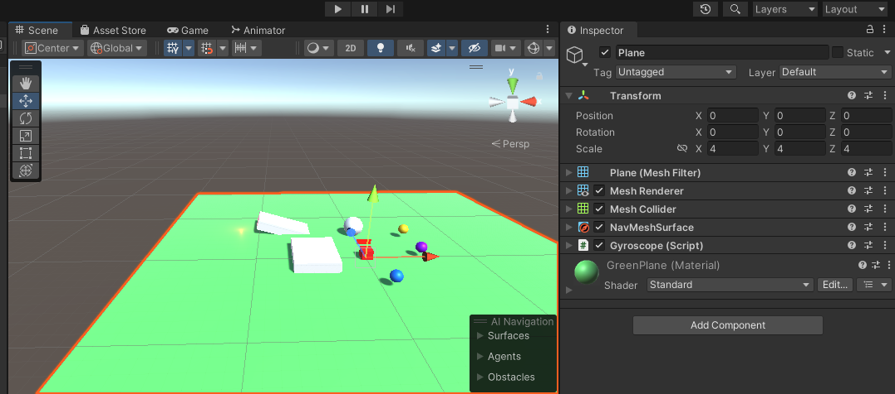
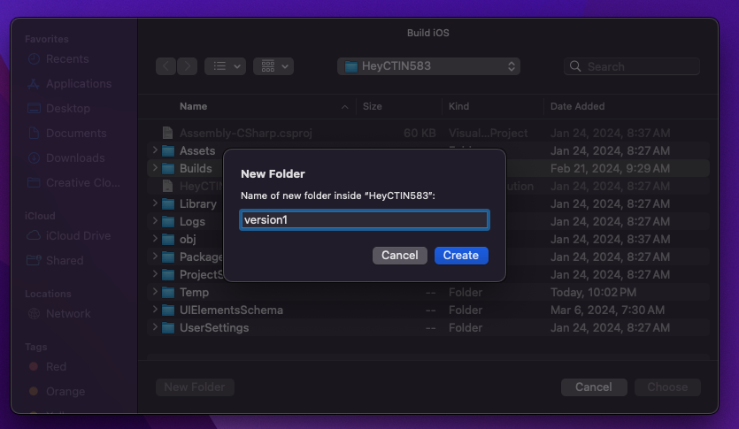
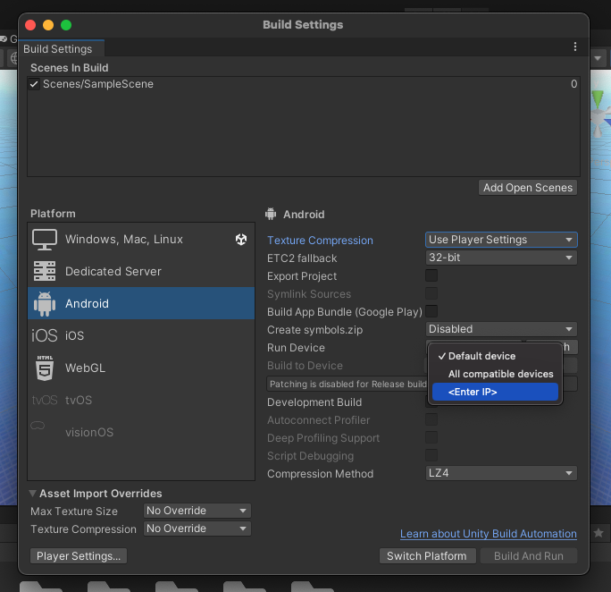

# 🥽 HW 4: AR & XR Foundation

!!! tip "Assignment Deadline"
    This assignment is due **Friday, February 7th** on [Brightspace](https://brightspace.usc.edu/)

    [Submit :fontawesome-solid-paper-plane:](https://brightspace.usc.edu/){ .md-button .md-button--primary }

<div style="width:100%;height:0;padding-bottom:56%;position:relative;"><iframe src="https://giphy.com/embed/mp6RbySJrSrXF2jdtq" width="100%" height="100%" style="position:absolute" frameBorder="0" class="giphy-embed" allowFullScreen></iframe></div><p><a href="https://giphy.com/gifs/Futurebiz-ar-augmented-reality-snapchat-mp6RbySJrSrXF2jdtq">via GIPHY</a></p>

Extended Reality (XR) is an umbrella term encapsulating Augmented Reality (AR), Virtual Reality (VR), Mixed Reality (MR), and everything in between. XR is “reality-plus” tech using any kind of display. XR is VR plus AR. XR stands for “extended reality,” an umbrella term that covers VR, AR, and MR. All XR tech takes the human-to-PC screen interface and modifies it, either by 1) immersing you in the virtual environment (VR), 2) adds to, or augments, the user’s surroundings (AR), or 3) both of those (MR).

The term XR has been around for decades. It first popped up in the 1960s when Charles Wyckoff filed a patent for his silver-halide “XR” film, intended for photographing extremely bright light events, such as nuclear explosions.
More recently, the term has moved into the mainstream as device makers struggle to describe the different display upgrades they’re working with. A couple of examples are immersing gamers in the action by putting a screen (a smartphone display or headset) right in front of the eyes (VR) or adding game characters to real-world surroundings like in the popular Pokémon Go (AR).

## Augmented Reality
What is AR? Augmented reality is an enhanced, interactive version of a real-world environment achieved through digital visual elements, sounds, and other sensory stimuli via holographic technology. AR incorporates three features: a combination of digital and physical worlds, interactions made in real time, and accurate 3D identification of virtual and real objects.

Augmented reality offers an alternative way to design, curate, and deliver consumable instructions by overlaying digital content in real-world work environments.

* **Augmented reality (AR)**— designed to add digital elements over real-world views with limited interaction.
* **Virtual reality (VR)**— immersive experiences helping to isolate users from the real world, usually via a headset device and headphones designed for such activities.
* **Mixed reality (MR)**— combining AR and VR elements so that digital objects can interact with the real world, means businesses can design elements anchored within a real environment.
* **Extended reality (XR)**— covering all types of technologies that enhance our senses, including the three types previously mentioned.

There are various types of AR including marker-based and no marker-based. 

* **Marker-based AR** is created using image recognition to identify objects already programmed into your AR device or application. When placing objects in view as points of reference, they can help your AR device determine the position and orientation of the camera. This is generally achieved by switching your camera to grayscale and detecting a marker to compare that marker with all the others in its information bank. Once your device finds a match, it uses that data to mathematically determine the pose and place the AR image in the right spot.

* **Marker-less AR** is more complex as there’s no point in which your device will focus on. Because of this, your device must recognize items as they appear in view. Using a recognition algorithm, the device will look for colors, patterns, and similar features to determine what that object is and then, using time, accelerometer, GPS, and compass information, it will or orient itself and use a camera to overlay an image of whatever you’d like within your real-world surroundings.

Unity provides support for AR development through frameworks like AR Foundation, which allows developers to create AR applications that can run across multiple platforms, such as Android (ARCore) and iOS (ARKit). AR Foundation is Unity's cross-platform framework designed to simplify the development of Augmented Reality (AR) experiences for both iOS (using ARKit) and Android (using ARCore). It acts as an abstraction layer that provides a unified API for interacting with AR functionalities across multiple platforms, eliminating the need to write platform-specific code.


## Virtual Reality
Virtual reality is a simulated 3D environment that enables users to explore and interact with a virtual surrounding in a way that approximates reality, as it is perceived through the users' senses. The environment is created with computer hardware and software, although users might also need to wear devices such as helmets or goggles to interact with the environment. The more deeply users can immerse themselves in a VR environment -- and block out their physical surroundings -- the more they are able to suspend their belief and accept it as real, even if it is fantastical in nature.

Some main types:

* Non-immersive. This type of VR typically refers to a 3D simulated environment that's accessed through a computer screen. The environment might also generate sound, depending on the program. The user has some control over the virtual environment using a keyboard, mouse or other device, but the environment does not directly interact with the user. A video game is a good example of non-immersive VR, as is a website that enables a user to design a room's decor.

* Semi-immersive. This type of VR offers a partial virtual experience that's accessed through a computer screen or some type of glasses or headset. It focuses primarily on the visual 3D aspect of virtual reality and does not incorporate physical movement in the way that full immersion does. A common example of semi-immersive VR is the flight simulator, which is used by airlines and militaries to train their pilots.

* Fully immersive. This type of VR delivers the greatest level of virtual reality, completely immersing the user in the simulated 3D world. It incorporates sight, sound and, in some cases, touch. There have even been some experiments with the addition of smell. Users wear special equipment such as helmets, goggles or gloves and are able to fully interact with the environment. The environment might also incorporate such equipment as treadmills or stationary bicycles to provide users with the experience of moving through the 3D space. Fully immersive VR technology is a field still in its infancy, but it has made important inroads into the gaming industry and to some extent the healthcare industry, and it's generating a great deal of interest in others.

## Mixed Reality
Mixed reality is the next wave in computing following mainframes, PCs, and smartphones. Mixed reality is going mainstream for consumers and businesses. It liberates us from screen-bound experiences by offering instinctual interactions with data in our living spaces and with our friends. Online explorers, in hundreds of millions around the world, have experienced mixed reality through their handheld devices. Mobile AR offers the most mainstream mixed reality solutions today on social media. People may not even realize that the AR filters they use on Instagram are mixed reality experiences. Windows Mixed Reality takes all these user experiences to the next level with stunning holographic representations of people, high fidelity holographic 3D models, and the real world around them.

Mixed reality is a blend of physical and digital worlds, unlocking natural and intuitive 3D human, computer, and environmental interactions. This new reality is based on advancements in computer vision, graphical processing, display technologies, input systems, and cloud computing. The term "mixed reality" was introduced in a 1994 paper by Paul Milgram and Fumio Kishino, "A Taxonomy of Mixed reality Visual Displays." Their paper explored the concept of a virtuality continuum and the taxonomy of visual displays. Since then, the application of mixed reality has gone beyond displays to include:

* Environmental understanding: spatial mapping and anchors.
* Human understanding: hand-tracking, eye-tracking, and speech input.
* Spatial sound.
* Locations and positioning in both physical and virtual spaces.
* Collaboration on 3D assets in mixed reality spaces.

## Problems

This week's homework will explore how we can create XR applications with code in [Unity](https://docs.unity3d.com/Manual/XR.html) and with no-code solutions such as [8th Wall](https://www.8thwall.com/) and [Snapchat Lens Studio](https://ar.snap.com/?utm_campaign=LensStudio_Brand_P0&utm_content=LS_ProductPage&utm_medium=PAIDPLATFORM&utm_source=GoogleSEM&utm_term=Snap_AR). Please note that for this homework assignment, hardware compatibility is important to run your Unity app on your selected hardware. 

For **Mac** users, you can only build to iOS devices such as the Apple Vision Pro, iPhone, iPad, Mac. Users on a **Windows** machine can only build to Android devices. If you do not have compatible hardware, please work together with other students in the class on this homework assignment. **On Brightspace, please leave a comment noting who you collaborated with on this homework assignment.**

We can also use [Unity Remote](https://docs.unity3d.com/Manual/UnityRemote5.html) to build our AR applications. Unity Remote is a downloadable application that helps with Android, iOS, and tvOS development. Unity Remote connects your target device to the Unity Editor and displays the visual output from the Editor on the target device’s screen at a reduced frame rate. It also sends live inputs from the target device back to the running project in Unity. This is useful to understand how an application looks and handles on the target device without creating a build. In order to use Unity Remote, we will need to download it on your personal phones.

The **Fish Bowl** is available to checkout devices such as the Oculus Quest and Android phones. 


### Problem 1: AR/MR Core

Install the Unity AR or MR Core templates. Feel free to pick whichever template you find more interesting. Depending on which Unity version you are on, the name and content of the template may vary. Download the templates and explore what transforms a 3D scene into one that is compatible with AR, VR, or MR. 

For this homework assignment, the screenshots are created with the Unity **AR Mobile Core** template (2022.3.7f1) on Debbie's **MacBook Pro** for her **iPhone 12 Pro**. These steps may be slightly different on other computers and hardware.

???+ question "Step 1: Install Unity AR Template"

    Install a Unity AR or MR template of your choice. Here, I installed the [Unity AR Core template](https://docs.unity3d.com/2022.2/Documentation/Manual/xr-template-ar.html) from Unity Hub. 

    


???+ question "Step 2: Explore the Contents"

    Explore the **Scene** and **Game** tabs. Investigate the `prefab` **XR Origin**. What does it do? 
    
    

???+ question "Step 3: Gyroscope"

    Create a new script in Unity named `Gyroscope.cs`. Attach your script to a cube or 3D object that is in your scene. It is important to attach your Unity script after you create it. It will throw errors if you have a script that is not attached. 

    
    
    Then, copy and paste the following code into your `Gyroscope.cs` script. The code will also be found in the following repository [`https://github.com/debbieyuen/ctin583-fa24-hw/`](https://github.com/debbieyuen/ctin583-fa24-hw/). To access this code on your own fork, click on the sync changes button on your forked repository.

    === "C#"

    ``` c# title="Gyroscope.cs" linenums="1"
    using System.Collections;
    using System.Collections.Generic;
    using UnityEngine;

    public class Gyroscope : MonoBehaviour
    {

        // Start is called before the first frame update
        void Start()
        {
            Input.gyro.enabled = true;
        }

        // Update is called once per frame
        void Update()
        {
            Debug.Log(Input.gyro.attitude);
            transform.rotation = Input.gyro.attitude;
        }
    }
    ```

???+ question "Step 4: Build App"

    In your Unity Editor, navigate to **File/ Build Settings**. Since I am on a Mac, I will be building to **iOS**. Make sure you have selected all the scenes you want to include in your build. Then, hit **Build and Run**. If you are on a Windows, you can build to **Android**.

    I recommend connecting your laptop and phone with a cable. Make sure the cords are connected while you build your app. 
    
    

    All applications that are built for iOS will need to go through **XCode**. If you don't have XCode, you can download it from the Apple App Store. This is a heavy application, so if it takes up too much space and time, that is okay. If possible, please work with a student who has XCode. If you are unable to build your app with XCode, please use download [Unity Remote](https://apps.apple.com/us/app/unity-remote-5/id871767552) on your phone. 

    Save your build under a `builds` folder and name it as something like `version1.0`.
    

    After saving your build, you should be able to open the project in XCode. If you clicked on **Build and Run**, XCode should open automaticaly. 
    

    If you are on Android Studio or XCode and need a paid developer account, please reach out to Debbie - she has her personal credentials that you can use. 
    

???+ question "Step 5: Preview on Phone"

    Connect your phone to your laptop. Spend some time playing around with the AR application.
    

    If you are using **Unity Preview**, you are required to connect with a USB. Go to **Edit / Project Settings / Editor** and select your phone. 
    

???+ question "Step 6: Unity Console"

    After you connect your phone to Unity, you should see lines printed out within your Unity Console. They should show data from your phone's gyroscope.

???+ question "Step 7: BrightSpace Submission"

    Please take an image of your application working on your phone. 
    
    

### Problem 2: VR Core

???+ question "Step 1: Meta Quest Developer"
    Create an account with [Meta Quest Developer](https://developer.oculus.com/). For convenience, my account is associated with my Facebook and Instagram accounts. Creating an account with Meta Developer will allow you to build and launch your VR applications on the Oculus Quest headsets. On the USC headsets, I am unsure if a developer account is associated with them already. If they are not, you will need to sign in with your own credentials. After you are done with your VR headset, remember to sign out of your account! 

    

    The Oculus Quest: 
    

???+ question "Step 2: Enable Developer Mode on Oculus Quest"
    Write in the comments what each line of `using` is doing. What are these packages in Unity?

    

???+ question "Step 3: Create VR App with Unity"
    Create a new VR project with the VR Core. Explore its contents!

    

???+ question "Step 4: Build App to the Oculus Quest"
    Build your application as an **Android** build. Select your Oculus Quest when connected to your computer. 
    If you are on a **Mac**, you must build to a headset. If you are on **Windows**, Unity has the [Meta Quest Quick Link App](https://www.meta.com/help/quest/articles/headsets-and-accessories/oculus-rift-s/install-app-for-link/). [Here](https://www.circuitstream.com/blog/how-to-setup-oculus-quest-2-for-development-in-unity-under-20-minutes) are some instructions.

    

???+ question "Step 5: BrightSpae Submission"
    Have a friend take a photo or video of you with the Oculus Quest! Then, take a screenshot of your view in the Quest.


### Problem 3: Vuforia

Vuforia is a software development kit (SDK) which is a consists of an ecosystem of software tools, libraries, and documentation. Thee features enable developers to build augmented reality apps for mobile devices. Vuforia is used in conjunction with other tools such as Unity. The SDK is useful because it adds advanced computer vision functionality to your application. It will then be able to recognize images, objects, and spaces with intuitive options to configure your app to interact with the real world. 

???+ question "Step 0: Vuforia In-Class Lab??"
    Adding another section on Vuforia would make the homework assignment too long. Would you be interested in learning in class on how to make a Marker-Based App or an AR app with embedded computer vision? Please comment on BrightSpace and share your opinion! 

### Problem 4: 8th Wall

Last year, we welcomed a guest speaker from Niantic Labs who works on 8th Wall. 8th Wall is a cross-platform development solution for building AR experiences that run on the mobile web and iOS/Android applications developed by Niantic Labs. 8th Wall is a great tool in simplifying the prototyping process for AR applications. 

???+ question "Problem 4: 8th Wall Effects API"
    Lets give the [8th Wall Face Effects API](https://www.8thwall.com/blog/post/113939468379/new-improved-face-effects-webar#:~:text=Face%20Effects%20also%20features%20all,and%20to%20control%20lip%20movements.) a try. You can also find and clone the project at the following link: [`https://www.8thwall.com/8thwall/face-makeup-aframe`](https://www.8thwall.com/8thwall/face-makeup-aframe). 

    

### Problem 5: Snap Lens Studio

Snapchat Lens Studio is a free desktop application developed by Snap Inc. that allows creators and developers to design, build, and publish augmented reality (AR) experiences, known as Lenses, for Snapchat. These Lenses are interactive AR filters that users can apply to their faces, bodies, or surroundings when taking photos or videos.

Snapchat Lens Studio does not directly integrate with Unity, but you can use Unity to create assets and import them into Lens Studio to enhance the augmented reality (AR) experience. While there isn’t a native plugin or direct connection between the two platforms, developers often use Unity to design and develop 3D models, animations, or environments, and then export those assets in compatible formats for Lens Studio.
    
???+ question "Problem 5: Snapchat Lens Studio"
    Please explore Snapchat's [Lens Studio for Unity Developers](https://docs.snap.com/lens-studio/references/guides/general/lens-studio-for-unity#unity-to-lens-studio-glossary) and select any of the ["Getting Started" tutorials](https://docs.snap.com/lens-studio/references/guides/general/lens-studio-for-unity#unity-to-lens-studio-glossary) with Snapchat's Developer Toolkit. For your BrightSpace submission, please take a screenshot of what something you tried making with Snapchat Lens Studio.

    

## Resources and Links

* [Dual Body Bimanual Coordination in Immersive Environments](https://www.youtube.com/watch?v=fWsPGINexYI&ab_channel=JamesSmith)
* [GeneratiVR: Spatial Interactions in Virtual Reality to Explore Generative Design Spaces](https://www.youtube.com/watch?v=qHSx5f6fRts&ab_channel=JamesSmith)
* [8th Wall: Wave Hello to Hand Tracking](https://www.8thwall.com/blog/post/126815603359/wave-hello-to-hand-tracking)
* [8th Wall: Introducing new and improved Face Effects](https://www.8thwall.com/blog/post/113939468379/new-improved-face-effects-webar#:~:text=Face%20Effects%20also%20features%20all,and%20to%20control%20lip%20movements.)
* [Microsoft: What is augmented reality or AR?](https://dynamics.microsoft.com/en-us/mixed-reality/guides/what-is-augmented-reality-ar/)
* [HP: What Is Extended Reality (XR) and How Is it Changing the Future?](https://www.hp.com/us-en/shop/tech-takes/what-is-xr-changing-world)
* [Lens Studio for Unity Developers](https://docs.snap.com/lens-studio/references/guides/general/lens-studio-for-unity#scene-vs-scene)
* [Microsoft: What is Mixed Reality?](https://learn.microsoft.com/en-us/windows/mixed-reality/discover/mixed-reality)
* [Tech Target: VR](https://www.techtarget.com/whatis/definition/virtual-reality)

## Submission

!!! note "XR Applications"

    To receive credit for this homework assignment, please make sure you submit videos and images of what you have created! 
    
    * **Unity AR/MR Core Template**: Share a video/image of your application running on your **phone**. 
    * **Unity VR Core Template**: Share a video/image of you interacting with the Oculus Quest and a screenshot of your experience working in the Quest.
    * **Vuforia**: Comment if you would like to have an in-class workshop on Marker-based Applications
    * **8th Wall**: Share a video/image of yourself with something you created in 8th Wall
    * **Snap Lens Studio**: Share a video/image of yourself with something you created in Lens Studio
    * **Kitchen Chaos Tutorial**: Share a screenshot of where you are in the tutorial. At this point, you should be about halfway done. 