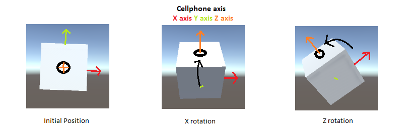
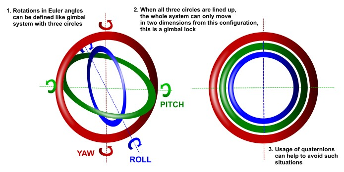
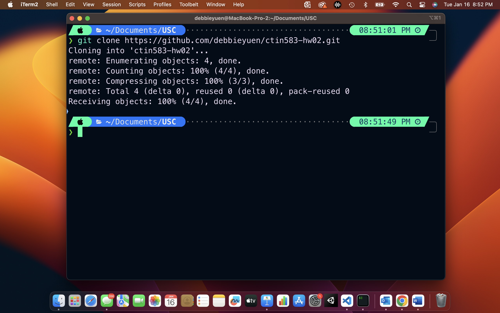
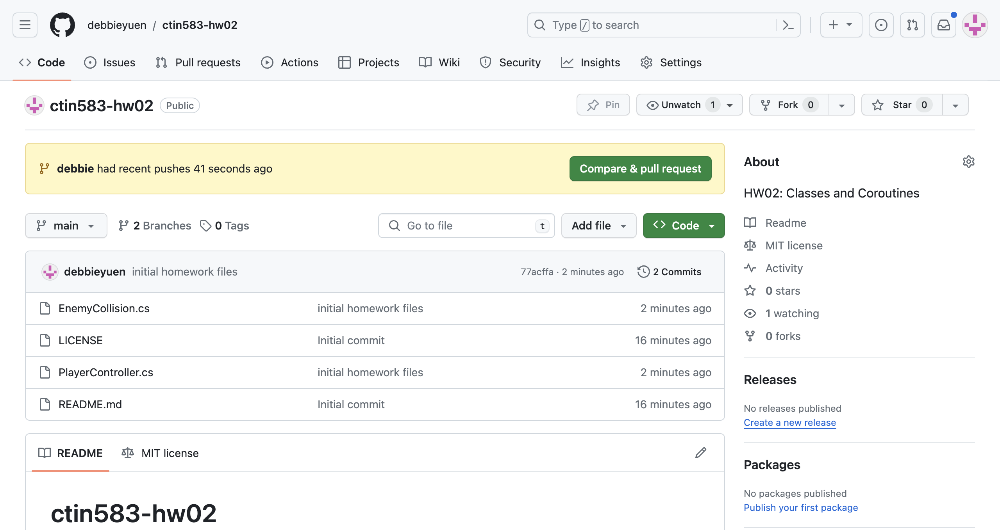

# 🐙 HW 6: 3D Orientations

!!! tip "Assignment Deadline"
    [Gradescope](https://www.gradescope.com/) assignment due **Friday, February 16th, 2024**

    [Submit :fontawesome-solid-paper-plane:](https://www.gradescope.com/courses/696965/assignments/3876770){ .md-button .md-button--primary }



What is an orientation? In general terms, the orientation of an object tells the direction the object is facing. An orientation in a 3D space is related to direction, angular displacement, and rotation. An example of this would be with vectors. A vector may have a direction but not an orientation in which a vector points in a certain direction with no real change to the vector itself. However, a 3D object has a certain direction. When the object is rotated and twisted, the orientation will also change.

In numeric terms, a big difference between direction and orientation can be expressed by how we parameterize a direction in 3D. A direction requires two numbers - **spherical coordinate angles**. An orientatipn requires at least three numbers - **Euler angles** and **Quaternions**.

## Euler Angles
Euler Angeles are one of the most common ways of representing orientations and 3D rotations in Unity. Euler Angeles define an angular displacement as a sequence of three rotations amongst three mutually perpendicular axes. Together, these angles describe orientation as three rotations about three mutually perpendicular axes amongst any order of axes. They rotate about the body axes, so the axis of rotation for a given step depends on the angeles used in prior rotations. 

**Advantages of Euler Angeles:**

- Because Euler angeles parameterize orientation using three numbers, these numbers can be expressed as angles. Working with angles can be more intuitive and convenient to display numerically.
- Euler angeles use the smallest possible representation.

**Disdvantages of Euler Angeles:**

- Because Euler angles are dependent on each other, each representation for a given orientation or rotation is not unique
- Causes Gimbal lock in which a rotation amongst one axis will cause the other rotations to rotate about the same axis

## Quaternions

### Quaternions in Math


In Division Algebra, Quaternions are a method to represent a solid 3D object's three dimensional orientations or other rotational quantity. The algebra for Quaternions consists of 4 dimensions, aka 4 scalar variables that are added and multipled as a single unit. These variables are also known as **Euler Parameters** and hold one real dimension and 3 imaginary dimensions. Each of these imaginary dimensions has a unit value of the square root of -1, but they are different square roots of -1 all mutually perpendicular to each other, known as i,j and k. So a quaternion can be represented as $a + i b + j c + k d$.

For example, the equation $z^2 + 1 = 0$, has infinitely many quaternion solutions, which are the quaternions $z = b i + c j + d k$. The fundamental formula for Quaternion algebra is as follows: 

$$
a + i b + j c + k d
$$

As such, these "roots of -1" form a unit square in the 3D space of vector quaternions. It may seem strange that there are 3 square roots of -1, but we have to remember that we are working in 4 dimensions so there are at least 3 ways to get round from +1 to -1. It is not very practical to try to draw 4 dimensions in 2 dimensions

$$
b^2 + c^2 + d^2 = 1
$$

### Gimbal Lock



Gimbal lock is the loss of one degree of freedom in a three-dimensional, three-gimbal mechanism that occurs when the axes of two of the three gimbals are driven into a parallel configuration, "locking" the system into rotation in a degenerate two-dimensional space. (Wikipedia)

The term gimbal-lock can be misleading in the sense that none of the individual gimbals are actually restrained. All three gimbals can still rotate freely about their respective axes of suspension. Nevertheless, because of the parallel orientation of two of the gimbals' axes, there is no gimbal available to accommodate rotation about one axis, leaving the suspended object effectively locked (i.e. unable to rotate) around that axis. (Wikipeda)

<!-- ### Rotations in Unity -->

### Quaternions in Unity


Quaternions are useful in accurately representing rotations. They are compact, don't suffer from gimbal lock and can easily be interpolated. Unity internally uses Quaternions to represent all rotations and expects Quaternions to be normalized. Luckily in Unity, the individual Quaternion components (x,y,z,w) do not need to be individually accessed or modified. You can take the existing rotations and from there, construct new rotations to smoothly interpolate between two rotations. The Quaternion functions that you will use 9% of the time are:

* `Quaternion.LookRotation` z axis will be aligned with forward, X axis aligned with cross product between forward and upwards, and Y axis aligned with cross product between Z and X.
* `Quaternion.Quaternion.Angle` Think of two GameObjects (A and B) moving around a third GameObject (C). Lines from C to A and C to B create a triangle which can change over time. The angle between CA and CB is the value Quaternion.Angle provides.
* `Quaternion.Euler` Returns a rotation that rotates z degrees around the z axis, x degrees around the x axis, and y degrees around the y axis; applied in that order.
* `Quaternion.Slerp` Use this to create a rotation which smoothly interpolates between the first quaternion a to the second quaternion b, based on the value of the parameter t. If the value of the parameter is close to 0, the output will be close to a, if it is close to 1, the output will be close to b.
* `Quaternion.FromToRotation` Usually you use this to rotate a transform so that one of its axes eg. the y-axis - follows a target direction toDirection in world space.
* `Quaternion.identity` This quaternion corresponds to "no rotation" - the object is perfectly aligned with the world or parent axes.
* `Quaternion.operator` rotate one rotation by another, or to rotate a vector by a rotation

## Problems

Before we get can get started with the homework problems, please clone the following repository [`https://github.com/debbieyuen/ctin583-hw06.git`](https://github.com/debbieyuen/ctin583-hw06.git).

???+ note "Step 1: Cloning with Terminal"

    If you are using terminal, use `cd` to change into the your desired directory. Then `git clone https://github.com/debbieyuen/ctin583-hw06.git`.

    

    

    

Now that you have successfully cloned the repository to your computer, it is time to create your own branch! Creating a branch will allow you to have your own version of the code to work off of without making changes to the main branch. In this way, each student will have a copy of the homework assignment to work on on their own respective branches. 


Replace "debbie" with your first name. Here we create a new branch.
``` 
$ git branch debbie
```

Here we check-in to the branch we just created
```
$ git checkout debbie 
```

## Resources and Links
* [Maths - Quaternions](https://www.euclideanspace.com/maths/algebra/realNormedAlgebra/quaternions/)
* [Wolfram: Quaternion](https://mathworld.wolfram.com/Quaternion.html)
* [Wikipedia: Quaternion](https://en.wikipedia.org/wiki/Quaternion#:~:text=For%20example%2C%20the%20equation%20z,dimensional%20space%20of%20vector%20quaternions.)
* [Unity Scripting: Quaternion](https://docs.unity3d.com/ScriptReference/Quaternion.html)
* [C# Quaternions in Unity!](https://www.youtube.com/watch?v=hd1QzLf4ZH8&ab_channel=Unity)
* [Rotation and Orientation in Unity](https://docs.unity.cn/ru/2019.4/Manual/QuaternionAndEulerRotationsInUnity.html)
* [Unity Quaternion and Rotation Guide for Beginners](https://vionixstudio.com/2022/06/16/unity-quaternion-and-rotation-guide/)
* [Quaternions in Unity](https://medium.com/@spicuzza157/quatern-b5cf7b83b1d1)
* [Wikipedia: Gimbal Lock](https://en.wikipedia.org/wiki/Gimbal_lock)

## Submission

!!! note "GitHub Pull Requests"

    To receive credit for this homework assignment, please make sure you provide a link to your GitHub branch and name the branch as your first name. 
    Then assign Nile and Debbie as `Reviewers` and `Assignees` before you hit the green `Create Pull Request` button.

    

    

    