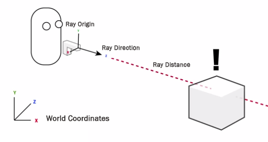

# HW 8: Raycasting

## What is Raycasting?
Raycasting is the "ray" or invisible line within a game world that shows what GameObjects are in that direction. Raycasting can be used to draw a ray from the center of one character to another and see whether it hits another object. This is important because a mouse doesn't technically exist within the game world. 

In the game world, the mouse position is just a set of coordinates on a 2D screen. In this case, covert the mouse's screen position into a world position. Then, you can send a ray forward into the game world to see what it hits. 

**You can use raycasting to answer questions like:**

* Where will the player's grappling hook hit the ceiling?
* Can one player see another player's character?
* Is the character standing on solid ground?
* Is the player's mouse hovering over an object? 