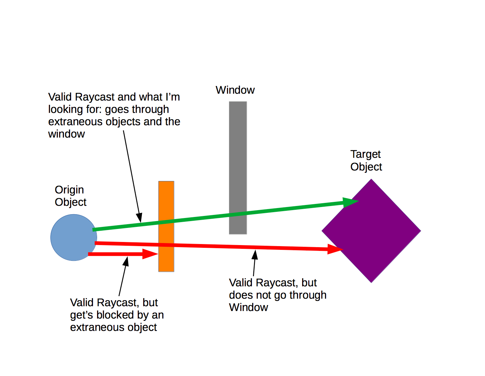
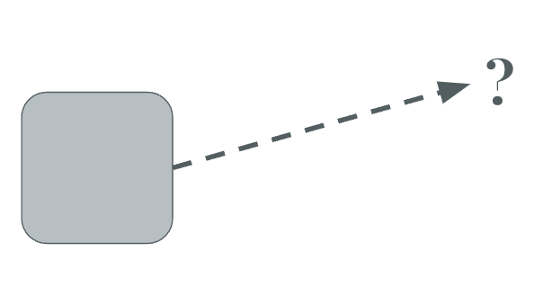

# 📟 HW 8: Yarn Spinner

!!! tip "Assignment Deadline"
    This assignment is due **Friday, October 18th**. Nothing to submit on [Brightspace](https://brightspace.usc.edu/). Please complete your homework on GitHub.

    [Submit :fontawesome-solid-paper-plane:](https://brightspace.usc.edu/){ .md-button .md-button--primary }



## Raycasting

Before we dive into Yarn Spinner, lets talk a little bit about Raycasting! Though the topics aren't related, Raycasting is an important concept to know.

At its core, a ray is an infinite line starting at origin and going in some direction. To define a ray, we can define two points. The two points represent the ray's origin and the ray's endpoint. Unity provides a useful data struct that helps represent a point of origin and direction for the ray to travel. 

We can create a ray manually in C# like this:

=== "C#"

``` c# title="Raycasting.cs" linenums="1"
// Creates a Ray that is moving forward
Ray ray = new Ray(transform.position, transform.forward);
    
```



Raycasting is the "ray" or invisible line within a game world that shows what GameObjects are in that direction. Raycasting can be used to draw a ray from the center of one character to another and see whether it hits another object. This is important because a mouse doesn't technically exist within the game world. 

In the game world, the mouse position is just a set of coordinates on a 2D screen. In this case, covert the mouse's screen position into a world position. Then, you can send a ray forward into the game world to see what it hits. 


**You can use raycasting to answer questions like:**

* Where will the player's grappling hook hit the ceiling?
* Can one player see another player's character?
* Is the character standing on solid ground?
* Is the player's mouse hovering over an object? 

Sometimes it's not enough to know whether two objects are colliding. For example, Mario can only jump w hen he's standing on something. Is Mario standing on solid ground? You could use collisions to answer this. We could draw a ray down from Mario's center and see whether it hits something. So we would do something like this, with two raycasts. If either of the raycasts hits solid ground, then Mario doesn't fall. 


In Unity2D, the basic form of the 2D raycast function looks like:

=== "C#"

``` c# title="Raycasting.cs" linenums="1"
RaycastHit2D hit2D = Physics2D.Raycast(startOfRay, direction, distance);
// startOfRay: Where to start the ray, this is a point, so a Vector2
// direction: Which direction it goes, this is a direction, so also a Vector2
// distance: How far the ray should go, a length, so a float
    
```

In Unity 2D, a raycast returns a `RaycastHit2D`, which is a package of information about what happened with the raycast. A `RaycastHit2D` is very similar to a `Collision` object. It's not the thing that the ray collided with. It's a wh ole bunch of information that includes that. We can get the GameObject that the ray hit with `hit2D.collider.gameObject`.

We can then ask that other GO for its components, tag, and so on. 

=== "C#"

``` c# title="Raycasting.cs" linenums="1"
GameObject otherGO = hit2D.collider.gameObject;
otherGO.GetComponent<SpriteRenderer>()
otherGO.gameObject.tag
otherGO.SetActive(false)
    
```
Be aware though! `RaycastHit2D` will never be **null**. Therefore, it is not always necessary to have an if statement to check if the ray is null. 

=== "C#"

``` c# title="Raycasting.cs" linenums="1"
// This code always runs whether or not the raycast actualy hits something
if (hit2D != null) {
    print(hit2D.collider.name);
}

// If the ray hit something
if (hit2D.collider != null) {
    print(hit2D.collider.name);
}
    
```

By default, the raycast will hit the same GameObject that is casting the ray. You can fix this a couple of different ways.

* By starting the ray outside of the GameObject's collider
* By setting up a layer mask

## Visualizing Raycasts
In Unity, it can be hard to set up raycasting correctly because the ray is invisible. You can't directly make the ray visible, but you can draw a line alongside the ray by using `Debug.DrawRay`. It's **almost** the same as the raycast function... but slightly different. `Debug.DrawRay(startPosition, directionAndDistance, color);`. In this case, the second parameter is still a `Vector3`, but this time it doesn't just specify the direction. It also determines the length of the ray, all in the same vector.

=== "C#"

``` c# title="VisualizingRaycasting.cs" linenums="1"
// dirToPlayer is a vector that points directly to the player
Vector3 dirToPlayer = player.transform.position - transform.position;
Debug.DrawRay(transform.position, dirToPlayer, Color.red);

// if we want to look in the player's direction, but only a certain distance, we normalize the vector
Vector3 dirToPlayer = player.transform.position - transform.position;
Vector3 towardPlayer = dirToPlayer.normalized * distance;
Debug.DrawRay(transform.position, towardPlayer, Color.red);
    
```

## Yarn Spinner
!!! question "Tutorial: Choose-Your-Path Game"
    Please complete the following tutorial on Yarn Spinner. Submit your C# and Yarn scripts on GitHub. 

## Resources and Links
* [RaycastHit2D](https://docs.unity3d.com/ScriptReference/RaycastHit2D.html)
* [Raycasts in Unity, made easy](https://gamedevbeginner.com/raycasts-in-unity-made-easy/)
* [Ray](https://docs.unity3d.com/ScriptReference/Ray.html)
* [Physics - Raycast](https://docs.unity3d.com/ScriptReference/Physics.Raycast.html)


## Submission

!!! note "GitHub Pull Requests"

    To receive credit for this homework assignment, please Jerry and Debbie as `Reviewers` and `Assignees` when you hit the green `Create Pull Request` button.

    

    

    