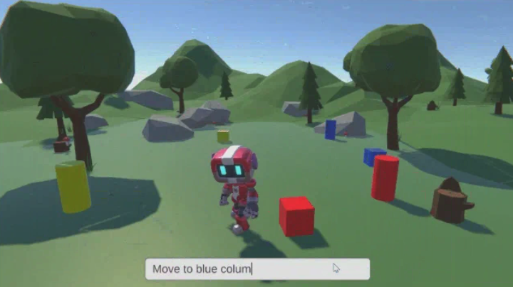
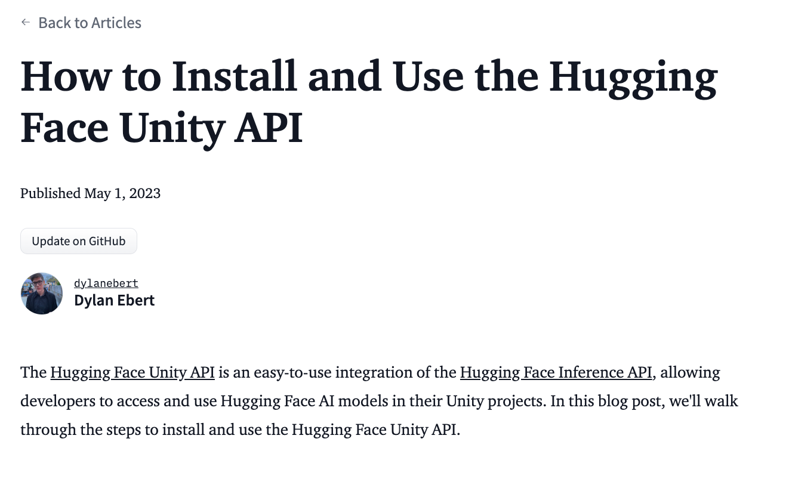
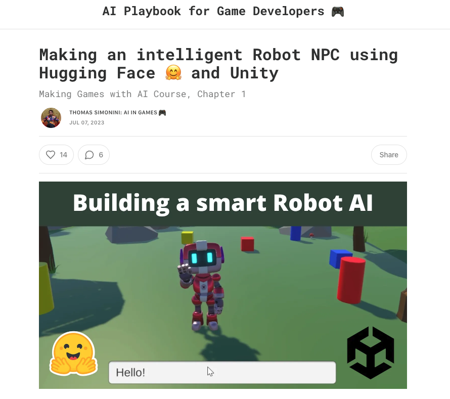
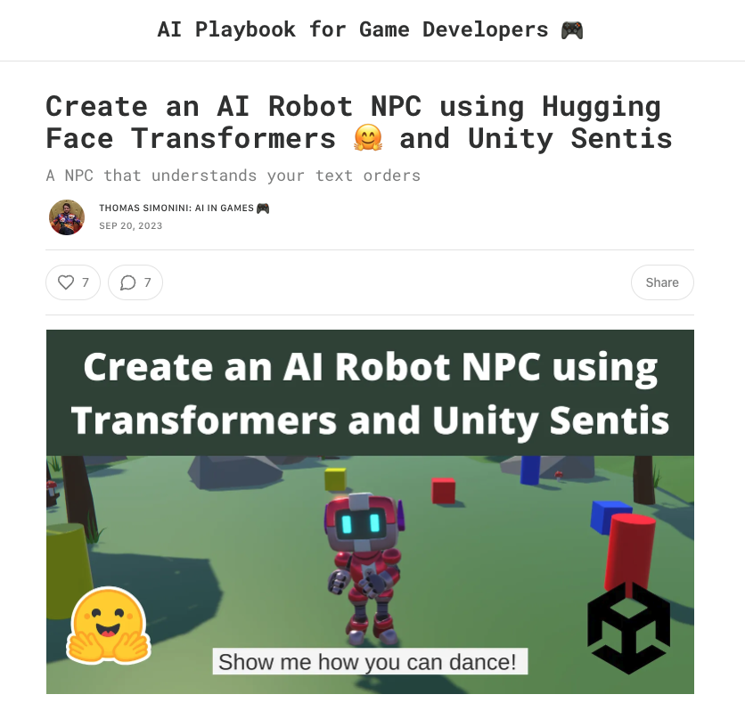

# &#129303 HW 10: Hugging Face API

!!! tip "Assignment Deadline"
    This assignment is due **Friday, November 1st** on [Brightspace](https://brightspace.usc.edu/).

    [Submit :fontawesome-solid-paper-plane:](https://brightspace.usc.edu/){ .md-button .md-button--primary }

## Hugging Face API

Unity's Cinematic Studio template includes features that help develop movies within the Unity Editor. It includes sample content to demonstrate its strengths and to help us get started! 

## Resources and Links
* [GitHub: Hugging Face Unity API](https://github.com/huggingface/unity-api)
* [Hugging Face - Unity Technologies](https://huggingface.co/unity)
* [Discord - Hugging Face](https://discord.com/invite/JfAtkvEtRb)

## Submission

!!! note "How to Install and Use the Hugging Face Unity API"

    First read the documentation on how to install and use the [Hugging Face Unity API](https://huggingface.co/blog/unity-api)

     

!!! note "Making an intelligent Robot NPC using Hugging Face 🤗 and Unity"

    Complete the [Making an intelligent Robot NPC using Hugging Face 🤗 and Unity](https://thomassimonini.substack.com/p/building-a-smart-robot-ai-using-hugging) tutorial

     

!!! note "Create an AI Robot NPC using Hugging Face Transformers 🤗 and Unity Sentis"

    Complete the [Create an AI Robot NPC using Hugging Face Transformers 🤗 and Unity Sentis](https://thomassimonini.substack.com/p/create-an-ai-robot-npc-using-hugging?utm_source=profile&utm_medium=reader2) tutorial

     