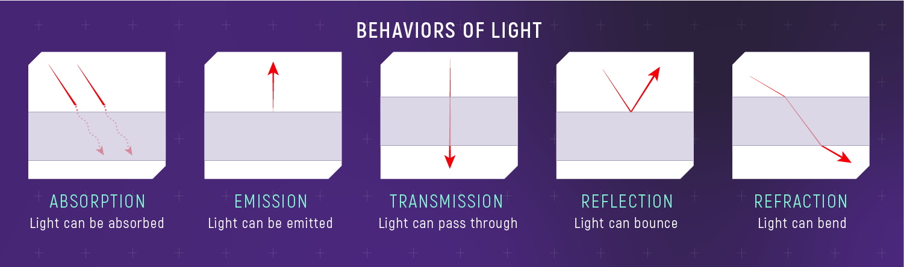
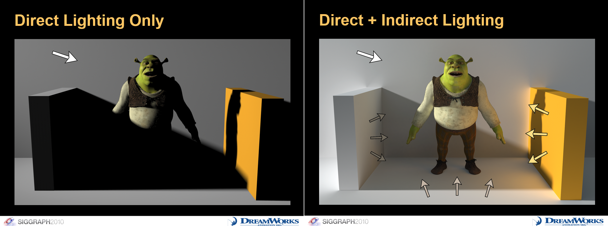

# 💡 HW 10: Illumination

!!! tip "Assignment Deadline"
    [Gradescope](https://www.gradescope.com/) assignment due **Friday, March 1st 2024**

    [Submit :fontawesome-solid-paper-plane:](https://www.gradescope.com/courses/696965/assignments/3876770){ .md-button .md-button--primary }

<iframe src="https://giphy.com/embed/XyJZNF8BY9X38ifJMt" width="100%" height="100%" style="position:absolute" frameBorder="0" class="giphy-embed" allowFullScreen></iframe>

<a href="https://giphy.com/gifs/here-theyre-heeere-XyJZNF8BY9X38ifJMt">via GIPHY</a>

## Global Illumination

Our eyes works interpret light by picking up rays of light. These rays of light bounce around and everytime it hits an object, the light responds in a certain way depending on the object's properties. For example, the light may be absorbed or reflected depending on the object's properties it hits and the object's material. In computer graphics, we are now able to simulate light properties. Global illumination plays an essential part in simulating indirect lighting by serving as a set of algorithms whose purpose is to add more realistic lighting to 3D scenes. Global illumination simulates indirect lighting, like light bouncing and color bleeding. Global illumination is an important part of 3D animation and design that helps give it a more realistic feel. Without global illumination, objects simply would look right in certain cases, which would lead to pulling the audience out of the moment. It is also a group of techniques that model both direct and indirect lighting to provide realistic lighting results.

For example, in Unity you can have multiple objects of various colors where the colors are cast onto a reflective sphere. That effect is referred to as indirect lighting because the colored light isn't being cast directly from a light but rather is the result of light being cast onto a colored object which is then bleeding into the nearby reflective sphere. Global illumination plays a big role in getting this distinctive and often necessary look.  **Unity has two, main global illumination systems, which combine direct and indirect lighting - Progressive Lightmapper (baked) and Enlighten Realtime Global Illumination  (real-time).**

This act of light bouncing around is categorized into two types. Such algorithms take into account not only the light that comes directly from a light source (direct illumination), but also subsequent cases in which light rays from the same source are reflected by other surfaces in the scene, whether reflective or not (indirect illumination). Unity can calculate direct lighting, indirect lighting, or both direct and indirect lighting. The lighting techniques that Unity uses depends on how you configure your Project.

* **Direct Lighting**: Direct light is light that is emitted, hits a surface once, and is then reflected directly into a sensor (for example, the eye’s retina or a camera). 

* **Indirect Lighting**: Indirect light is all other light that is ultimately reflected into a sensor, including light that hits surfaces several times, and sky light. To achieve realistic lighting results, you need to simulate both direct and indirect light.

## Lighting

With Unity, you can achieve realistic lighting that is suitable for a range of art styles. Lighting comes in three formats or modes. To assign a `Mode`, select the Light in your `Scene`
 and, in the `Light Inspector window`, select `Mode`.

* **[Realtime](https://docs.unity3d.com/Manual/LightMode-Realtime.html)**: Unity calculates and updates the lighting of Realtime Lights every frame at runtime. Unity does not precompute any calculations for Realtime Lights.
* **[Mixed](https://docs.unity3d.com/Manual/LightMode-Mixed.html)**: Unity performs some calculations for Mixed Lights in advance, and some calculations at runtime.
* **[Baked](https://docs.unity3d.com/Manual/LightMode-Baked.html)**: Unity pre-calculates the illumination from Baked Lights before runtime, and does not include them in any runtime lighting calculations.

In order to get started with adding lighting to your scene, add lighting and reposition it as needed in your scne. If you are using say, Baked Global Illumination, make sure the feature is turned on. Then, adjust each object's lighting settings accordingly. For baked lighting on objects, each object should be static. Finally, you may bake the lighting. A useful Unity package to help with visual effects is the [Post Processing package](https://docs.unity3d.com/Manual/PostProcessingOverview.html). 

## Light Sources

Standard Abstract Light Types:

- **Point Light:** Also known as *omni lights* or *spherical*, they represent light that emanates from a single point outward in all directions. A point light has a position and color, which controls the hue and intensity of the light.

- **Spot Light:** Represents light from a specific location in a specific direction. These are commonly used for lights such as flashlights, headlights, and spot lights. A spot light has a position and an orientation, and optionally a falloff distance. The shape of the lit area is either a cone or a pyramid. 

- **Conical Spot Light:** The conical spot light is shaped like a cone, meaning it h as a circular bottom. The width of the cone is known as the *falloff angle*. 

- **Rectangular Spot Light:** A rectangular spot light is similar to the conical spot light except that it forms a pyramid bottom instead of a cone shaped bottom.

- **Directional Light:** This light represents light coming out from a point in a far away space in which all the rays of light can be considered parallel. Good examples of directional lights would be the sun and moon.

## Resources and Links
* [Unity Manual: Introduction to Lighting](https://docs.unity3d.com/Manual/LightingInUnity.html)
* [Unity Learn: Get Started with Lighting](https://learn.unity.com/tutorial/get-started-with-lighting?pathwayId=61a65568edbc2a00206076dd&missionId=61a106efedbc2a5554f0dcba)
* [Realistic 2D Lights & Shadows in Unity](https://www.youtube.com/watch?v=-gzw_DHfoKU&t=12s&ab_channel=WillyDev)
* [LIGHTING in Unity](https://www.youtube.com/watch?v=VnG2gOKV9dw&t=229s&ab_channel=Brackeys)
* [Finding Next-Gen – Part I – The Need For Robust (and Fast) Global Illumination in Games](https://colinbarrebrisebois.com/2015/11/06/finding-next-gen-part-i-the-need-for-robust-and-fast-global-illumination-in-games/)
* [Understanding Global Illumination](https://www.pluralsight.com/blog/film-games/understanding-global-illumination)

## Submission

!!! note "GitHub Pull Requests"

    To receive credit for this homework assignment, please make sure you provide a link to your GitHub branch and name the branch as your first name. 
    Then assign Nile and Debbie as `Reviewers` and `Assignees` before you hit the green `Create Pull Request` button.

    

    

    