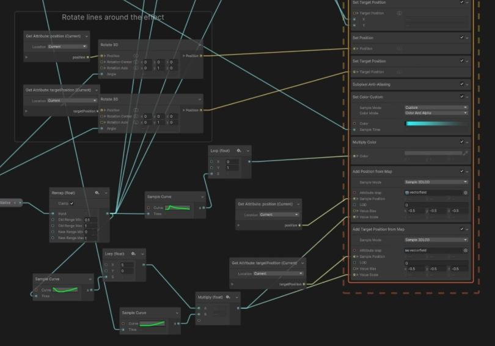
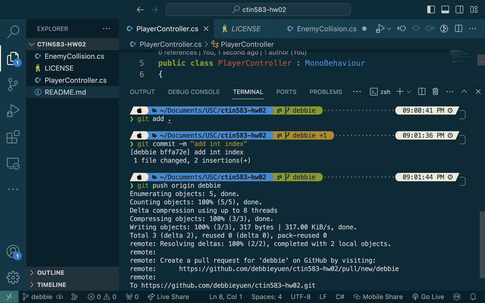

# HW 11: Shaders

!!! tip "Assignment Deadline"
    [Gradescope](https://www.gradescope.com/) assignment due **Friday, March 1st 2024**

    [Submit :fontawesome-solid-paper-plane:](https://www.gradescope.com/courses/696965/assignments/3876770){ .md-button .md-button--primary }

## Resources and Links
* [Unity Manual: Visual Effect Graph](https://docs.unity3d.com/Packages/com.unity.visualeffectgraph@12.0/manual/index.html)
* [Introduction to the VFX Graph in Unity](https://unity.com/how-to/introduction-vfx-graph-unity)
* [Unity VFX Graph](https://www.youtube.com/watch?v=7bMOhNUA1bI&list=PLpPd_BKEUoYhN8CiOoNLTSVh-7U5yjg3n&ab_channel=GabrielAguiarProd.)

Computer graphics allows us to create different things from a single pixel to a group of pixels. Pixel shading is one of many things that can be performed with computer graphics. Pixel shading refers to the process of computing a color for a pixel. On shader-based hardware, this is where your pixel shader is executed. In a basic forward renderer pass, where we are rendering objects into the frame buffer, the pixel is typically first lit and then fogged if fogging is being used. the output of a pixel shader consists of not only an RGB color, bu also an alpha value, which is usually interpreted as the "opacity" of the pixel, used for blending. 

## HLSL

HLSL is similar to the shader language, "Cg", which is a shader language developed by NVIDIA and GLSL, the shading langiage used in OpenGL. 

## Visual Effect Graph

Unity's Visual Effect Graph (VFX Graph) allows you to create simple and complex visual effects from a node-based programming language that combines blocks, nodes, and sequences. These effects can range from common particle behaviors to complex scene simulations. Together, these nodes can be combined as building blocks to created advanced procedural effects. 

According to the Unity Manual, the Visual Effect Graph is useful for:

* Create one or multiple Particle Systems.
* Add static meshes and control Shader properties.
* Create properties to customize the instances you use in the Scene.
* Create events to turn parts of your effect on and off. You can then send these events from the Scene via C# or Timeline.
* Extend the library of features by creating sub-graphs of the Nodes that you commonly use.
* Use a Visual Effect Graph in another Visual Effect Graph. For example, you can reuse and customize a simple but configurable explosion in more complex graphs.
* Previews changes immediately, so you can simulate effects at various rates and perform step-by-step simulation. For instructions on how to install the Visual Effect Graph, see Getting started with Visual Effect Graph.

## Resources and Links
* [Maths - Quaternions](https://www.euclideanspace.com/maths/algebra/realNormedAlgebra/quaternions/)
* [Wolfram: Quaternion](https://mathworld.wolfram.com/Quaternion.html)
* [Wikipedia: Quaternion](https://en.wikipedia.org/wiki/Quaternion#:~:text=For%20example%2C%20the%20equation%20z,dimensional%20space%20of%20vector%20quaternions.)
* [Unity Scripting: Quaternion](https://docs.unity3d.com/ScriptReference/Quaternion.html)
* [C# Quaternions in Unity!](https://www.youtube.com/watch?v=hd1QzLf4ZH8&ab_channel=Unity)
* [Rotation and Orientation in Unity](https://docs.unity.cn/ru/2019.4/Manual/QuaternionAndEulerRotationsInUnity.html)
* [Unity Quaternion and Rotation Guide for Beginners](https://vionixstudio.com/2022/06/16/unity-quaternion-and-rotation-guide/)
* [Quaternions in Unity](https://medium.com/@spicuzza157/quatern-b5cf7b83b1d1)
* [Wikipedia: Gimbal Lock](https://en.wikipedia.org/wiki/Gimbal_lock)

## Submission

!!! note "GitHub Pull Requests"

    To receive credit for this homework assignment, please make sure you provide a link to your GitHub branch and name the branch as your first name. 
    Then assign Nile and Debbie as `Reviewers` and `Assignees` before you hit the green `Create Pull Request` button.

    

    

    