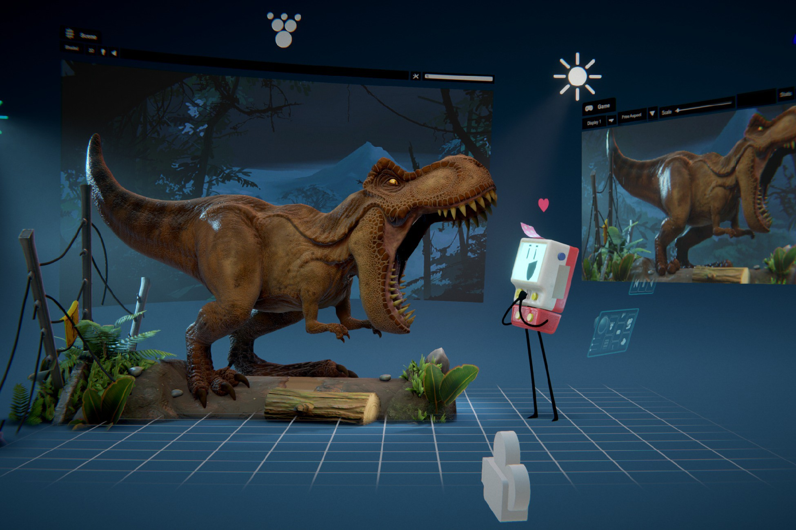
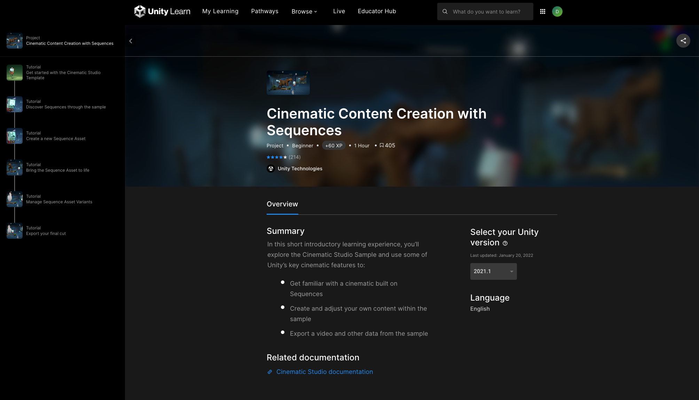

# &#129303 HW 12: Hugging Face API

!!! tip "Assignment Deadline"
    [Gradescope](https://www.gradescope.com/) assignment due **Friday, March 1st 2024**

    [Submit :fontawesome-solid-paper-plane:](https://www.gradescope.com/courses/696965/assignments/3876770){ .md-button .md-button--primary }

## Hugging Face API

Unity's Cinematic Studio template includes features that help develop movies within the Unity Editor. It includes sample content to demonstrate its strengths and to help us get started! 

**Some Cinematic Studio tools and features:**

* **Timeline**: Create cinematic content, gameplay sequences, audio sequences, and complex particle effects
* **Sequences**: A workflow tool to keep movie's editorial content organized, collaborative, and flexible
* **FBX Exporter**: A workflow that roundtrip content between Unity and 3D modeling software by sending geometries, Lights, Cameras, and animations
* **Alembic**: A file format for optimized playback for complex animations
* **Cinemachine**: Unity's camera system for framing and following all the action
* **Recorder**: A tool that captures and exports videos, stills, arbitary output variables, and much more

## Resources and Links
* [GitHub: Hugging Face Unity API](https://github.com/huggingface/unity-api)
* [Hugging Face - Unity Technologies](https://huggingface.co/unity)
* [Discord - Hugging Face](https://discord.com/invite/JfAtkvEtRb)

## Submission

!!! note "Unity Cinematic Studio"

    Download the Cinematic Studio template. As part of HW09, you will be experimenting with the [Cinematic Content Creation with Sequences](https://learn.unity.com/project/cinematic-content-creation-with-sequences). Please complete the entire tutorial and take a screenshot of the completed tasks. 

     