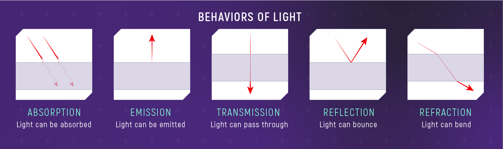

# 💡 HW 12: Illumination

!!! tip "Assignment Deadline"
    This assignment is due **Friday, November 15th** on [Brightspace](https://brightspace.usc.edu/).

    [Submit :fontawesome-solid-paper-plane:](https://brightspace.usc.edu/){ .md-button .md-button--primary }

<iframe src="https://giphy.com/embed/XyJZNF8BY9X38ifJMt" width="100%" height="100%" style="position:absolute" frameBorder="0" class="giphy-embed" allowFullScreen></iframe>

<a href="https://giphy.com/gifs/here-theyre-heeere-XyJZNF8BY9X38ifJMt">via GIPHY</a>

## Lighting

With Unity, you can achieve realistic lighting that is suitable for a range of art styles. Lighting comes in three formats or modes. To assign a `Mode`, select the Light in your `Scene`
 and, in the `Light Inspector window`, select `Mode`.

* **[Realtime](https://docs.unity3d.com/Manual/LightMode-Realtime.html)**: Unity calculates and updates the lighting of Realtime Lights every frame at runtime. Unity does not precompute any calculations for Realtime Lights.
* **[Mixed](https://docs.unity3d.com/Manual/LightMode-Mixed.html)**: Unity performs some calculations for Mixed Lights in advance, and some calculations at runtime.
* **[Baked](https://docs.unity3d.com/Manual/LightMode-Baked.html)**: Unity pre-calculates the illumination from Baked Lights before runtime, and does not include them in any runtime lighting calculations.

In order to get started with adding lighting to your scene, add lighting and reposition it as needed in your scne. If you are using say, Baked Global Illumination, make sure the feature is turned on. Then, adjust each object's lighting settings accordingly. For baked lighting on objects, each object should be static. Finally, you may bake the lighting. A useful Unity package to help with visual effects is the [Post Processing package](https://docs.unity3d.com/Manual/PostProcessingOverview.html). 

### Volumetric Lighting

### Dynamic Lighting

## Light Sources

Standard Abstract Light Types:

- **Point Light:** Also known as *omni lights* or *spherical*, they represent light that emanates from a single point outward in all directions. A point light has a position and color, which controls the hue and intensity of the light.

- **Spot Light:** Represents light from a specific location in a specific direction. These are commonly used for lights such as flashlights, headlights, and spot lights. A spot light has a position and an orientation, and optionally a falloff distance. The shape of the lit area is either a cone or a pyramid. 

- **Conical Spot Light:** The conical spot light is shaped like a cone, meaning it h as a circular bottom. The width of the cone is known as the *falloff angle*. 

- **Rectangular Spot Light:** A rectangular spot light is similar to the conical spot light except that it forms a pyramid bottom instead of a cone shaped bottom.

- **Directional Light:** This light represents light coming out from a point in a far away space in which all the rays of light can be considered parallel. Good examples of directional lights would be the sun and moon.

## Global Illumination

Our eyes works interpret light by picking up rays of light. These rays of light bounce around and everytime it hits an object, the light responds in a certain way depending on the object's properties. For example, the light may be absorbed or reflected depending on the object's properties it hits and the object's material. In computer graphics, we are now able to simulate light properties. Global illumination plays an essential part in simulating indirect lighting by serving as a set of algorithms whose purpose is to add more realistic lighting to 3D scenes. Global illumination simulates indirect lighting, like light bouncing and color bleeding. Global illumination is an important part of 3D animation and design that helps give it a more realistic feel. Without global illumination, objects simply would look right in certain cases, which would lead to pulling the audience out of the moment. It is also a group of techniques that model both direct and indirect lighting to provide realistic lighting results.

For example, in Unity you can have multiple objects of various colors where the colors are cast onto a reflective sphere. That effect is referred to as indirect lighting because the colored light isn't being cast directly from a light but rather is the result of light being cast onto a colored object which is then bleeding into the nearby reflective sphere. Global illumination plays a big role in getting this distinctive and often necessary look.  **Unity has two, main global illumination systems, which combine direct and indirect lighting - Progressive Lightmapper (baked) and Enlighten Realtime Global Illumination  (real-time).**

This act of light bouncing around is categorized into two types. Such algorithms take into account not only the light that comes directly from a light source (direct illumination), but also subsequent cases in which light rays from the same source are reflected by other surfaces in the scene, whether reflective or not (indirect illumination). Unity can calculate direct lighting, indirect lighting, or both direct and indirect lighting. The lighting techniques that Unity uses depends on how you configure your Project.

* **Direct Lighting**: Direct light is light that is emitted, hits a surface once, and is then reflected directly into a sensor (for example, the eye’s retina or a camera). 

* **Indirect Lighting**: Indirect light is all other light that is ultimately reflected into a sensor, including light that hits surfaces several times, and sky light. To achieve realistic lighting results, you need to simulate both direct and indirect light.

### Light Probes, Lightmaps, and Volumes

What are light probes? Light probes in Unity Scenes are ways to capture and use information about light that is passing through empty spaces. They store "baked" information about lighting in our scene - information about light passing through **empty space** in our scenes. In Unity, Light Probes are positions within the scene where the light is measured, or probed, during the bake. During runtime, the indirect light that hits dynamic GameObjects is approximated using the values from the nearest Light Probes to that object.

Light probes have two main use cases. The techniques we use for these use cases are not the same. 

* Provide high quality lighting including indirect bounced light

* Provide lighting information for static scenery when the scenery is using Unity's LOD system

Lightmaps, on the other hand, store lighting information about light hitting the **surfaces** in our scenes. 

### Realtime Global Illumination

### Screen Space Global Illumination

## Post-Processing
Post-processing is a vital part in making our games look and feel good through improved visuals, . This is important in making our games more fun to play and experience. 

## Unity Illumination
Illumination and lighting resources for Unity: 

* [**Unity Bloom:**](https://docs.unity3d.com/560/Documentation/Manual/PostProcessing-Bloom.html) In Unity, Bloom is a post-processing effect that creates a glow around bright areas by simulating light bleed, enhancing realism and visual appeal. It captures intense light sources and softly diffuses them, especially noticeable in high-luminance areas, adding atmosphere to scenes. Unity's bloom effect includes settings for intensity, threshold, and scatter, giving developers control over how much glow and spread is applied.
* Unity Asset Store Plugins
    * [**Kronnect Radient Global Illumination:**](https://store.kronnect.com/products/radiant-global-illumination) Radiant Global Illumination is a Unity asset that adds real-time global illumination to 3D scenes, enhancing lighting realism by simulating indirect light without pre-baking. It supports multiple rendering pipelines, various light sources, and works with both static and dynamic content. Key features include customizable light bounce, noise reduction filters, organic lighting options, and spatial settings for finer control. It’s compatible with Unity 2021.3+ for Windows, Mac, and high-end mobile devices but excludes VR support.
    * [**Erebus**:](https://assetstore.unity.com/packages/vfx/shaders/erebus-ray-traced-ao-shadows-with-sdfs-235851?srsltid=AfmBOoolxETujoM_LBw1A39Z6RgooHBbM_WBMtw63jmvCUcO8oXAk_LI) The Erebus Unity plugin offers real-time ray-traced ambient occlusion (AO) and shadow effects using signed distance fields (SDFs) for enhanced realism in lighting and shadows. It works across Unity’s Built-in, Universal, and High Definition Render Pipelines (URP, HDRP) and is suitable for dynamic and static content. It’s particularly useful for creating detailed, high-quality visual effects with efficient performance on compatible Unity versions.
* [**Unity 6 URP RenderGraph:**](https://unity.com/resources/introduction-to-urp-advanced-creators-unity-6) Render Graph in Unity's Universal Render Pipeline (URP) is a framework for managing rendering processes efficiently. It allows developers to define rendering steps in a modular, organized way, enabling better control over resource usage and rendering performance. Render Graph optimizes resource allocation, minimizes redundant processing, and provides tools for debugging and visualization, helping to streamline complex rendering tasks for real-time applications.
* [**Adaptive Prob Volumes (APVs) for URP and HDRP:**](https://docs.unity3d.com/6000.0/Documentation/Manual/urp/probevolumes-concept.html) APV generates densely placed probes in areas with more geometry, and fewer probes in areas with less densely placed objects, like the background of Scene. This volume-based system helps us automate the placement of probes rather than placing them by hand, enhancing your scene without manual setup. The automated placement system is useful in creating smoother, per-pixel lighting transitions, improving realism in both complex and sparse areas. APVs support lighting consistency across scenes and large areas through probe "bricks," and they include memory optimization through streaming. 
* [**Screen Space Global Illumination for HDRP:**](https://docs.unity3d.com/Packages/com.unity.render-pipelines.high-definition@14.0/manual/Override-Screen-Space-GI.html) Screen Space Global Illumination (SSGI) in Unity's High Definition Render Pipeline (HDRP) is a lighting feature that calculates diffuse light bounces using screen-space data. It supports ray marching, ray tracing, or a mixed mode for optimized lighting and shadow detail. SSGI dynamically adjusts to the scene’s geometry, improving lighting realism without baked lighting. This feature offers options for quality, denoising, and ray settings, enhancing visual fidelity in real-time environments.

## Resources and Links
* [Unity Manual: Introduction to Lighting](https://docs.unity3d.com/Manual/LightingInUnity.html)
* [Unity Learn: Get Started with Lighting](https://learn.unity.com/tutorial/get-started-with-lighting?pathwayId=61a65568edbc2a00206076dd&missionId=61a106efedbc2a5554f0dcba)
* [Realistic 2D Lights & Shadows in Unity](https://www.youtube.com/watch?v=-gzw_DHfoKU&t=12s&ab_channel=WillyDev)
* [LIGHTING in Unity](https://www.youtube.com/watch?v=VnG2gOKV9dw&t=229s&ab_channel=Brackeys)
* [Finding Next-Gen – Part I – The Need For Robust (and Fast) Global Illumination in Games](https://colinbarrebrisebois.com/2015/11/06/finding-next-gen-part-i-the-need-for-robust-and-fast-global-illumination-in-games/)
* [Understanding Global Illumination](https://www.pluralsight.com/blog/film-games/understanding-global-illumination)
* [New ways of applying global illumination to your worlds in Unity 6](https://unity.com/blog/engine-platform/new-ways-of-applying-global-illumination-in-unity-6)

## Submission

!!! note "An Introduction to Unity ML-Agents"

    Complete the [Introduction to Unity ML-Agents](https://huggingface.co/learn/deep-rl-course/en/unit5/introduction) tutorial

    