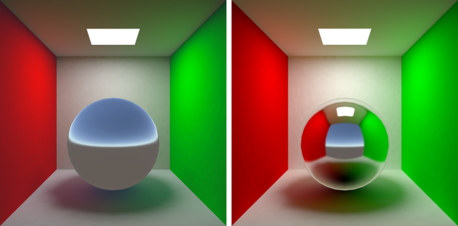
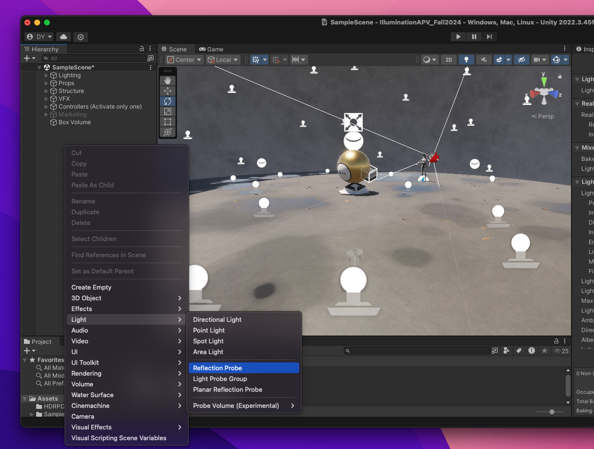

# 💡 HW 12: Illumination
???+ tip "Assignment Deadline"
    This assignment is due **Friday, November 15th** on [Brightspace](https://brightspace.usc.edu/).

    [Submit :fontawesome-solid-paper-plane:](https://brightspace.usc.edu/){ .md-button .md-button--primary }

<iframe src="https://giphy.com/embed/XyJZNF8BY9X38ifJMt" width="100%" height="100%" style="position:absolute" frameBorder="0" class="giphy-embed" allowFullScreen></iframe>

<a href="https://giphy.com/gifs/here-theyre-heeere-XyJZNF8BY9X38ifJMt">via GIPHY</a>

## Lighting

With Unity, you can achieve realistic lighting that is suitable for a range of art styles. Lighting comes in three formats or modes. To assign a `Mode`, select the Light in your `Scene`
 and, in the `Light Inspector window`, select `Mode`.

* **[Realtime](https://docs.unity3d.com/Manual/LightMode-Realtime.html)**: Unity calculates and updates the lighting of Realtime Lights every frame at runtime. Unity does not precompute any calculations for Realtime Lights.
* **[Mixed](https://docs.unity3d.com/Manual/LightMode-Mixed.html)**: Unity performs some calculations for Mixed Lights in advance, and some calculations at runtime.
* **[Baked](https://docs.unity3d.com/Manual/LightMode-Baked.html)**: Unity pre-calculates the illumination from Baked Lights before runtime, and does not include them in any runtime lighting calculations.

In order to get started with adding lighting to your scene, add lighting and reposition it as needed in your scne. If you are using say, Baked Global Illumination, make sure the feature is turned on. Then, adjust each object's lighting settings accordingly. For baked lighting on objects, each object should be static. Finally, you may bake the lighting. A useful Unity package to help with visual effects is the [Post Processing package](https://docs.unity3d.com/Manual/PostProcessingOverview.html). 

### Volumetric Lighting
Unity's volume system is the main way to control the visual settings per camera in HDRP. Multiple volumes may share the same profile. We are able to adjust the size of the volume, contrast, saturation, and much more. When the camera enters the volume, the settings then are applied to the frame. 

### Dynamic Lighting

## Light Sources

Standard Abstract Light Types:

- **Point Light:** Also known as *omni lights* or *spherical*, they represent light that emanates from a single point outward in all directions. A point light has a position and color, which controls the hue and intensity of the light.

- **Spot Light:** Represents light from a specific location in a specific direction. These are commonly used for lights such as flashlights, headlights, and spot lights. A spot light has a position and an orientation, and optionally a falloff distance. The shape of the lit area is either a cone or a pyramid. 

- **Conical Spot Light:** The conical spot light is shaped like a cone, meaning it h as a circular bottom. The width of the cone is known as the *falloff angle*. 

- **Rectangular Spot Light:** A rectangular spot light is similar to the conical spot light except that it forms a pyramid bottom instead of a cone shaped bottom.

- **Directional Light:** This light represents light coming out from a point in a far away space in which all the rays of light can be considered parallel. Good examples of directional lights would be the sun and moon.

## Global Illumination

Our eyes works interpret light by picking up rays of light. These rays of light bounce around and everytime it hits an object, the light responds in a certain way depending on the object's properties. For example, the light may be absorbed or reflected depending on the object's properties it hits and the object's material. In computer graphics, we are now able to simulate light properties. Global illumination plays an essential part in simulating indirect lighting by serving as a set of algorithms whose purpose is to add more realistic lighting to 3D scenes. Global illumination simulates indirect lighting, like light bouncing and color bleeding. Global illumination is an important part of 3D animation and design that helps give it a more realistic feel. Without global illumination, objects simply would look right in certain cases, which would lead to pulling the audience out of the moment. It is also a group of techniques that model both direct and indirect lighting to provide realistic lighting results.

For example, in Unity you can have multiple objects of various colors where the colors are cast onto a reflective sphere. That effect is referred to as indirect lighting because the colored light isn't being cast directly from a light but rather is the result of light being cast onto a colored object which is then bleeding into the nearby reflective sphere. Global illumination plays a big role in getting this distinctive and often necessary look.  **Unity has two, main global illumination systems, which combine direct and indirect lighting - Progressive Lightmapper (baked) and Enlighten Realtime Global Illumination  (real-time).**

This act of light bouncing around is categorized into two types. Such algorithms take into account not only the light that comes directly from a light source (direct illumination), but also subsequent cases in which light rays from the same source are reflected by other surfaces in the scene, whether reflective or not (indirect illumination). Unity can calculate direct lighting, indirect lighting, or both direct and indirect lighting. The lighting techniques that Unity uses depends on how you configure your Project.

* **Direct Lighting**: Direct light is light that is emitted, hits a surface once, and is then reflected directly into a sensor (for example, the eye’s retina or a camera). 

* **Indirect Lighting**: Indirect light is all other light that is ultimately reflected into a sensor, including light that hits surfaces several times, and sky light. To achieve realistic lighting results, you need to simulate both direct and indirect light.

### Light Probes, Lightmaps, and Volumes

What are light probes? Light probes in Unity Scenes are ways to capture and use information about light that is passing through empty spaces. They store "baked" information about lighting in our scene - information about light passing through **empty space** in our scenes. In Unity, Light Probes are positions within the scene where the light is measured, or probed, during the bake. During runtime, the indirect light that hits dynamic GameObjects is approximated using the values from the nearest Light Probes to that object.

Light probes have two main use cases. The techniques we use for these use cases are not the same. 

* Provide high quality lighting including indirect bounced light

* Provide lighting information for static scenery when the scenery is using Unity's LOD system

Lightmaps, on the other hand, store lighting information about light hitting the **surfaces** in our scenes. 

### Realtime Global Illumination

### Screen Space Global Illumination

## Post-Processing
Post-processing is a vital part in making our games look and feel good through improved visuals, . This is important in making our games more fun to play and experience. 

## Unity Illumination
Illumination and lighting resources for Unity: 

* [**Unity Bloom:**](https://docs.unity3d.com/560/Documentation/Manual/PostProcessing-Bloom.html) In Unity, Bloom is a post-processing effect that creates a glow around bright areas by simulating light bleed, enhancing realism and visual appeal. It captures intense light sources and softly diffuses them, especially noticeable in high-luminance areas, adding atmosphere to scenes. Unity's bloom effect includes settings for intensity, threshold, and scatter, giving developers control over how much glow and spread is applied.
* Unity Asset Store Plugins
    * [**Kronnect Radient Global Illumination:**](https://store.kronnect.com/products/radiant-global-illumination) Radiant Global Illumination is a Unity asset that adds real-time global illumination to 3D scenes, enhancing lighting realism by simulating indirect light without pre-baking. It supports multiple rendering pipelines, various light sources, and works with both static and dynamic content. Key features include customizable light bounce, noise reduction filters, organic lighting options, and spatial settings for finer control. It’s compatible with Unity 2021.3+ for Windows, Mac, and high-end mobile devices but excludes VR support.
    * [**Erebus**:](https://assetstore.unity.com/packages/vfx/shaders/erebus-ray-traced-ao-shadows-with-sdfs-235851?srsltid=AfmBOoolxETujoM_LBw1A39Z6RgooHBbM_WBMtw63jmvCUcO8oXAk_LI) The Erebus Unity plugin offers real-time ray-traced ambient occlusion (AO) and shadow effects using signed distance fields (SDFs) for enhanced realism in lighting and shadows. It works across Unity’s Built-in, Universal, and High Definition Render Pipelines (URP, HDRP) and is suitable for dynamic and static content. It’s particularly useful for creating detailed, high-quality visual effects with efficient performance on compatible Unity versions.
* [**Unity 6 URP RenderGraph:**](https://unity.com/resources/introduction-to-urp-advanced-creators-unity-6) Render Graph in Unity's Universal Render Pipeline (URP) is a framework for managing rendering processes efficiently. It allows developers to define rendering steps in a modular, organized way, enabling better control over resource usage and rendering performance. Render Graph optimizes resource allocation, minimizes redundant processing, and provides tools for debugging and visualization, helping to streamline complex rendering tasks for real-time applications.
* [**Adaptive Prob Volumes (APVs) for URP and HDRP:**](https://docs.unity3d.com/6000.0/Documentation/Manual/urp/probevolumes-concept.html) APV generates densely placed probes in areas with more geometry, and fewer probes in areas with less densely placed objects, like the background of Scene. This volume-based system helps us automate the placement of probes rather than placing them by hand, enhancing your scene without manual setup. The automated placement system is useful in creating smoother, per-pixel lighting transitions, improving realism in both complex and sparse areas. APVs support lighting consistency across scenes and large areas through probe "bricks," and they include memory optimization through streaming. 
* [**Screen Space Global Illumination for HDRP:**](https://docs.unity3d.com/Packages/com.unity.render-pipelines.high-definition@14.0/manual/Override-Screen-Space-GI.html) Screen Space Global Illumination (SSGI) in Unity's High Definition Render Pipeline (HDRP) is a lighting feature that calculates diffuse light bounces using screen-space data. It supports ray marching, ray tracing, or a mixed mode for optimized lighting and shadow detail. SSGI dynamically adjusts to the scene’s geometry, improving lighting realism without baked lighting. This feature offers options for quality, denoising, and ray settings, enhancing visual fidelity in real-time environments.

## Problems

For this homework assignment, we will be experimenting with Unity's **Adaptive Probe Volumes (APV)** as part of Unity 6 and **Enlighten: Realtime Global Illumination**. We will be learning how to handle lighting setups and how to generate lighting. Please follow the steps below.

### Problem 1: Volumetric Lighting

???+ question "Step 1: Create HDRP Project"
    Create a new Unity HDRP project such as starting with the **High Definition 3D Sample** template in Unity. 

    

???+ question "Step 2: HDRP Tutorial"
    Step through the **High Definition Render Pipeline** tutorials. 

    

???+ question "Step 3: Clear Baked Lighting Data"
    Unbake all Lighting data. This way we can start with a base scene and recreate our own lighting.

    

???+ question "Step 4: Create a new Volume"
    Unity's volume system is the main way to control the visual settings per camera in HDRP. Multiple volumes may share the same profile. We are able to adjust the size of the volume, contrast, saturation, and much more. When the camera enters the volume, the settings then are applied to the frame. 

    First, lets create a new volume

    

???+ question "Step 5: Create a new Profile"
    Then, create a new profile

    

???+ question "Step 6: Add Override"
    Then, `Add Override` and `Color Adjustments`

    

???+ question "Step 7: Experiment!"
    Apply your overrides to your frame and try moving in and out of your volume. Try setting your Mode to `Global` or `Local`.
    We can adjust many things including the sky and post processing. 

    

???+ question "Step 8: Disable the Fog"
    Now lets try to set up the sky for HDRI with the volume system. This is done with a visual override. If we deselect the `Fog`, we can see that the HDRI unobstructed. 

    

???+ question "Step 9: Visual Environment"
    In your `Hierarchy` window, you may go to `Lighting` > `Volumes` > `Volume Global`. Then, in your `Inspector`, you will see `Visual Environment`. There, you can choose between four types of skies including: non-HDRI sky, HDRI Sky, Physically Based Sky, and Gradient Sky. 

    

???+ question "Step 10: Sky Exposure Values"
    Remember to make sure all your baked data is cleared so that we can see that in the absence, of proper indirect lighting, HDRP will always fall back to the sky probe. Now you can try adjusting the exposure values.

    

???+ question "Step 11: Sun Light"
    What if we would like to have bounce lighting? HDRP is physically based, so we can control the color temperature of the light using the Kelvin scale.  In your `Hierarchy` window, you may go to `Lighting` > `Directional Light Sun`. Then in your `Inspector` window, we can find the `Light` component and then the `Emission` tab. We can try using the **Day Light** preset. Now try experimenting with the **Shadows** override components and the **Indirect Lighting Controller** component. Adjusting the Indirect Lighting Controller values can be a quick way to dim unwanted ambient lighting without using Unity Global Illumination. 

    

### Problem 2: Realtime Global Illumination
Unity's Realtime Global Illumination (GI) system relies on Enlighten, so that lighting precomputes take minutes rather than hours. It is useful for Lights that change slowly and have a significant visual impact on our game. This includes the sun moving across the sky, or a slowly pulsating light in a closed corridor. 

This system allows us to work with **precomputed lighting**, which is the process of calculating the bounce of light around the static geometry within a scene in the Unity Editor and storing this data for use at run time. This process reduces the number of lighting calculations that must be performed at run time, allowing realtime bounced lighting while maintaining interactive frame rates. 

???+ question "Step 1: Read Documentation on Realtime GI"
    First read the documentation on Realtime Global Illumination: [Introduction to Realtime Global Illumination using Enlighten](https://docs.unity3d.com/Manual/realtime-gi-using-enlighten.html)

???+ question "Step 2: Enable Enlighten Realtime Global Illumination"
    Enable Realtime Global Illumination in your Scene by going to `Window` > `Rendering` > `Lighting` then enable `Realtime Global Illumination`.

    Recall that baked lightmaps are textures that store the lighting. They are cheap at runtime but take time to generate. To generate lightmaps, we use the `Lighting` window. Select `Baked Indirect` as your **Lighting Mode**.

    

    Then, select `Progressive GPU` as the progressive **Lightmapper**. 
    If you like, you may customize sample counts and denoising options. 
    Feel free to check out the documentation: [Enble Enlighten Realtime Global Illumination](https://docs.unity3d.com/Manual/realtime-gi-using-enlighten-use.html)

    

???+ question "Step 3: Baked Lightmaps"
    For the objects to participate in the Global Illumination (GI) computation, we will need to check **Contribute Global Illumination** in our meshes. Make sure they all receive lighting from our lightmaps. 
    
    

???+ question "Step 4: Reflection Probes"
    Reflection probes help capture local specular lighting. They are objects that can capture the surrounding environment into a cube map. The cube map is then used to provide specular lighting to the nearby objects. 
    
    Lets start with adding a **reflection probe** in front of the camera. 
    
    
    
    By default, it is a baked reflection probe and looks like a black sphere. Once baked, it has successfully captured the surrounding environment.

    

    To capture correct local reflections, we need to place more reflection probes. Updating the bounds, the capture point, and the fade distance for each probe can be a time-consuming task. 
    
    How should we place our relection probes? We can group them by the same lighting condition. If they have the same lighting condition, we can share the same reflection probe. Usually the more probes, the more exact the reflections. However, this will have a memory cost. 

    To test your reflections, you may change your materials to **Mirrors**. 

???+ question "Step 5: Generate Lighting"
    In the `Lighting` panel, we can then press on `Generate Lighting` to produce lightmaps. Using the Unity Realtime Global Illumination system with Enlighten, it should take a couple of minutes to generate or less than a minute. During this time, the lightmaps are gettting denoised, compressed, and stored as EXR.
    
    

???+ question "Step 6: Rendering Debugger"
    We may also visualize our work with the **Rendering Debugger**. Open the debugger by going to `Window` > `Analysis` > `Rendering Debugger`. When in **Play Mode**, we can press `LeftCtrl` + `Backspace` (`LeftCtrl` + `Delete` on macOS). On a console controller, press `L3` and `R3` (Left Stick and Right Stick).

    Feel free to read the documentation: [Rendering Debugger](https://docs.unity3d.com/Packages/com.unity.render-pipelines.universal@12.1/manual/features/rendering-debugger.html#how-to-access)

### Problem 3: Adaptive Probe Volumes
What about lighting of dynamic objects that cannot rely on baked lightmaps because they can move in very dark or bright parts of the scene. These objects need to be lit by a different type of lighting provided by lightprobes. 

Unity's legacy stystem is called the [Light Probe Group](https://docs.unity3d.com/520/Documentation/Manual/class-LightProbeGroup.html). It relies on a network of probes to capture lighting. This network is usually set up by hand, and the artists will need to place every probe manually, which is very time consuming. Usually, the probe needs to be placed around areas of highlighting contrast to capture as much lighting variations as possible. Not only do lightmap UVs need to be authored, probes need to be placed for dynamic objects to be lit correctly, and we will need to deal with large textures that is heavy on our application's runtime memory. This solution is usually efficient on mobile, as the lighting calculations are extremely cheap. However, it is not great visually for high-end scenarios. 

Unity's new, [Adaptive Probe Volumes (APV)](https://docs.unity3d.com/6000.0/Documentation/Manual/urp/probevolumes-concept.html) system gives us a new way to apply global illumination in our worlds. It is a new and more robust **light baking architecture** to authoring light-probe lit environments, a group of lightprobes that Unity places automatically based on the geometry density in our Scene, to build bake indirect lighting.

Because it is adaptive, APV generates more densely placed probes in areas with more geometry and fewer probes in areas with less placed objects, like the background of a Scene. This system also allows for objects to receive many lighting variations on its surface and receives correct per pixel lighting, something the legacy system cannot provide. 

???+ question "Step 1: Light Probe Group"
    Unity's legacy [Light Probe Groups](https://docs.unity3d.com/2019.3/Documentation/Manual/class-LightProbeGroup.html) are a collection of points that store information about light hitting surfaces in a scene. They can be used to add high-quality light to moving objects, including indirect bounced light. In your `Hierarchy` > `Lighting` > `Light Probe Group`, check out the `Inspector` window. You will see yellow probes scattered around the Scene. These probes were all manually placed by someone who worked on a project!!
    
    

???+ question "Step 2: Enable APV"
    By default, the project is using the **Light Probe Group** system. We need to switch our system over to **Adaptive Probe Volumes**. 

    First:
    
    * From the main menu, select `Edit` > `Project Settings` > `Quality` > `HDRP`.
    * Expand `Lighting` > `Light Probe Lighting`.
    * Set `Light Probe System` to `Probe Volumes`. 
    
    

    Then:
    
    * Select the `Graphics` > `Pipeline Specific Settings` > `HDRP` tab.
    * Go to Frame Settings.
    * Expand `Camera` > `Lighting` and enable `Probe Volumes`.

    

    Finally, to make sure our reflection probes also capture lighting data from APV, we should also do the following: 

    * Expand `Realtime Reflection` > `Lighting` and enable `Probe Volumes`.
    * Expand `Baked` or `Custom Reflection` > `Lighting` and enable `Probe Volumes`.

    

    Feel free to reference the documentation: [Use Adaptive Probe Volumes (HDRP)](https://docs.unity3d.com/Packages/com.unity.render-pipelines.high-definition@17.0/manual/probevolumes-use.html)

???+ question "Step 3: Add an APV to the Scene"

    To automatically generate probes, you can create an **Adaptive Probe Volume**. While you’re working, you can see live updates, allowing you to preview probe placement without baking. These updates are based on bricks and the subdivision levels you previously defined, which then adjusts according to the proximity of nearby geometry.

    * From the main menu, select `GameObject` > `Light` > `Probe Volume (Experimental)` > `Probe Volume`.

    

    * Select the `Probe Volume` GameObject and under the `Lighting` tab, uncheck **Realtime Lighting** since using Enlighten at the same time is not compatible. 

    

    * In the Inspector for the Adaptive Probe Volume, set Mode to `Global` to make this Adaptive Probe Volume cover your entire Scene.

    

???+ question "Step 4: Light and Mesh Renderer Settings"

    * To include a Light in an Adaptive Probe Volume’s baked lighting data, open the Inspector for the Light then set the **Light Mode** to `Mixed` or `Baked`.

    

    * To include a **GameObject** in an Adaptive Probe Volume’s baked lighting data, open the Inspector for the GameObject and enable `Contribute Global Illumination`. 

    * To make a GameObject receive baked lighting, open the Inspector for the GameObject and set `Receive Global Illumination` to `Light Probes`.

    

???+ question "Step 5: Bake your Lighting"
   
    * From the main menu, select `Window` > `Rendering` > `Lighting`. If you do not see this panel, instead of `Lighting`, visit `Light Explorer` > `Light Probes`.

    * Select the `Adaptive Probe Volumes` panel or `Light Probes` tab.
    

???+ question "Step 6: Baking Sets with APV"
    Open up the **Probe Volume Settings (Experimental) panel under `Window` > `Rendering`. 
    

    Then, create `New Baking Set` and add your scene. 
    

???+ question "Step 7: Generate Lighting"
    Generate Lighting precomputes all lighting data, including light probes, which you can visualize in your scene. As previewed using bricks, you can see the various subdivision levels that have been applied when placing probes.
    * Select `Generate Lighting`.
    

???+ question "Step 8: Probe Placement with APV"
   
    APV is a volume-based system that automates the placement of probes rather than placing them by hand. To control globally how probes are placed in the world, you can use the **Probe Volume Settings** tools. 

    The general settings tab for APV lets you control parameters like Min and Max Probe Spacing to control the distances between probes. By default, dense areas will use the highest resolution, while areas with less geometry will use lower density levels. This automatic and adaptive behavior ensures efficient resource allocation, focusing on areas where they are most needed.

    

???+ question "Step 9: Light Leaking"
    However, a problem with automated probes placement is that sometimes probes can sometimes end up inside objects and create invalid lighting data. This can produce **light leaking**, especially when dealing with high-contrast lighting. However, the Unity APV system can automatically mark probes within objecas as invalid, such as the ones between floors and walls. 

    The APV system also has a virtual offset that will slightly move the probes in case they are inside the geometry or too close to their surface. Within debug view, we can see how much the probes have been nudged before the irradiance was captured. 

    

## Resources and Links
* [Unity Manual: Introduction to Lighting](https://docs.unity3d.com/Manual/LightingInUnity.html)
* [Unity Learn: Get Started with Lighting](https://learn.unity.com/tutorial/get-started-with-lighting?pathwayId=61a65568edbc2a00206076dd&missionId=61a106efedbc2a5554f0dcba)
* [Realistic 2D Lights & Shadows in Unity](https://www.youtube.com/watch?v=-gzw_DHfoKU&t=12s&ab_channel=WillyDev)
* [LIGHTING in Unity](https://www.youtube.com/watch?v=VnG2gOKV9dw&t=229s&ab_channel=Brackeys)
* [Finding Next-Gen – Part I – The Need For Robust (and Fast) Global Illumination in Games](https://colinbarrebrisebois.com/2015/11/06/finding-next-gen-part-i-the-need-for-robust-and-fast-global-illumination-in-games/)
* [Understanding Global Illumination](https://www.pluralsight.com/blog/film-games/understanding-global-illumination)
* [New ways of applying global illumination to your worlds in Unity 6](https://unity.com/blog/engine-platform/new-ways-of-applying-global-illumination-in-unity-6)
* [Exploring Post-Processing in Unity](https://blog.logrocket.com/exploring-post-processing-unity/)
* [Lighting tutorial: 4 techniques to light environments in Unity | Unite 2022](https://www.youtube.com/watch?v=DlxuvvYZO4Q&t=1494s)

## Submission

!!! note "Illumination"

    Please share three videos of what you have created - one for each problem on BrightSpace. Screenshots will not count and will be marked as incomplete.

<!-- - [x] URP is better when it comes to optimization for virtual reality experiences 
- [x] When developing for the Oculus Quest, HDRP has a high performance cost
- [x] URP is better for projects that need to run on a variety of devices including older hardware
- [x] HDRP is useful for highly realistic rendering

    - [x] Continue working off of your Unity URP project. Make sure there are 3D objects in your scene so that you can visualize lighting
    - [x] Read the documentation on Adaptive Probe Volumes: [Introduction to Adaptive Probe Volumes](https://docs.unity3d.com/6000.0/Documentation/Manual/urp/probevolumes-concept.html)
    - [x] Create or start with a Unity URP project 
    - [x] Complete the  tutorial  -->

<!-- First, please create a Unity URP project or start with an existing URP project with 3D objects within the scene. For the first problem, you may complete the equivalent in Unity HDRP. The second problem depends on Unity URP. -->