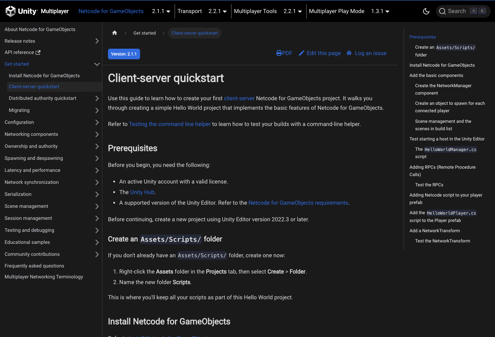
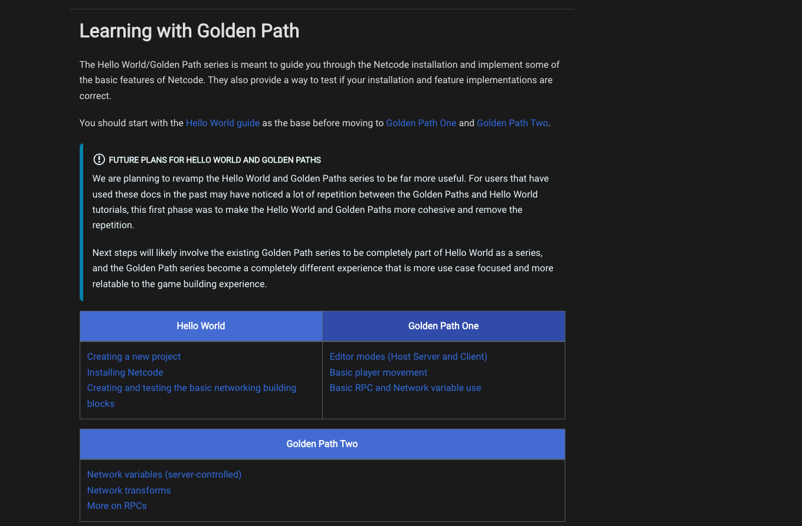
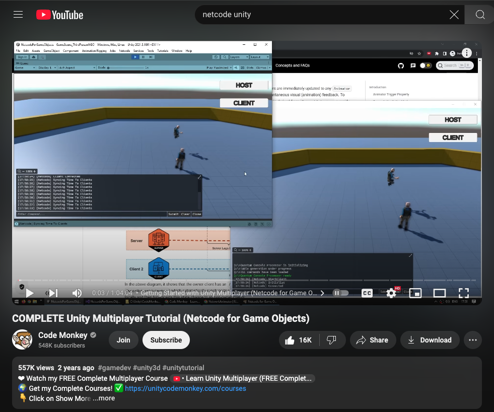

# 🏄 HW 13: Netcode Multiplayer
???+ tip "Assignment Deadline"
    This assignment is due **Friday, November 22nd** on [Brightspace](https://brightspace.usc.edu/).

    [Submit :fontawesome-solid-paper-plane:](https://brightspace.usc.edu/){ .md-button .md-button--primary }

## Resources and Links
* [Unity Multiplayer](https://docs-multiplayer.unity3d.com/)
* [Code Monkey's COMPLETE Unity Multiplayer Tutorial](https://www.youtube.com/watch?v=3yuBOB3VrCk&t=197s)
* [FishNet: Networking Evolved](https://fish-networking.gitbook.io/docs)
* [Photon: Multiplayer for Unity](https://www.photonengine.com/pun#)

## Submission

!!! note "Part 1: Get started with Netcode"

    Read about Unity's [Netcode for GameObjects](https://docs-multiplayer.unity3d.com/netcode/current/about/). Then, complete the [Install Netcode for GameObjects](https://docs-multiplayer.unity3d.com/netcode/current/installation/) and [Client-server quickstart](https://docs-multiplayer.unity3d.com/netcode/current/tutorials/get-started-ngo/) tutorials.

    

!!! note "Part 2: Learning with Golden Path"

    Complete the [Learning with Golden Path](https://docs-multiplayer.unity3d.com/netcode/current/tutorials/goldenpath_series/gp_intro/) series including the **Hello World** guide, **Golden Path One**, and **Golden Path Two**. 

    

!!! note "Part 3: CodeMonkey Unity Multiplayer Tutorial (Netcode for Game Objects)"

    Watch Code Monkey's tutorial on Netcode: [COMPLETE Unity Multiplayer Tutorial (Netcode for Game Objects)](https://www.youtube.com/watch?v=3yuBOB3VrCk&t=197s). Upon completion of this homework assignment, please take a video of your multiplayer working and a screenshot that you have watched the entire YouTube channel. Please submit on BrightSpace.

    