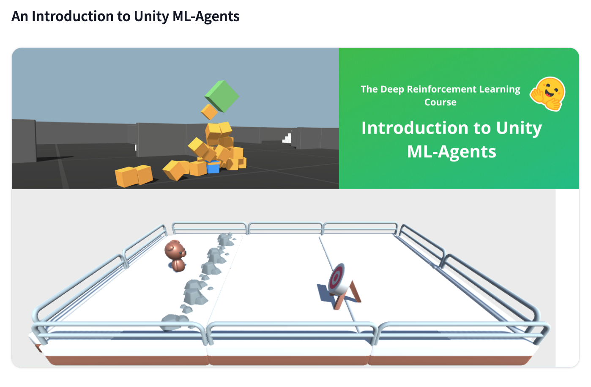
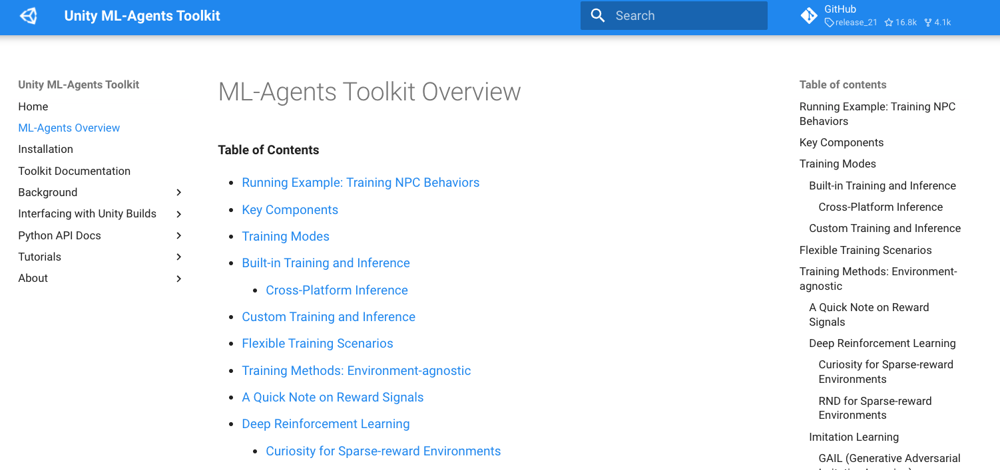

# 🤖 HW 13: ML-Agents Toolkit

!!! tip "Assignment Deadline"
    [Gradescope](https://www.gradescope.com/) assignment due **Friday, April 5th 2024**

    [Submit :fontawesome-solid-paper-plane:](https://www.gradescope.com/courses/696965/assignments/3876770){ .md-button .md-button--primary }

## Unity Muse

Unity MUSE (Machine Learning, Simulation, and Environment) is a tool within the Unity ecosystem designed to facilitate the creation and training of AI models using Unity’s simulation capabilities. MUSE provides an integrated environment for developing machine learning models, particularly those focused on reinforcement learning, by leveraging Unity's simulation engine. This tool is useful for creating intelligent agents that can interact with and learn from virtual environments, making it a valuable resource for AI researchers, game developers, and engineers working on simulations and autonomous systems. Unity MUSE simplifies the process of training AI by offering a seamless interface between Unity's powerful simulation capabilities and machine learning frameworks, allowing users to build, train, and deploy intelligent agents more efficiently.

##  Unity ML-Agents Toolkit

The Unity Machine Learning Agents Toolkit (ML-Agents Toolkit) is an open-source resource that allows games and simulations to be used as training environments for intelligent agents. With an easy-to-use Python API, you can train agents using methods like reinforcement learning, imitation learning, neuroevolution, and other machine learning techniques. The toolkit also includes PyTorch-based implementations of cutting-edge algorithms, enabling game developers and hobbyists to effortlessly train intelligent agents for 2D, 3D, and VR/AR games. These agents can be utilized for various purposes, including managing NPC behavior in different scenarios (such as multi-agent and adversarial settings), automating game testing, and evaluating game design decisions before release. 

## Resources and Links
* [ML-Agents Toolkit Overview](https://unity-technologies.github.io/ml-agents/ML-Agents-Overview/)
* [Deep RL Course](https://huggingface.co/learn/deep-rl-course/en/unit5/introduction)

## Submission

!!! note "ML-Agents Toolkit Overview"

    Read about Unity's [ML-Agents Toolkit](https://unity-technologies.github.io/ml-agents/ML-Agents-Overview/)

    

!!! note "An Introduction to Unity ML-Agents"

    Complete the [Introduction to Unity ML-Agents](https://huggingface.co/learn/deep-rl-course/en/unit5/introduction) tutorial

    