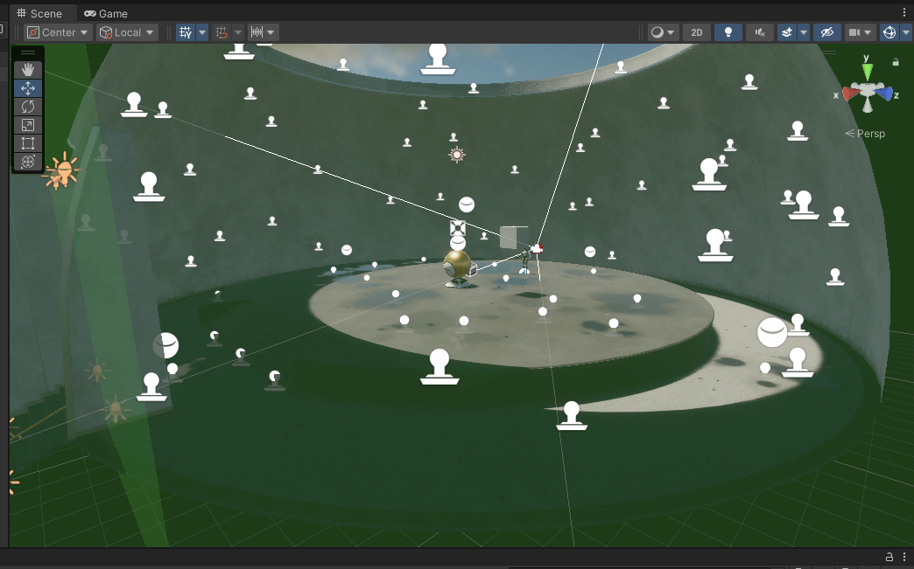

# 👼 HW 14: Metahumans
???+ tip "Assignment Deadline"
    This assignment is due **Friday, November 29th** on [Brightspace](https://brightspace.usc.edu/).

    [Submit :fontawesome-solid-paper-plane:](https://brightspace.usc.edu/){ .md-button .md-button--primary }

## Digital Humans

## Problems

### Problem 1: Character

???+ question "Step 1: Documentation"
    Read Unreal's [documentation](https://dev.epicgames.com/documentation/en-us/metahuman/creating-a-metahuman-in-metahuman-creator) on creating Metahumans. Please not that you must be workin in Unreal Engine 5 or above. 

    

???+ question "Step 2: Create Character"
    If you are on Windows, please install the [MetaHuman Plugin](https://www.fab.com/listings/055a6486-ad17-4590-aa1e-261d47f7f041) from the Marketplace. Currently, the MetaHuman Plugin does not work on Linux and MacOS (unless I am mistaken). 

    

    If you are unable to access the MetaHuman Plugin, you may work with the [MetaHuman Creator](https://www.epicgames.com/id/login?response_type=code&redirect_uri=https%3A%2F%2Fmetahuman.unrealengine.com%2Feos-login-redirect&scope=basic_profile&client_id=xyza7891OORp4qeFMsqG8MGwJLsun9Tb) platform. 

    

    Both MetaHuman Plugin and MetaHuman Creator allow you to design your own character; however, in my experience, MetaHuman Creator seemed to be more laggy.

### Problem 2: Live Link

???+ question "Step 1: Light Leaking"
    Hello

    

???+ question "Step 2: Light Leaking"
    Hello

    

### Problem 3: Calibrating
???+ question "Step 9: Light Leaking"
    Hello

    

???+ question "Step 9: Light Leaking"
    Hello

    

### Problem 4: Deepfake

???+ question "Step 9: Light Leaking"
    Hello

    

## Resources and Links
* [Unity Multiplayer](https://docs-multiplayer.unity3d.com/)
* [Code Monkey's COMPLETE Unity Multiplayer Tutorial](https://www.youtube.com/watch?v=3yuBOB3VrCk&t=197s)
* [FishNet: Networking Evolved](https://fish-networking.gitbook.io/docs)
* [Photon: Multiplayer for Unity](https://www.photonengine.com/pun#)

## Submission

!!! note "BrightSpace Submission"

    Please take a video of your MetaHumans character working with Live Link.
