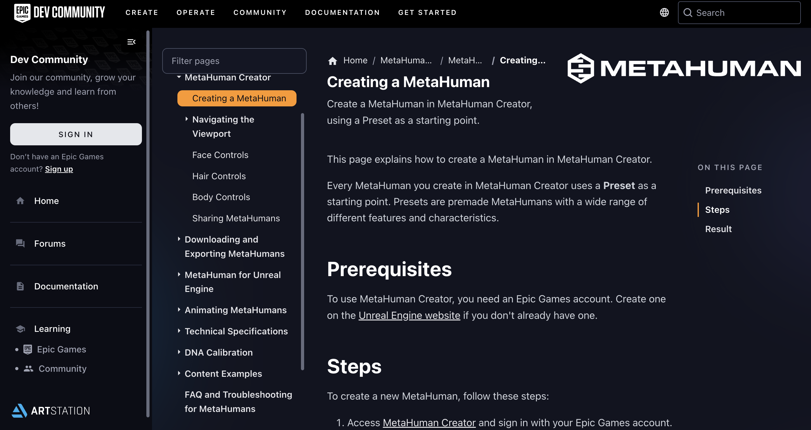

# 👼 HW 14: Metahumans
???+ tip "Assignment Deadline"
    This assignment is due **Friday, November 29th** on [Brightspace](https://brightspace.usc.edu/).

    [Submit :fontawesome-solid-paper-plane:](https://brightspace.usc.edu/){ .md-button .md-button--primary }

## Digital Humans

## Problems

### Problem 1: Design Character

???+ question "Step 1: Documentation"
    Read Unreal's [documentation](https://dev.epicgames.com/documentation/en-us/metahuman/creating-a-metahuman-in-metahuman-creator) on creating Metahumans. Please not that you must be workin in Unreal Engine 5 or above. 

    

???+ question "Step 2: Create Character"
    If you are on Windows, please install the [MetaHuman Plugin](https://www.fab.com/listings/055a6486-ad17-4590-aa1e-261d47f7f041) from the Marketplace. Currently, the MetaHuman Plugin does not work on Linux and MacOS (unless I am mistaken). 

    

    If you are unable to access the MetaHuman Plugin, you may work with the [MetaHuman Creator](https://www.epicgames.com/id/login?response_type=code&redirect_uri=https%3A%2F%2Fmetahuman.unrealengine.com%2Feos-login-redirect&scope=basic_profile&client_id=xyza7891OORp4qeFMsqG8MGwJLsun9Tb) platform. 

    

    Both MetaHuman Plugin and MetaHuman Creator allow you to design your own character; however, in my experience, MetaHuman Creator seemed to be more laggy.

### Problem 2: Animating Characters

???+ question "Step 1: Download Live Link"
    After creating our 3D Metahuman Character, we would like to animate our characters by mapping our facial expressions to our 3D model.
    Fist, install [Live Link for Unreal Engine](https://apps.apple.com/us/app/live-link-face/id1495370836) on your iOS devices. 

    

???+ question "Step 2: Calibrating"
    We need to take some calibration videos! 
    * Take a video of yourself looking: straight ahead, left angle, right angle, smile with teeth
    * Take our main calibration video making a variety of facial expressions.

    

???+ question "Step 4: Capture Source"
    Import footages and source files. One for each device.

    

???+ question "Step 5: IP Address"
    Make sure your IP address is matching. 

    

???+ question "Step 6: Metahuman Identity"
    Calibrate a new human face based on footage.

    

### Problem 3: Deepfake

???+ question "Step 1: Light Leaking"
    Hello

    

## Resources and Links
* [Live Link for Unreal Engine](https://apps.apple.com/us/app/live-link-face/id1495370836)
* [Animating with Live Link](https://dev.epicgames.com/documentation/en-us/metahuman/animating-metahumans-with-livelink-in-unreal-engine)
* [MetaHuman Creator](https://metahuman.unrealengine.com/)
* [Downloading and Exporting MetaHumans](https://dev.epicgames.com/documentation/en-us/metahuman/downloading-and-exporting-metahumans)
* [Unreal Engine Metahuman Deepfake Tutorial](https://www.youtube.com/watch?v=qJ596eXPqHc)
* [How to use Deep Live Cam Real-Time Face Swap and One-Click Video Deepfake with a Single Image](https://medium.com/@researchgraph/how-to-use-deep-live-cam-real-time-face-swap-and-one-click-video-deepfake-with-a-single-image-bfd3e948e0c0)
* [Integrate AI Characters with MetaHuman Avatars in Unreal Engine 5 - Convai](https://convai.com/blog/create-ai-characters-with-metahumans-unreal-engine)
## Submission

!!! note "BrightSpace Submission"

    Please take a video of your MetaHumans character working with Live Link.
