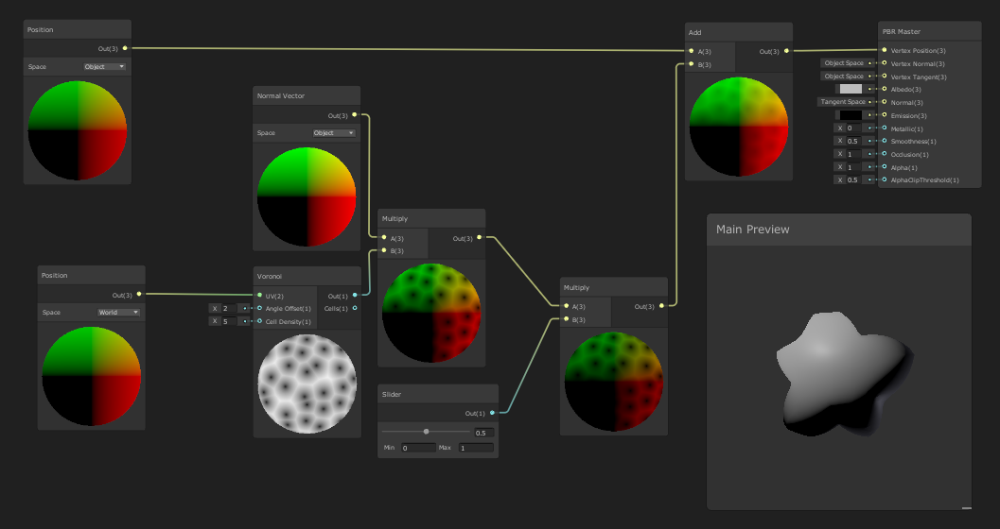
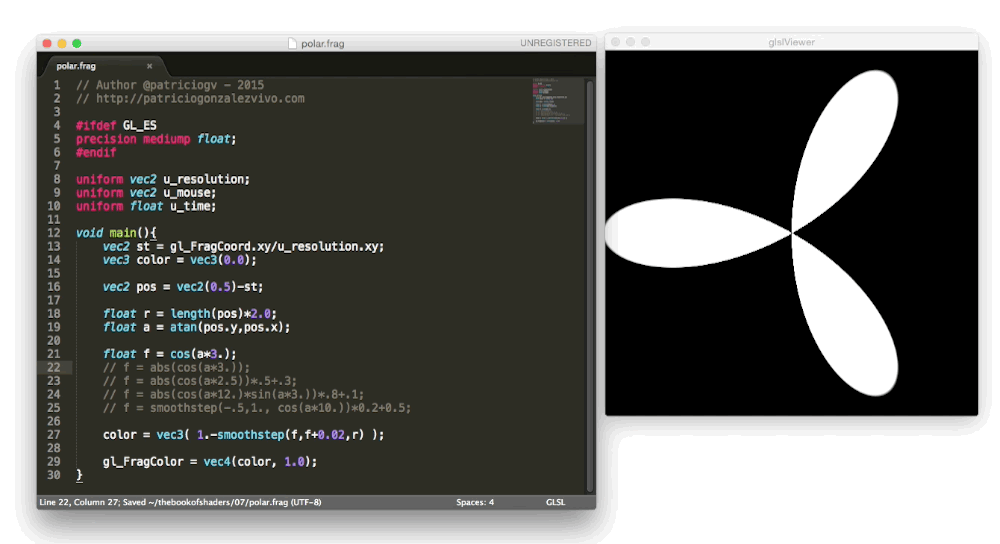
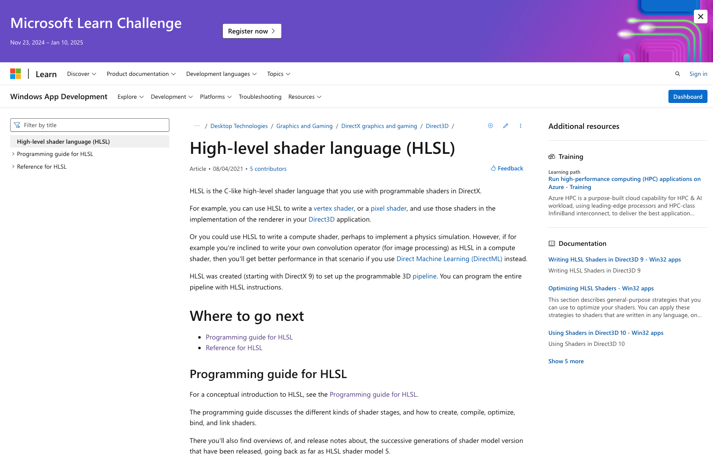
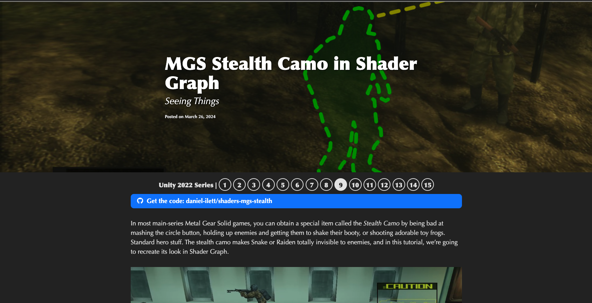

# ❄️ HW 15: Shaders and VFX

!!! tip "Assignment Deadline"
    [Gradescope](https://www.gradescope.com/) assignment due **Friday, December 6th 2024**

    [Submit :fontawesome-solid-paper-plane:](https://www.gradescope.com/courses/696965/assignments/3876770){ .md-button .md-button--primary }



Computer graphics allows us to create different things from a single pixel to a group of pixels. Pixel shading is one of many things that can be performed with computer graphics. Pixel shading refers to the process of computing a color for a pixel. On shader-based hardware, this is where your pixel shader is executed. In a basic forward renderer pass, where we are rendering objects into the frame buffer, the pixel is typically first lit and then fogged if fogging is being used. the output of a pixel shader consists of not only an RGB color, bu also an alpha value, which is usually interpreted as the "opacity" of the pixel, used for blending. 

## Shaders



A shader is a shader program, a program that runs on a GPU. In Unity, shaders are categorized as such: 

* The most common type of shaders are the ones part of the graphics pipeline. They are important because they help perform calculations that determine the color of pixels on the screen. In Unity, we work with Shader objects. 
* Compute shaders work outside of the regular graphics pipeline and perform calculations directly on the GPU
* Ray tracing shaders perform calculations related to ray tracing

Shaders are an important part of the computer graphics rendering pipeline because they inform the computer how to render and shade objects within a scene. Shaders can powerfully enable speed and detail enhancements in a program and can provide special effects in 2D and 3D computer graphics. 

## HLSL



HLSL is similar to the shader language, "Cg", which is a shader language developed by NVIDIA and GLSL, the shading langiage used in OpenGL. HLSL is the language that is behind Unity's shaders, a flexible and powerful shader that can be used within the context of Unity and other contexts. We can write many different kinds of shaders, they usually come in six forms including vertex shaders, geometry shaders, pixel shaders, compute shaders, ray tacing shaders, and tessellation shaders. Microsoft also uses this language for their Direct3D API to create GPU programs.

Here is an example of HLSL Shader code from [Microsoft's Documentation](https://learn.microsoft.com/en-us/windows/win32/direct3dhlsl/dx-graphics-hlsl-writing-shaders-9). This example uses a structure to provide multiple vertex shader inputs. 

=== "HLSL"

```shell
vector vClr;

struct VS_INPUT
{
    float4 vPosition : POSITION;
    float3 vNormal : NORMAL;
    float4 vBlendWeights : BLENDWEIGHT;
};

struct VS_OUTPUT
{
    float4  vPosition : POSITION;
    float4  vDiffuse : COLOR;

};

float4x4 mWld1;
float4x4 mWld2;
float4x4 mWld3;
float4x4 mWld4;

float Len;
float4 vLight;

float4x4 mTot;

VS_OUTPUT VS_Skinning_Example(const VS_INPUT v, uniform float len=100)
{
    VS_OUTPUT out;

    // Skin position (to world space)
    float3 vPosition = 
        mul(v.vPosition, (float4x3) mWld1) * v.vBlendWeights.x +
        mul(v.vPosition, (float4x3) mWld2) * v.vBlendWeights.y +
        mul(v.vPosition, (float4x3) mWld3) * v.vBlendWeights.z +
        mul(v.vPosition, (float4x3) mWld4) * v.vBlendWeights.w;
    // Skin normal (to world space)
    float3 vNormal =
        mul(v.vNormal, (float3x3) mWld1) * v.vBlendWeights.x + 
        mul(v.vNormal, (float3x3) mWld2) * v.vBlendWeights.y + 
        mul(v.vNormal, (float3x3) mWld3) * v.vBlendWeights.z + 
        mul(v.vNormal, (float3x3) mWld4) * v.vBlendWeights.w;
    
    // Output stuff
    out.vPosition    = mul(float4(vPosition + vNormal * Len, 1), mTot);
    out.vDiffuse  = dot(vLight,vNormal);

    return out;
}
    
```

**Important notes about HLSL syntax:**

* **DirectX 9-style syntax**: Uses sampler2D, tex2D(), and similar functions. This syntax works on all platforms and is considered legacy syntax
* **DirectX 10+ style syntax**: Uses Texture2D, SamplerStatea and .Sample() functions. Some forms of this syntax do not work on OpenGL platforms because textures and samplers are not different objects in OpenGL.
* It is important to note the different HLSL syntax because different hardware may be specific in what they need

## Shader Graph


In Unity, Shader Graph is a tool that helps build shaders in a visual way. Instead of writing code, we are able to use a node-based system to create a graph framework. It is great in giving instant feedback that reflects our changes. 

## Visual Effect Graph


Unity's Visual Effect Graph (VFX Graph) allows you to create simple and complex visual effects from a node-based programming language that combines blocks, nodes, and sequences. These effects can range from common particle behaviors to complex scene simulations. Together, these nodes can be combined as building blocks to created advanced procedural effects. 


According to the Unity Manual, the Visual Effect Graph is useful for:

* Create one or multiple Particle Systems.
* Add static meshes and control Shader properties.
* Create properties to customize the instances you use in the Scene.
* Create events to turn parts of your effect on and off. You can then send these events from the Scene via C# or Timeline.
* Extend the library of features by creating sub-graphs of the Nodes that you commonly use.
* Use a Visual Effect Graph in another Visual Effect Graph. For example, you can reuse and customize a simple but configurable explosion in more complex graphs.
* Previews changes immediately, so you can simulate effects at various rates and perform step-by-step simulation. For instructions on how to install the Visual Effect Graph, see Getting started with Visual Effect Graph.

## Problems
???+ question "ShaderGraph with Unity"
    Please follow the guides linked and reach at least **Part 6**. 
    
    * GitHub: [Intro to Shader Graph in Unity 2022](https://github.com/daniel-ilett/shader-graph-basics-2022-3?tab=readme-ov-file)
    * Tutorial: [MGS Stealth Camo in Shader Graph](https://danielilett.com/2024-03-26-tut7-9-mgs-stealth-camo/)

    

## Resources and Links
* [Unity Manual: Visual Effect Graph](https://docs.unity3d.com/Packages/com.unity.visualeffectgraph@12.0/manual/index.html)
* [Introduction to the VFX Graph in Unity](https://unity.com/how-to/introduction-vfx-graph-unity)
* [Unity VFX Graph](https://www.youtube.com/watch?v=7bMOhNUA1bI&list=PLpPd_BKEUoYhN8CiOoNLTSVh-7U5yjg3n&ab_channel=GabrielAguiarProd.)
* [Shaders Introduction](https://docs.unity3d.com/Manual/shader-introduction.html)
* [HLSL - Ronja's tutorials](https://www.ronja-tutorials.com/post/002-hlsl/)
* [Unity-Shader-Basics-Tutorial](https://github.com/Centribo/Unity-Shader-Basics-Tutorial)
* [High-level shader language (HLSL)](https://learn.microsoft.com/en-us/windows/win32/direct3dhlsl/dx-graphics-hlsl)
* [The Book of Shaders by Patricio Gonzalez Vivo and Jen Lowe](https://thebookofshaders.com/04/)

## Submission

!!! note "BrightSpace Submission"

    Please take a video of the shaders you have created.