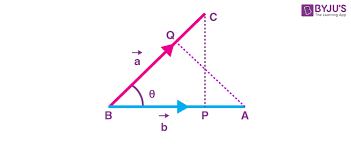
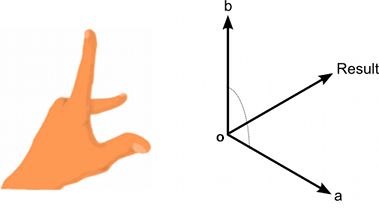

# 🍔 HW 16: Dot & Cross Product

!!! tip "Assignment Deadline"
    [Gradescope](https://www.gradescope.com/) assignment due **Friday, April 26th 2024**

    [Submit :fontawesome-solid-paper-plane:](https://www.gradescope.com/courses/696965/assignments/3876770){ .md-button .md-button--primary }

<div style="width:100%"><div style="height:0;padding-bottom:56.25%;position:relative;width:100%"><iframe allowfullscreen="" frameBorder="0" height="100%" src="https://giphy.com/embed/95oDPmWBGhiZJZIGZZ/video" style="left:0;position:absolute;top:0" width="100%"></iframe></div></div>

## Vector Dot Product
When multiplying two vectors together, there are two types of vector products. The first vector product is the **dot product** or **inner product**. The dot product is important in video game programming, computer graphics, simulation, and AI.  Therefore, the dot product is an important concept and formula to grasp.

The name "dot product" comes from the dot symbol used in the notation: `a * b`. Just like the scalar-times-vector multiplication, the vector dot product is performed before addition and subtraction, unless parantheses are used to override this default order of operations. While we usually omit the multiplication symbol when multiplying two scalars or a scalar and a vector, we must not forget the dot symbol when performing a vector dot product. The dot product of two vectors is the sum of the products of corresponding components, resulting in a scalar.



**What does the vector dot product mean geometrically?**

The vector dot product is fundamental to almost every aspect of 3D math. There are two main ways to interpet the dot product:

* **Projection:** Assume that `a^` is a unit vector and `b` is a vector of any length. Now take `b` and project it onto a line parallel to `a^`. Then, we can define the dot product (`a^ * b`) as the signed length of the projection of `b` onto this line. This projection of `b` can be thought of as a shadow onto a. The result of a dot product is scalar, not a vector. The dot product `a * b` is equal to the signed length of the projection of `b` onto any line parallel to `a`, multiplied by the length of `a`.

* **Trigonometry:** We can also examine the dot product through the lens of trigonometry.


Unity has `Vector3.Dot` that gets the Dot Product of two vectors. The dot product is a float value equal to the magnitudes of two vectors multiplied to gether and then multiplied by the cosine of the angle between them. 

=== "C#"

``` c# title="DeclaringClasses.cs" linenums="1"
// detects if other transform is behind this object

using UnityEngine;
using System.Collections;

public class ExampleClass : MonoBehaviour
{
    public Transform other;

    void Update()
    {
        if (other)
        {
            Vector3 forward = transform.TransformDirection(Vector3.forward);
            Vector3 toOther = Vector3.Normalize(other.position - transform.position);

            if (Vector3.Dot(forward, toOther) < 0)
            {
                print("The other transform is behind me!");
            }
        }
    }
}
    
```
## Vector Cross Product
The other vector product is known as the **cross product**. The cross product is only applied in 3D mathematical situations and is not commutative. The term "cross product" comes from the symbol used in the notation `a x b`. We write the cross symbol, rather than omitting it as we do with scalar multiplication.



The cross product enjoys the same level of operator precedence as the dot product: multiplication occurs before addition and subtraction. When dot product and cross product are used together, the cross product takes precedence: `a * b x c = a * (b x c)`.

## Resources and Links
* [Vector3.Dot](https://docs.unity3d.com/ScriptReference/Vector3.Dot.html)
* [Vector3.Cross](https://docs.unity3d.com/ScriptReference/Vector3.Cross.html)
* [3D Math Primer for Graphics and Game Development](https://gamemath.com/)
* [Dot Product](https://tutorial.math.lamar.edu/classes/calcii/dotproduct.aspx)

## Submission

!!! note "GitHub Pull Requests"

    To receive credit for this homework assignment, please make sure you provide a link to your GitHub branch and name the branch as your first name. 
    Then assign Nile and Debbie as `Reviewers` and `Assignees` before you hit the green `Create Pull Request` button.

    

    

    