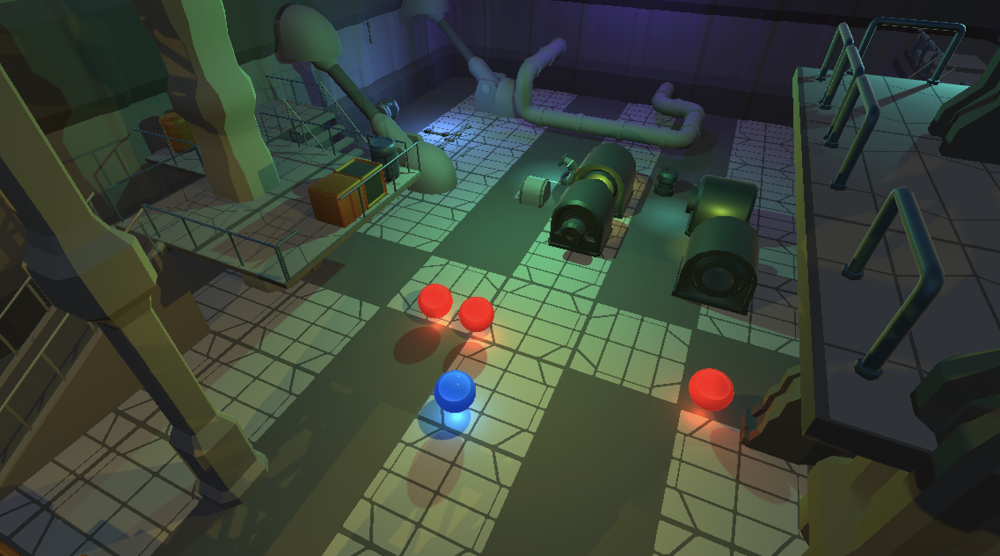
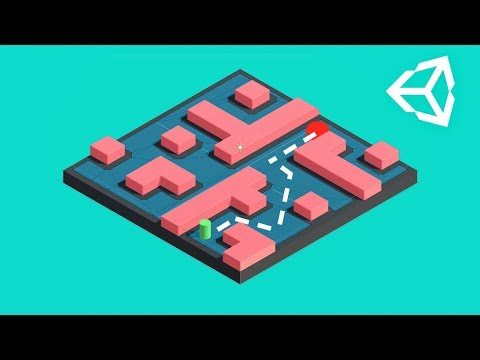
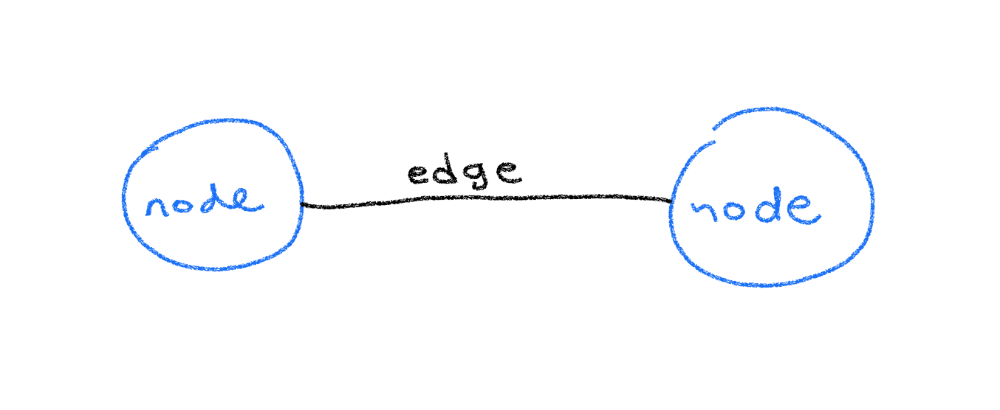
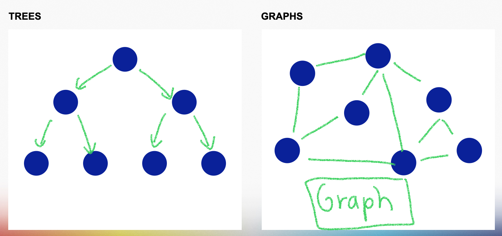
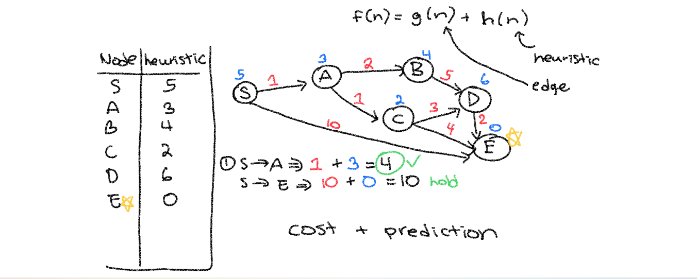

# 🎮 HW 17: A* Algorithm

!!! tip "Assignment Deadline"
    [Gradescope](https://www.gradescope.com/) assignment due **Friday, March 1st 2024**

    [Submit :fontawesome-solid-paper-plane:](https://www.gradescope.com/courses/696965/assignments/3876770){ .md-button .md-button--primary }

<iframe src="https://giphy.com/embed/zMukICnMEZmSf8zvXd" width="100%" height="100%" style="position:absolute" frameBorder="0" class="giphy-embed" allowFullScreen></iframe>

<a href="https://giphy.com/gifs/Giflytics-gif-jazminantoinette-giflytics-zMukICnMEZmSf8zvXd">via GIPHY</a>

## Game AI

Recently, we have seen a rise in machine learning applications deployed in different technological contexts. It has shaped how we experience technology and led to new doors of innovation and a mass market interest in artificial intelligence (AI). In modern games, heuristic algorithms play essential roles in navigating movement, coordinating behaviors, and running animations in video games. Common examples of game AI use cases include an AI agent moving efficiently to get to a location in the world
space, discovering items, and chasing a character.

Game AI refers to responsive and adaptive video game experiences typically created with pathfinding algorithms. Game AI focuses on the human psychology aspect by using and looking for fun, creative solutions to generate unique illusions of intelligence. While academic research pushes the boundaries of AI through novel approaches, games serve as important testbeds for virtual agents. Research or “real” AI addresses fields in machine learning, heuristics that can reason, decision making, neural networks, and much more. 

Artificial intelligence (AI) in games gives space for generative response and intelligent behavior. In game AI, this is common and integral part of non-playable characters (NPCs). The idea of AI opponents that responds depending on the play'er input is popular. However, AI is also used in areas that are not always visible to the player.

Game AI encompasses a broad set of algorithms that mimic intelligence. It can be argued that the video game AI is not true intelligence, but is instead, a set of computer programs that use sorting and matching algorithms to create the illusion of intelligent behavior.

## Pathfinding in Games
Graph theory is a powerful concept in the overall field of AI, including game AI and research AI. Graph-based representations help in analyzing strategic, deep learning, outcomes in games, and influencing AI decision making algorithms. 

In machine learning, graph theory refers to the application of mathematical structures known as graphs to model pairwise relations between objects. It provides a fundamental framework to handle complex data structures and is widely used in various machine learning algorithms and applications. 

Graphs in game theory allows us to model complex interactions between players in intuitive ways. They allow us to easily visualize relationships between say, players and the outcomes of their actions. In graph theory, a graph is a structured datatype that has nodes, which are entities that hold information, and edges, connections between nodes that hold information. Graphs are a type of Non-Euclidean data, which means they exist in a 3D space.

There are several types of graphs. Two of the most common are directed and undirected graphs. Each type of graph has its own set of properties that make it suitable for different types of games.

In a directed graph, the edges have a direction. Each edge goes from one node to another in a specific direction. They are useful in representing Ames in which players make sequential moves, such as chess or poker. 

Undirected graphs are graphs in which the edges do not have a direction. Each edge connects two nodes without indicating a specific direction. They are often used to represent games in which players make simultaneous moves, such as rock-paper scissors or the prisoner’s dilemma. 

Graphs and trees are similar with important differences. Both graphs and trees are non-linear data structures with a set of nodes and edges. Trees are a kind of graph, an undirected graph that is connected and contains no cycles. They have a unique node, known as the root.

## A* Pathfinding Algorithm

In Game AI, these behaviors are driven by the pathfinding process, usually with the A* Algorithm in which they are represented as graph nodes. 

The A* Algorithm expands upon neighboring nodes with high node metrics to find the best or most efficient path. This involves the constant calculation of the best paths between the
current location and the destination. Unlike other algorithms, the A* algorithm only finds the shortest path from a specified source to a specified goal, making it a specific-goal-directed heuristic. A heuristic in computer science tells the A* algorithm to estimate the minimum cost from any vertex n to the goal. 

Lets take a look at how and why the A* algorithm works.

Imagine a grid of nodes where we want to move from node A to node B. The A* search algorithm finds the shortest path from begin node to endpoint.

This is executed by examining all the surrounding nodes to find and determine each heuristic. 

## Resources and Links
* [Introduction to A*](https://theory.stanford.edu/~amitp/GameProgramming/AStarComparison.html)
* [Unity NavMesh](https://learn.unity.com/tutorial/unity-navmesh?projectId=5f60d859edbc2a001ee947ea#)
* [Getting Started with AI Pathfinding](https://learn.unity.com/project/beginner-ai-pathfinding)
* [Introduction to the A* Algorithm](https://www.redblobgames.com/pathfinding/a-star/introduction.html#:~:text=Graph%20search%20algorithms%20let%20us,explores%20equally%20in%20all%20directions.)
* [Pathfinding.js](https://qiao.github.io/PathFinding.js/visual/)

## Submission

!!! note "GitHub Pull Requests"

    To receive credit for this homework assignment, please make sure you provide a link to your GitHub branch and name the branch as your first name. 
    Then assign Nile and Debbie as `Reviewers` and `Assignees` before you hit the green `Create Pull Request` button.

    

    

    