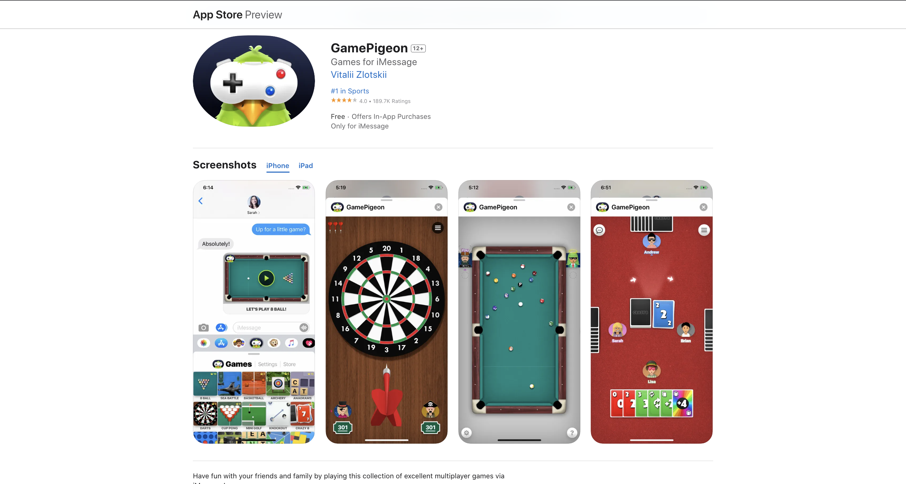

# HW 18: Technical Interviews

!!! tip "Assignment Deadline"
    [Gradescope](https://www.gradescope.com/) assignment due **Friday, March 1st 2024**

    [Submit :fontawesome-solid-paper-plane:](https://www.gradescope.com/courses/696965/assignments/3876770){ .md-button .md-button--primary }

# ☎️ Lab 10: Technical Interviews

<iframe src="https://giphy.com/embed/6Q3M4BIK0lX44" width="100%" height="100%" style="position:absolute" frameBorder="0" class="giphy-embed" allowFullScreen></iframe>

<a href="https://giphy.com/gifs/6Q3M4BIK0lX44">via GIPHY</a>

Here are some things I wish I knew while I was a student looking for design and software engineering. Applying to jobs is something I am continuously learning and is constantly evolving as the industry changes. My own resumes, cover letters, and portfolios are far from perfect -- it has been an iterative process! 

The ideal time frame to apply to internships is the **Fall Semester**. I've been noticing some companies have been starting to open their recruitment timelines and internship applications earlier and earlier -- some internship roles for Google and Tesla opened up over the summer! Don't worry if you don't have anything by the end of the semester, there will be opportunities to land a summer internship even when your summer started. That is what happened with me!

- [x] **Job Descriptions:** Look at current job openings and read their job descriptions even when you aren't applying to jobs or internships in the immediate future. Write down some of the software tools and technical skills they are looking for. Get familiar with the terminology, learn the tools, and put those skills in your resume. I will use **software engineering/development internship** job descriptions for the game industry as an example. 

    So I searched on Google Careers and LinkedIn for the following terms: `Software Engineer Games`, `Unity Engineer`, `Unity Developer`, `Game Developer`, `Technical Game Designer`. Breezing through the job descriptions, I have seen many job descriptions with the following skills:

    * **Programming Languages:** Must know `C++`, `C#` and ocassionally `Javascript`
    * **Math:** 3D Math, Linear Algebra and sometimes Computer Vision algorithms
    * **Game Engines:** `Unity`, `Unreal`, or sometimes `Godot`
    * **APIs:** `OpenGL`, `DirectX`, `Metal`, `Vulkon`, and other Unity APIs and packages

- [x] **Events and Conferences:** I have heard over and over again finding a job is about who you know -- your connections. Go to Career Faire and events/conferences you are passionate about. You will learn a lot about the industry you want to go into while meeting others with more experience who are already in the industry. Some conferences include the [Game Developer Conference](https://gdconf.com/), [SIGGRAPH](https://www.siggraph.org/), [Grace Hopper Conference](https://ghc.anitab.org/). 
- [x] **Recruiting Schedule:** It is recommended to apply to internships/jobs earlier than later. The closer to the posting date -- in most cases, is better. For example, applying to an internship within a week of its posting is better than applying three months in. This is in most cases though!
- [x] **Resume:** Do your own research on what makes a good resume. Look at examples online, get feedback from people who have seen and written a lot of resumes, and read up on what makes the [STAR Method](https://www.indeed.com/career-advice/resumes-cover-letters/star-method-resume) really effective. For many job applications your resume must pass a couple of screenings:
    * Automated Test based on an AI or RPA -- the stage before any human sees your resume. Your goal is to get a human to read your resume so they can see your shine!
    * Recruiter, Sourcers, or Human Resources -- They will look over your resume and see how closely your resume and work aligns with the **internal** job description. Some may have technical experience and will be able to spot from the get go if it looks like you have the skills. Some do not. 
    * Hiring Manager -- the hiring manager knows their stuff!! If you are a Game UI Developer, they know the packages you should know how to use.
- [x] **Portfolio:** This is where you can sell yourself on the visuals. You need to make sure your portfolio looks good and clean. Demonstrate your skills and personality here. Typically, portfolios include at least 3-4 four meaningful pieces that highlight the underlying themes of your course of study. While certain projects featured in the portfolio may be team projects, significant individual work must be the focus of the portfolio and its contents articulated in depth.

    **From the UC Berkeley portfolio archives:**
    

    **What is a portfolio?**

    * A reflection of your capabilities to potential employers — The first step to landing an interview!
    * A visual, project-oriented version of your resume (that complements your resume)
    * A framework for documenting your projects moving forward in your design career

    **What is the role of a portfolio?**

    * To show the final output of the projects the designer has worked on
    * To demonstrate the designer’s process
    * Is it to be a piece of art in itself, that showcases the designer’s vision

- [x] **Practice:** In both design and engineering internships I applied for, the companies have required me to pass technical assessments. In the past, this has included designing a game with Unity and on-demand coding exams.
- [x] **Interviewing:** Interviewing is a skill. Never talk yourself down!!!

## LinkedIn
???+ tip "How to find people who are #hiring"
    

    On LinkedIn, type in the name of a company in the search bar. In this example, I search for Blizzard Entertainment.

    Then, scroll down to the `People` section. Click on `See all people results`.

    

    In the header, click on the `Actively hiring` button. 

    LinkedIn will then show results for users who are hiring at Blizzard. 

???+ tip "Who to follow"
    On LinkedIn, feel free to try following people who regularly post openings or opportunities you are interested in. For example, some University recruiters will regularly post their internship opportunities on LinkedIn and are well connected with other recruiters. That means, you will see their activity and likes as well. **Remember that LinkedIn notifies anyone you follow!**
    
    

???+ tip "InMail Messaging"
    There are two ways of starting a direct conversation with another LinkedIn user. A connect request may be sent in which LinkedIn provides a 300 character message limit. The second way is to send InMail messages. InMails are awesome because you are able to attach files and write as much or as little as you like.
    

<!-- ## Technical Exams

???+ tip "HackerRank"
    Hi
    

???+ tip "CoderPad and Sandbox"
    Hi
    

???+ tip "How to prepare for technical exams"
    Hi
    

## Take Home Projects

???+ tip "GitHub"
    Hi
    

???+ tip "Presentation"
    Hi
     -->
