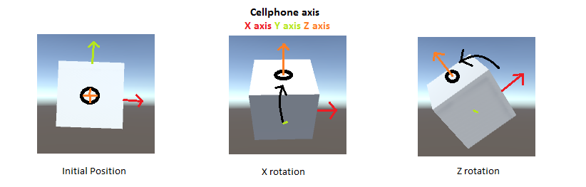

# 🍩 Lab 5: Quaternions

## Resources and Links
* [Maths - Quaternions](https://www.euclideanspace.com/maths/algebra/realNormedAlgebra/quaternions/)
* [Wolfram: Quaternion](https://mathworld.wolfram.com/Quaternion.html)
* [Wikipedia: Quaternion](https://en.wikipedia.org/wiki/Quaternion#:~:text=For%20example%2C%20the%20equation%20z,dimensional%20space%20of%20vector%20quaternions.)
* [Unity Scripting: Quaternion](https://docs.unity3d.com/ScriptReference/Quaternion.html)
* [C# Quaternions in Unity!](https://www.youtube.com/watch?v=hd1QzLf4ZH8&ab_channel=Unity)
* [Rotation and Orientation in Unity](https://docs.unity.cn/ru/2019.4/Manual/QuaternionAndEulerRotationsInUnity.html)
* [Unity Quaternion and Rotation Guide for Beginners](https://vionixstudio.com/2022/06/16/unity-quaternion-and-rotation-guide/)
* [Quaternions in Unity](https://medium.com/@spicuzza157/quatern-b5cf7b83b1d1)
* [Wikipedia: Gimbal Lock](https://en.wikipedia.org/wiki/Gimbal_lock)

## Quaternions

### Quaternions in Math
In Division Algebra, Quaternions are a method to represent a solid 3D object's three dimensional orientations or other rotational quantity. The algebra for Quaternions consists of 4 dimensions, aka 4 scalar variables that are added and multipled as a single unit. These variables are also known as **Euler Parameters** and hold one real dimension and 3 imaginary dimensions. Each of these imaginary dimensions has a unit value of the square root of -1, but they are different square roots of -1 all mutually perpendicular to each other, known as i,j and k. So a quaternion can be represented as $a + i b + j c + k d$.

For example, the equation $z^2 + 1 = 0$, has infinitely many quaternion solutions, which are the quaternions $z = b i + c j + d k$. The fundamental formula for Quaternion algebra is as follows: 

$$
a + i b + j c + k d
$$

As such, these "roots of -1" form a unit square in the 3D space of vector quaternions. It may seem strange that there are 3 square roots of -1, but we have to remember that we are working in 4 dimensions so there are at least 3 ways to get round from +1 to -1. It is not very practical to try to draw 4 dimensions in 2 dimensions

$$
b^2 + c^2 + d^2 = 1
$$

### Gimbal Lock

Gimbal lock is the loss of one degree of freedom in a three-dimensional, three-gimbal mechanism that occurs when the axes of two of the three gimbals are driven into a parallel configuration, "locking" the system into rotation in a degenerate two-dimensional space. (Wikipedia)

The term gimbal-lock can be misleading in the sense that none of the individual gimbals are actually restrained. All three gimbals can still rotate freely about their respective axes of suspension. Nevertheless, because of the parallel orientation of two of the gimbals' axes, there is no gimbal available to accommodate rotation about one axis, leaving the suspended object effectively locked (i.e. unable to rotate) around that axis. (Wikipeda)

<!-- ### Rotations in Unity -->

### Quaternions in Unity
Quaternions are useful in accurately representing rotations. They are compact, don't suffer from gimbal lock and can easily be interpolated. Unity internally uses Quaternions to represent all rotations and expects Quaternions to be normalized. Luckily in Unity, the individual Quaternion components (x,y,z,w) do not need to be individually accessed or modified. You can take the existing rotations and from there, construct new rotations to smoothly interpolate between two rotations. The Quaternion functions that you will use 9% of the time are:

* `Quaternion.LookRotation`
* `Quaternion.Quaternion.Angle`
* `Quaternion.Euler`
* `Quaternion.Slerp`
* `Quaternion.FromToRotation`
* `Quaternion.identity`
* `Quaternion.operator` rotate one rotation by another, or to rotate a vector by a rotation