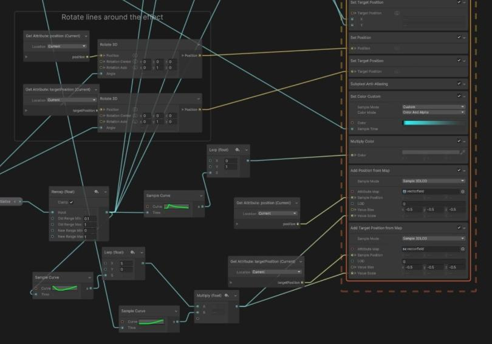

# 🌝 Lab 9: VFX Graph

## Resources and Links
* [Unity Manual: Visual Effect Graph](https://docs.unity3d.com/Packages/com.unity.visualeffectgraph@12.0/manual/index.html)
* [Introduction to the VFX Graph in Unity](https://unity.com/how-to/introduction-vfx-graph-unity)
* [Unity VFX Graph](https://www.youtube.com/watch?v=7bMOhNUA1bI&list=PLpPd_BKEUoYhN8CiOoNLTSVh-7U5yjg3n&ab_channel=GabrielAguiarProd.)

## Visual Effect Graph

Unity's Visual Effect Graph (VFX Graph) allows you to create simple and complex visual effects from a node-based programming language that combines blocks, nodes, and sequences. These effects can range from common particle behaviors to complex scene simulations. Together, these nodes can be combined as building blocks to created advanced procedural effects. 

According to the Unity Manual, the Visual Effect Graph is useful for:

* Create one or multiple Particle Systems.
* Add static meshes and control Shader properties.
* Create properties to customize the instances you use in the Scene.
* Create events to turn parts of your effect on and off. You can then send these events from the Scene via C# or Timeline.
* Extend the library of features by creating sub-graphs of the Nodes that you commonly use.
* Use a Visual Effect Graph in another Visual Effect Graph. For example, you can reuse and customize a simple but configurable explosion in more complex graphs.
* Previews changes immediately, so you can simulate effects at various rates and perform step-by-step simulation. For instructions on how to install the Visual Effect Graph, see Getting started with Visual Effect Graph.

