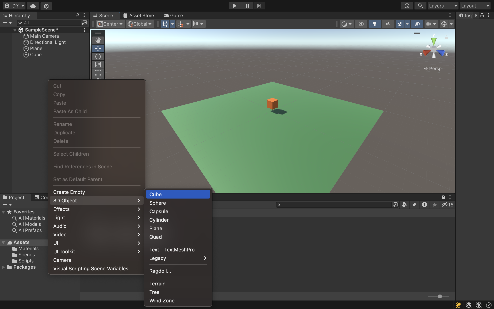
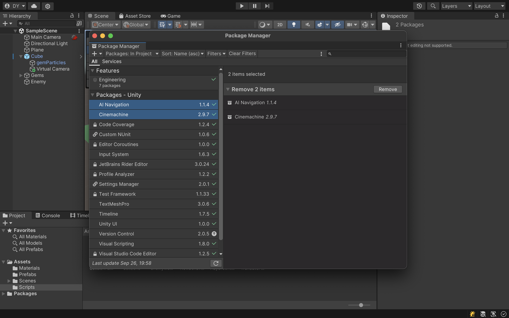
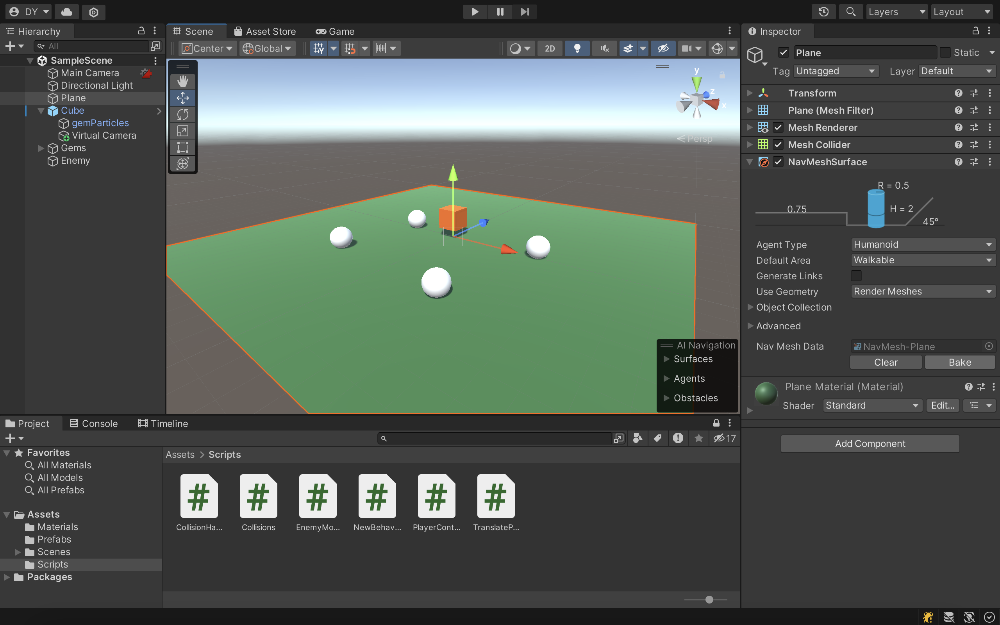

# ❤️ Midterm: Advocacy

!!! tip "Important Dates"
    **Checkpoint 1:** Monday, September 30th

    **First Playtest:** Monday, October 7th

    **Project Due:** Monday, October 14th

    **Second Playtest and Presentation:** Monday, October 16th


<div style="width:100%;height:0;padding-bottom:75%;position:relative;"><iframe src="https://giphy.com/embed/l1KVcrdl7rJpFnY2s" width="100%" height="100%" style="position:absolute" frameBorder="0" class="giphy-embed" allowFullScreen></iframe></div><p><a href="https://giphy.com/gifs/world-earth-l1KVcrdl7rJpFnY2s">via GIPHY</a></p>

## 📙 Introduction
The intent of this project is to build, run, and publish a 3D Unity game that tackles a social justice issue. You will be implementing your own version of a WebGL single-player video game with multiple levels. Please feel free to start with the 3D Unity project we have been working on in class as a starting point. I recommend making a copy of the class project to avoid confusing our class project from your project 1. If you would rather not use the 3D Unity project we have been working on in class, feel free to create a new 3D project from scratch. You may use any packages and assets as you see fit; however, please review the project requirements to ensure that you have integrated all required features. Last but not least - make sure the game is created with the Universal Render Pipeline ([URP](https://unity.com/srp/universal-render-pipeline)) and supports [Perforce](https://www.perforce.com/downloads/helix-visual-client-p4v) integration.

**By the end of Project 1, you will:** 

* Gain an understanding of the usage of Unity Engine - AI ([NavMesh](https://docs.unity3d.com/ScriptReference/AI.NavMesh.html)), [Cinemachine](https://docs.unity3d.com/Packages/com.unity.cinemachine@3.0/manual/index.html), and [Physics](https://docs.unity3d.com/Manual/PhysicsSection.html)
* Program player movement and collisions with [Transform.Translate](https://docs.unity3d.com/ScriptReference/Transform.Translate.html) and [Rigidbody](https://docs.unity3d.com/ScriptReference/Rigidbody.html)
* Understand the unique qualities and features that are important in designing and playing browser-based games
* Have experience designing, building, and publishing 3D Unity games for [WebGL](https://docs.unity3d.com/Manual/webgl-building.html)
* Collaborate and share projects via Perforce
* Share and receive feedback on [itch.io](https://itch.io/) and other online platforms
* Have a final product that you can add to your portfolio
* Build a browser-based game with [GitHub pages](https://pages.github.com/) and WebGL
* Experiment with Unity’s new [Input System](https://docs.unity3d.com/Packages/com.unity.inputsystem@1.8/manual/index.html)
* Learn how to build interactive and immersive websites. See some examples on [awwwards](https://www.awwwards.com/websites/unity/)


!!! warning "Policy on Collaboration and Cheating"
    For this project, you must work alone! Please carefully read the [Policy on Collaboration and Cheating](https://ece-classes.usc.edu/ee591/pvs_sem/fall09/acad_integ.pdf) to see what this means exactly. In particular, do not look for solutions online, use game templates, and generate code with AI such as ChatGPT. 


## 👾 The Game
Games have the power to reach, engage, and educate the public. No matter where we end up in life, sharing our knowledge, having and finding purpose, and inspiring others through our works are important in building a more equitable and sustainable world. Select a cause, set of values, or mission you care about and come up with an idea for a game that achieves meaningful social change. Pick something that matters to you and promote the cause and ideas through your game. Advocacy can take many forms such as storytelling, gameplay, and narrative mechanics that inspire players to take action. I challenge you to use your skills and creativity to create a short, fun, and complete game that challenges beliefs, investigates one’s purpose, uplifts others, and spreads compassion. 

Whatever your background is in, use your skills and expertise to create something fun with Unity that has a positive, educational, or impactful message.

**Some potential topics:**

* Animal rights
* Accessibility
* Mental Health
* Environmental justice
* Sustainability
* Civil Rights
* Education
* Health


## 🎬 Getting Started
???+ note "Step 1: Create a new Unity project"

    Unity URP is the best overall pipeline for general purposes. URP has higher rendering quality compared to Unity 3D. Unity 3D is recommended for prototypes that don't require high quality graphics.

    

???+ note "Step 2: Scene set up"

    Right click in the **Hierarchy** and create a new plane at (0, 0, 0) and a 3D cube at (0, 1, 0).

    

???+ note "Step 3: Package Manager"

    In the Windows/Package Manager tab, add [Cinemachine](https://github.com/Unity-Technologies/com.unity.cinemachine) and [AI Navigation](https://github.com/Unity-Technologies/NavMeshComponents/tree/master) packages. If you are workinng in Unity versions older than 2022, please add the **AI Navigation** package by name `com.unity.ai.navigation`

    

???+ note "Step 4: Rigidbody and Box Collider"

    In your Inspector panel, add the [Rigidbody](https://docs.unity3d.com/Manual/class-Rigidbody.html) and [Box Collider](https://docs.unity3d.com/Manual/class-BoxCollider.html) components. 

    


???+ note "Step 5: Camera and Cinemachine"

    Unity URP is the best overall pipeline for general purposes. URP has higher rendering quality compared to Unity 3D. Unity 3D is recommended for prototypes that don't require high quality graphics.

    

???+ note "Step 6: Opponent Movement and NavMesh"

    Unity URP is the best overall pipeline for general purposes. URP has higher rendering quality compared to Unity 3D. Unity 3D is recommended for prototypes that don't require high quality graphics.

    

    

    === "C#"

    ``` c# title="OpponenttMovement.cs" linenums="1"
    using System;
    using UnityEngine;
    using UnityEngine.InputSystem;
    using UnityEngine.AI;

    public class OpponentMovement : MonoBehaviour
    {
        [SerializeField] private NavMeshAgent opponent;
        [SerializeField] private Transform player;

        // Start is called before the first frame update
        void Start()
        {
            opponent = GetComponent<NavMeshAgent>();
        }

        // Update is called once per frame
        void Update()
        {
            opponent.SetDestination(player.position);
        }
    }
    ```

## 🎟️ Requirements

**Your game should include the following requirements and features:**

- [x] Short video game created with Unity 3D URP
- [x] Published as a WebGL build so that we can add it to a ReactJS website later on
- [x] Game can be short but must be playable. Can be single player
- [x] Game must look complete - use assets and sound effects 
- [x] If your game involves a scoring system, display score on screen
- [x] Include end and win game screens
- [x] The intro of the game is important. Design your intro with animations, instructions, and more
- [x] You must use Cinemachine, NavMesh, and integrate some sort of player movement and collisions in your game
- [x] Project must be shared with the instructors via Perforce
- [x] You may choose to use Unity's old or new input systems
- [x] And most importantly, publish to [itch.io](https://itch.io/)!!

## 🧐 Questions
Putting thought into who is playing your game and how they will experience it is important. Imagine who your players are and how they will feel playing your game. Your game should draw some sort of positive emotion from your players - wonder, excitment, inspiration, happiness, hope, etc. 

**Here are some questions to keep in mind:** 

* Who is the video game made for?
* What are the takeaway lessons players will learn from your game?
* What is the moral message of your game?
* Why are you creating this game? This game should be something you like too!

## 💯 Grading
We will be play testing your game during class!! Please make sure your game is published on itch.io by play test day and is 100% playable. 

| Assignment | Description | Percentage |
| :--------- | :--------- | :--------- |
| Documentation | Spend some time writing taglines and descriptions for your project. Take some videos and screenshots that you can use for your portfolio and resume. The instructors will be giving you feedback on this project through your portfolio. | 10% |
| Peer Feedback | Please meet with 2 of your classmates to give and receive feedback. It is important to give verbal and written feedback. Please fill out the google form for each student you gave feedback to. | 10% |
| Checkpoint 1 | Check in with any instructor. Show they what you've been working on and ask them any questions you have. | 10% |
| Published Website | By **Monday, October 18th** you must have your game published on itch.io. | 30% |
| Playtest during class | It is important to be present in class on this day. Participation is important here in giving and receiving feedback. This is the day your game should be working! The instructors will begin grading your project on after **Monday, October 16th**. | 40% |
| **Total** | | **100%** |

<!-- ## ✅ Checkpoint

By now, you have worked on project 1 for a week! It is time now to get feedback on your game before play test day. Each student should meet with two classmates to give and receive feedback. Every student will also meet with one of the instructors. Please feel free to ask the instructors for help and advice. We are here to support you!! by the end of the week, you should have met with your instructors and students and have enough feedback to bring your game to the next level! 

!!! note "Peer Feedback Form"

    Fill out the [Google form](https://forms.gle/VzmmsTqbDHXrFVrM7) after you have given each each classmate verbal feedback. The feedback will be shared with your classmate.

    

!!! note "Instructor Check-In"

    Please schedule an office hours appointment with Debbie via Discord or email (yuend@usc.edu). -->
    

## 🦄 Support
Ask for help! Don't be afraid to reach out to us and ask for help. Work together with your classmates and schedule office hours with the instructors whenever you need help and support.
