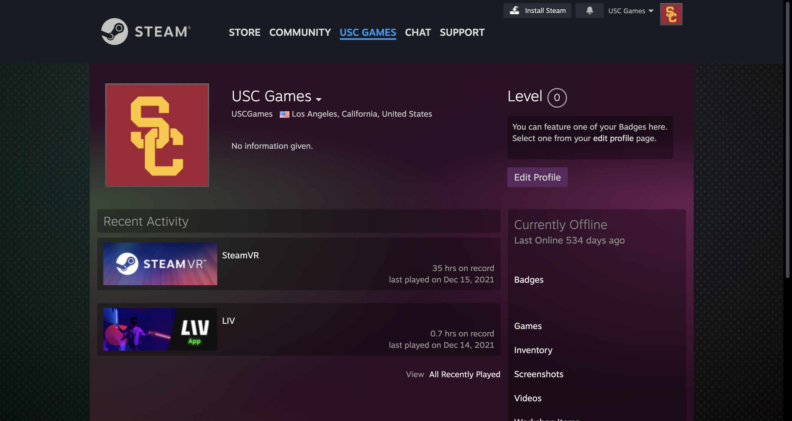
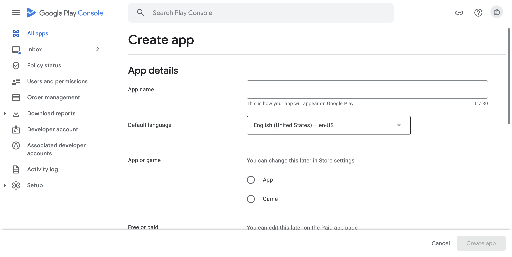
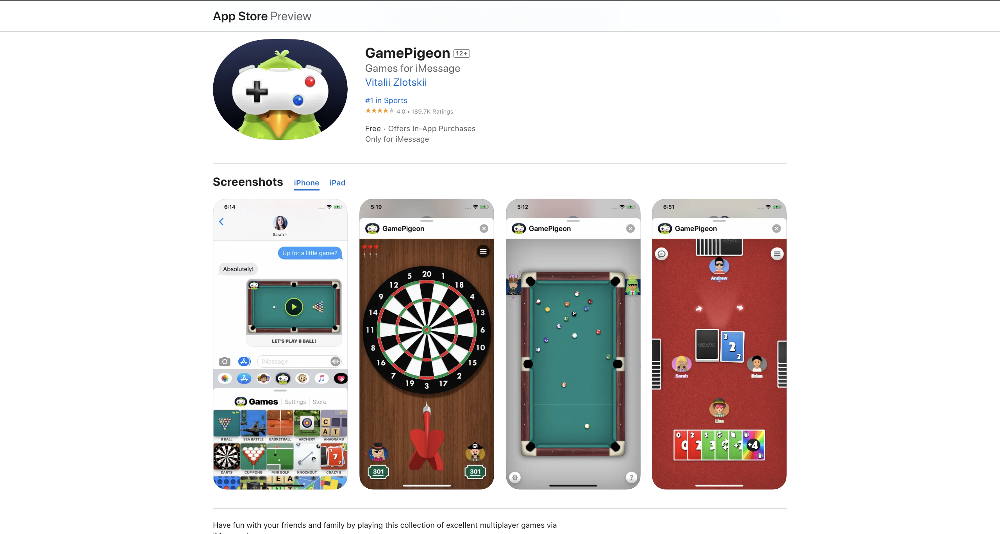
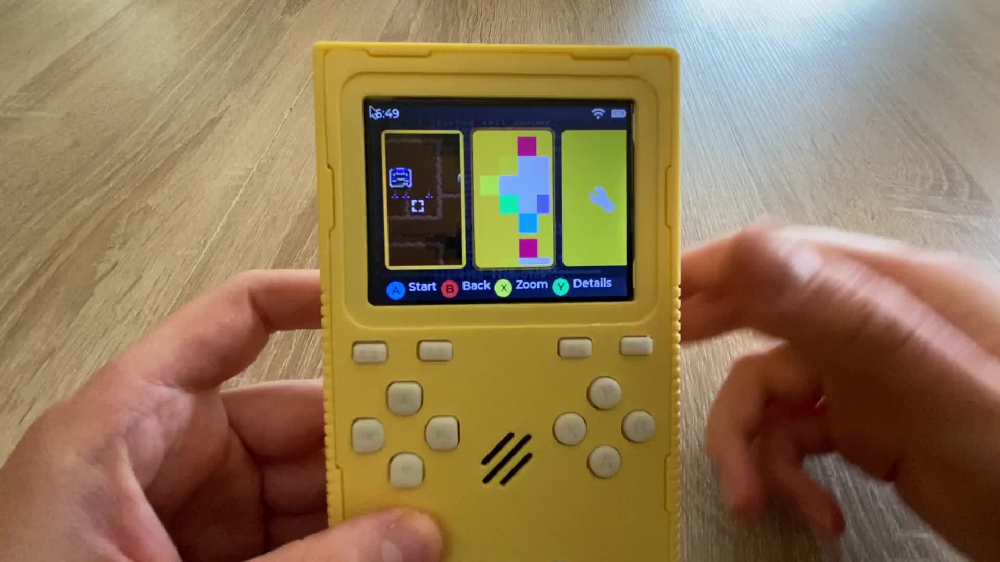
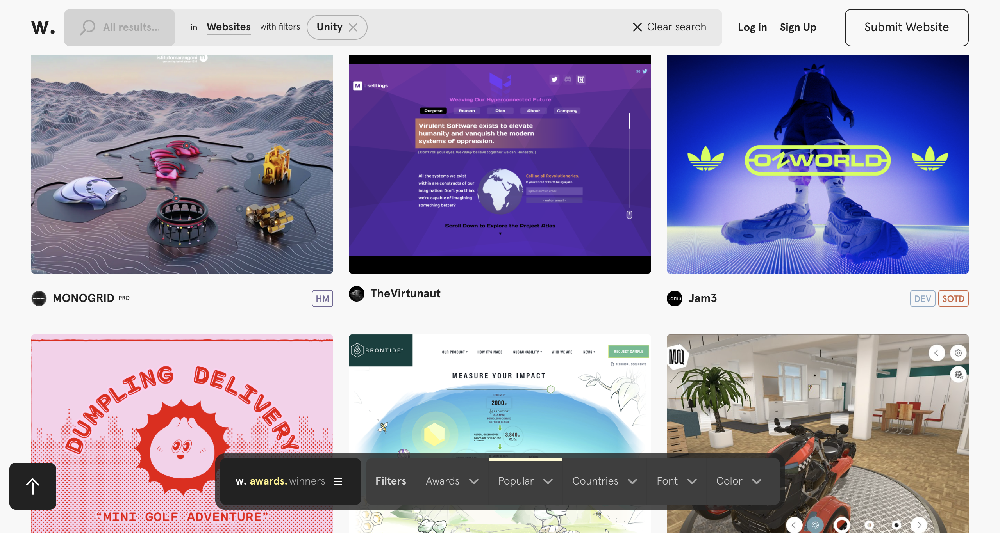
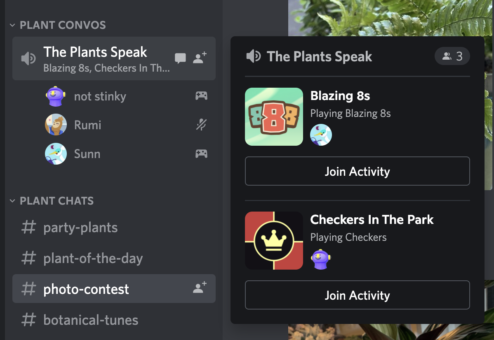

# 🧃 Final: Outside the Box

!!! tip "Important Dates"
    | Checkpoint | Play Test | Submission |
    | ---------  | --------- | ---------- |
    | **CP 1:** Monday, March 18th     In pairs, pull Perforce projects and pair program in Visual Studio Code. | **PT 1:** Monday, April 15th     You should have a working game by this day. We will be playtesting on your hardware. Fill out the provided Google Form to give and receive feedback. | **Final Presentation:** Monday, April 29th     In class presentation about your project. Students will have the opportunity to play your game while you present your work. Your presentation should consist of a research poster. |
    | **CP 2:** Monday, April 1st     Read your classmate's papers and give them constructive feedback in their Google Docs. | **PT 2:** Monday, April 29th     You should have a working game by this day. We will be playtesting on your hardware. Fill out the provided Google Form to give and receive feedback. | **Project Due:** Monday, May 6th     Your final submission should include a link to your published game, Overleaf link to your research paper, and 2 PDF files for your paper and poster. |
    | **CP 3:** Monday, April 15th     In pairs, host a code review with Perforce. | | |

<iframe src="https://giphy.com/embed/9age78wuTYN0tzfIR7" width="100%" height="100%" style="position:absolute" frameBorder="0" class="giphy-embed" allowFullScreen></iframe>

<a href="https://giphy.com/gifs/9age78wuTYN0tzfIR7">via GIPHY</a>

## 📙 Introduction

Fluency in the “what’s” and “how’s” through game design is important. But also the “why’s” that situate games as a cultural activity is essential as a contributor in the future of gaming but also to your career. The importance of innovation, research 

Take this final project as an opportunity to grow your soft skills of why you love and chose to learn game development. Find something you want to dive into that will challenge the state of the art and enable you to advance through your career. Here is the opportunity to create an experience that excites you with any game engine of your choice in addition to the mentorship of your instructors. Carefully consider what your needs are and what you are trying to accomplish when deciding to develop with Unreal, Godot, or Unity. 

**By the end of this project you will:**

* Participate in code reviews with [Perforce]()
* Create UI to bring your project together with [UI Toolkit]()
* Master UXML, USS, C# and/or HTML, CSS, and Javascript
* Collaborate and share builds with [GitHub repositories]()
* Pair programming in [Visual Studio Code]()
* Create an software experience that you are proud of - game, AR/VR experience, app, website, etc.
* Gain experience in what goes into publishing your projects and experiences
* Understand why you picked your selected platform and the ins and outs of it
* Work with your platform's respective SDKs 
* Have expertise and background knowledge in the hardware you are publishing to
* Have a published a game! 

!!! warning "Policy on Collaboration and Cheating"
    For this project, you must work individually or in teams! Please carefully read the [Policy on Collaboration and Cheating](https://ece-classes.usc.edu/ee591/pvs_sem/fall09/acad_integ.pdf) to see what this means exactly. In particular, do not look for solutions online, use game templates, and generate code with AI such as ChatGPT. 

!!! danger "Legal Licensing and Copyrights"
    For this project, you will be publishing a game, app, or other kind of software experience! Please make sure to read the copyrights when using templates, packages, and assets. Read [Unity's Terms of Service](https://unity.com/legal/as-terms) for reference.

## 🧐 Questions

### Game Experience

* What is a digital and software experience that you find interesting? Is there anything you've always wanted to try making? Think of an idea that gets you excited and let's try to create it with Unity, Unreal, or Godot! 

* Art has a responsibility to contribute cultural and humanist dimensions to our definition of the future. How does the intersection of art and technology move us from ephemeral performance to sustainable innovation? Ideate on ideas for a project and then write about it in your research paper.

* How does your experience critically explore its social, cultural, and affective impact?

* What is your experience's potential use case in the releam of emerging digital technologies? How does it impact users and citizens? Does your experience confront any major challenges of our time?

### Game Design

* Can I make a cozy, relaxing roguelike?

* What happens if the player’s ability regresses as the game progresses?

* Can I make a game where the mechanic is trying to understand an alien language?

* What happens if the player needs to solve violent problems nonviolently?

* What happens if you combine environment destruction gameplay with a cooking game?

* Can I make a game where the player is neither the protagonist nor the antagonist?

* Can I create the game version of the phrase “wrong answers only”?

* What actions should the player take?

## 👾 The Game

The goal of your final project for this class is twofold:

- [x] Put into practice the prototyping skills you have learned over the past 12 weeks. You are capable of expressing your design ideas in software, so let’s come up with some interesting design ideas and express them!
- [x] Start thinking about “design problems,” that is, the kinds of questions you can answer through prototyping. These are often questions of the form “What happens if?” or “Can I?”

Pick the platform you want to build for and publish to intentionally. Tailor your experience to the platform you selected. In project 2, I would like you to try publishing your experience or game and experiment with how you can take it to market. Consider the most natural inputs for your experience. Please note that many of these platforms do require a fee; however, you are welcome to use the instructor's account at no additional cost. 

**🔥 I ENCOURAGE YOU TO TRY SOMETHING NEW 🔥**

**Some examples:**

???+ example "PC: Windows, Mac, Linux"

    | Requirements |           Resources            |
    | ------------ | ------------------------------ | 
    | Create your own [Steamworks Account](https://partner.steamgames.com/). The instructor/class has their own account as well. | [How to publish your game on Steam](https://fungies.io/2023/03/04/how-to-publish-your-game-on-steam/) | 
    | $100 USD per game. This is a mandatory fee is covered by USC | [ Joining Steamworks Distribution Program](https://partner.steamgames.com/steamdirect)| 
    | Make sure your game meets Steam's [Terms of Service](https://store.steampowered.com/eula/767560_eula_0#:~:text=You%20agree%20not%20to%20use,Terms%20of%20Use%20are%20reserved). | [Steamworks Documentation: Getting Started](https://partner.steamgames.com/doc/gettingstarted) |
    | Supports latest version of Windows. Make sure you have a Windows PC to test your game. | [Integrating Unity Games with Steamworks](https://blog.theknightsofunity.com/integrating-unity-game-steamworks/) |
    | Install [Steamworks SDK](https://docs.unity.com/ugs/manual/authentication/manual/platform-signin-steam) for your selected game engine. | [How to Launch a Game on Steam - Before Release](https://www.youtube.com/watch?v=CAQsIDxI7rU&ab_channel=CodeMonkey)

    

???+ example "Android Mobile"

    | Requirements |           Resources            |
    | ------------ | ------------------------------ | 
    | Create your own [Google Play Developer account](https://play.google.com/console/about/). The instructor/class has their own account as well. | [Android Developers: Publish your app](https://developer.android.com/studio/publish) | 
    | Cost is covered by the class. However, if you want to publish on your own it is a $25 one time fee. Apps are free to publish after the entrance fee. | [Publish your UNITY game on Google Play Store](https://www.youtube.com/watch?v=UXl_C3ZnRLc&ab_channel=CocoCode)| 
    | Accept Google Play's [Terms of Service](https://play.google.com/intl/en-US_us/about/play-terms/index.html). | [How to Publish to Android](https://learn.unity.com/tutorial/how-to-publish-to-android-2) |
    | Download [Android Studio](https://developer.android.com/studio) on your computer. | [Android Developers: Build your game in Unity](https://developer.android.com/games/engines/unity/build-in-unity) |
    | Within Unity, build your game to Android and enable the [Build App Bundle](https://docs.unity3d.com/Manual/android-BuildProcess.html) for Android. | [Developer's Guide to Releasing a Unity Game on Google Play](https://www.youtube.com/watch?v=GTaXWgKz0e8&ab_channel=LlamAcademy) |
    
    
    Publishing to the Google Play Store is a relatively straightforward process.
     
     
     
     
    
    An example of Android widget games.

???+ example "iOS Mobile"

    | Requirements |           Resources            |
    | ------------ | ------------------------------ | 
    | You must have a Mac and have [XCode](https://developer.apple.com/xcode/) installed. | [Unity Learn: Publishing for iOS](https://learn.unity.com/tutorial/publishing-for-ios) | 
    | Cost is covered by the class. However, if you want to publish on your own it is a $100 a year to be part of the [Apple Developer Program](https://developer.apple.com/programs/). Apps are free to publish after the yearly developer program fee. | [Apple Developer: Submit your iOS apps to the Apple Store](https://developer.apple.com/ios/submit/) | 
    | Apple is very particular about how your app looks. You must follow Apple's [Guidelines](https://developer.apple.com/app-store/guidelines/) such as their [Human Interface Guidelines](https://developer.apple.com/design/human-interface-guidelines/). | [Unity Documentation: Build for iOS](https://docs.unity3d.com/Manual/iphone-BuildProcess.html) |
    | Within Unity, build your game to iOS and enable the [Build App Bundle](https://docs.unity3d.com/Manual/android-BuildProcess.html) for iOS. There will be other packages to add depending on what kind of Apple platform you are designing for. | [How to Build & Run Unity to iOS for Testing](https://www.youtube.com/watch?v=-Hr4-XNCf8Y&ab_channel=samyam) |
    | You are welcome to build for any Apple platform and experience. This includes [widgets](https://developer.apple.com/design/human-interface-guidelines/widgets), [iMessage games](https://developer.apple.com/imessage/), [App clips](https://developer.apple.com/app-clips/), [Vision Pro](https://developer.apple.com/visionos/), and [standalone apps](https://developer.apple.com/). | [Apple Game Center](https://developer.apple.com/game-center/) |

    

    A preview of XCode and it's simulator. 
     
     
     
     

    

    An example of an iMessage game, GamePigeon, for text messages. 

???+ example "Microcontrollers"

    | Requirements |           Resources            |
    | ------------ | ------------------------------ | 
    | You will be working with electronics and if you like, designing an encasing for your screen to turn it into a game console, mini arcade machine, or anything you want! | [Designing my own Game Console](https://www.youtube.com/watch?v=gkook0l_gsM&t=321s&ab_channel=LeandroLinares) | 
    | Cost is covered by the class and the instructor will provide a [Raspberry Pi]() or [Arduino](). However, if you want to purchase your own microcontrollers they are usually between $20-35 USD. | [Run Unity game on Raspberry Pi 4 with Picade arcade machine](https://medium.com/geekculture/run-unity-game-on-raspberry-pi-4-with-picade-arcade-machine-c54210d64b7a) | 
    | Install the [Arduinio IDE](https://www.arduino.cc/en/software). This will help you build your project to your selected microcontroller. | [How to integrate Arduino with Unity - hardware work with software](https://www.youtube.com/watch?v=SD3iUnLNjY0&ab_channel=CodetoCreate) |
    | Within Unity, build your game to WebGL. Unity supports microcontrollers like Raspberry Pi. Documentation [here](https://projects.raspberrypi.org/en/projects/unity-guide/0). | [How to Integrate Arduino with Unity 3D](https://www.iottechtrends.com/integrate-arduino-with-unity-3d/) |

    

???+ example "Websites"

    | Requirements |                         Resources                        |
    | : ------------ | : -------------------------------------------------------- | 
    | GitHub account with [GitHub Pages](https://pages.github.com/) set up. With [GitHub Education](https://education.github.com/pack), you can create a private repo for your website. If you do not have GitHub Education, you will need to make your build public. | [React Unity WebGL    ](https://react-unity-webgl.dev/) | 
    | Cost is **FREE** unless you want a custom domain which can cost between $5 - $10 a month to buy a domain.| [Custom Domains: Google Domains](https://domains.google/) |
    | Install a web framework such as ReactJS | [Custom Domains: GoDaddy domains](https://www.godaddy.com/) |
    | Within Unity, build your game to WebGL | [Awwwwards: Best Unity Websites in 2021](https://www.awwwards.com/websites/unity/) |

    

???+ example "Social Media Integrations"

    You are welcome to make a game for a specific social media platform such as Snapchat, Facebook Messenger, YouTube, Twitch, and Discord. Please see some of the resources listed below.

    | Resources |
    | : -------- |
    | [Twitch Chat Integration](https://www.kodeco.com/24373608-how-to-create-a-twitch-chat-game-with-unity): Create a game for Twitch's chat or integrate your game with Twitch. |
    | [Facebook Web Games and Instant Games](https://developers.facebook.com/docs/unity/getting-started/canvas/): Make games with WeBGL for Facebook websites and Facebook messenger. |
    | YouTube Advertisement Games with [AppMana](https://appmana.com/): Integrate your game into advertisements so that users can actively engage in media. |
    | With Snapchat's [Lens Studio](https://ar.snap.com/lens-studio) and [Snap Kit Unity SDKs](https://docs.snap.com/snap-kit/creative-kit/Tutorials/unity) try creating an interactive, AR game.|
    | [Making Games in Discord](https://www.youtube.com/watch?v=KiO5A3s91NA&ab_channel=GeorgiaGameDevelopersAssociation): Create games with Discord's Bot API. |

    

## 📝 The Paper

Your research paper can span areas including but not limited to animation, simulation, imaging, geometry, modeling, rendering, human-computer interaction, haptics, fabrication, robotics, visualization, audio, optics, programming languages, immersive experiences, and anything that aims to advance the state of the art that is related to your game or software experience.

???+ abstract "Association for Computing Machinery (ACM)"

    You are welcome to make a game for a specific social media platform such as Snapchat, Facebook Messenger, YouTube, Twitch, and Discord. Please see some of the resources listed below.

    

???+ abstract "LaTeX"

    You are welcome to make a game for a specific social media platform such as Snapchat, Facebook Messenger, YouTube, Twitch, and Discord. Please see some of the resources listed below.

    

???+ abstract "Overleaf"

    You are welcome to make a game for a specific social media platform such as Snapchat, Facebook Messenger, YouTube, Twitch, and Discord. Please see some of the resources listed below.

    

???+ abstract "Short Art Papers"

    How do we come to terms with contemporary media art culture that consists of varied practices ranging from craft to design to installation, software, hardware, choreography, mixed-media, and more? What current trajectories exist now that algorithmic processes, decades in the making, have finally advanced so much that they can generate usable code, graphics, and sounds from spoken or written prompts? What new methods or questions are needed as we leave visual space and return to acoustic space where orality, ambience, and overlapping and touchless media reign? How do we define and navigate the intersectional suprastructure that allows certain media practices to flourish while others are starved or co-opted? How do we process the entirety of this networked sphere of media intercourse under real planetary constraints? The SIGGRAPH Art Papers track is the premier place to publish critical findings within these diverse fields of art practices where they converge on screen, through interactive methods, within digital, mechanical, or biological interfaces. 
    - [SIGGRAPH 2024, Art Papers](https://s2024.siggraph.org/program/art-papers/)

    Short Art Papers are limited to 2,500-words and; 10 pages (including all references, tables, figures and figure captions. Papers should be proofed and completely anonymized.
    Submission example for SIGGRAPH 2024 [here](https://ssl.linklings.net/conferences/siggraph/?page=SampleForm&id=ArtPapersShortSubmission&site=siggraph2024).
    
    **Necessary information to include:**

    - [x] **Title of Short Paper:**
    - [x] **Abstract:** A 250-word (maximum) abstract summarizing the key points of the paper. Indicate paragraph breaks by a blank line in the text field; all other text formatting will be lost.
    - [x] **Why It Matters:** A 100 word (maximum) abstract explaining why your artwork is important for the whole SIGGRAPH community, in a large sense, from raising critical issues to opening perspectives or generating solutions. Indicate paragraph breaks by a blank line in the text field; all other text formatting will be lost.

    

???+ abstract "Short Technical Papers"

    You are welcome to make a game for a specific social media platform such as Snapchat, Facebook Messenger, YouTube, Twitch, and Discord. Please see some of the resources listed below.

    

## 🎟️ Requirements
In short, the main requirement is to create a game and write a paper. 

- [x] Build and publish to a specific hardware and platform
- [x] Must include game user interface with [UI Toolkit]() or [ReactJS]()
- [x] Utilize Unity’s new [Input Management System]()
- [x] The experience must look and feel completed
- [x] Play and test game on your selected hardware
- [x] Research paper with [OverLeaf]()
- [x] Research poster with [Adobe InDesign]()
- [x] Must code with C# and not node-based 

## 💯 Grading
We will be play testing your game during class!! Please make sure your game is published on itch.io by play test day and is 100% playable. 

| Assignment | Description | Percentage |
| :--------- | :--------- | :--------- |
| Peer Feedback | Please meet with your classmates to give and receive feedback. It is important to give verbal and written feedback. Collaborate on your projects and support each other. Please fill out the google form for each student you gave feedback to. | 10% |
| Checkpoints and Playtests | Check in with any instructor. Show they what you've been working on and ask them any questions you have. Complete the [check in assignments](../Projects/project2checkpoint1.md) with your classmates to practice collaborating over code. Participation is mandatory on playtest days and your game should be working and running on your selected hardware.| 10% |
| Research Paper | Write your research paper in Google Docs and share it with the instructors. For your submission, your research paper should be properly formated with [Overleaf](https://www.overleaf.com/) and exported as a PDF. It should also come in the format as a poster, designed with [Adobe InDesign](https://www.adobe.com/products/indesign.html). | 20% |
| Game Design | We will be evaluating your game's overall experience. Your game should look and feel complete with assets, sounds, and user interface. Your game should be completed by **Monday, December 4th** and you are free to use the rest of the time to prepare your project to be published. | 30% |
| Published Game | It is mandatory to publish your game. The process of publishing your game can be as long as 1 - 3 weeks. Please plan ahead and have your published game submitted by **Monday, December 11th**. | 30% |
| **Total** | | **100%** |

## 🦄 Support

Ask for help! Don't be afraid to reach out to us and ask for help. Work together with your classmates and schedule office hours with the instructors whenever you need help and support.

!!! question "Do I need to learn all the different languages for each platform? What if I don't know Swift/Kotlin/Javascript/C++/Java ?"

    Don't worry! You don't need to know all the languages and don't need to know everything about each language. You will work a little bit in those languages to make minor tweaks. Plus, the instructors are here to help you!

!!! question "A research paper usually takes a lot of work. Are we really going to write out a full research paper ?"

    It will be a research paper but it will be scaled down and shortened! We will be learning how to style write a professional paper that can be submitted for conferences in the future. 

!!! question "What if they don't approve the game I submitted ?"

    That is okay! Ideally, you will have a published app on the platform of your choice. But if it doesn't work out, we will at least publish to [GitHub Pages](https://pages.github.com/) and [itch.io](https://itch.io/).

!!! question "Why do we need to learn how to pair program and participate in code reviews ?"

    Game development is a collaborative effort so it is important to learn how to collaborate on designs and code. There are many great tools that will support collaboration within Visual Studio Code, Perforce, GitHub, and Unity.

!!! question "What if I don't want to publish my game ?"

    It is required to publish your game for project 2. Going through the process of sharing and putting up your game is an important part of the development experience. You will learn A LOT. At minimum, you should be publish your game to [GitHub Pages](https://pages.github.com/) and [itch.io](https://itch.io/).

