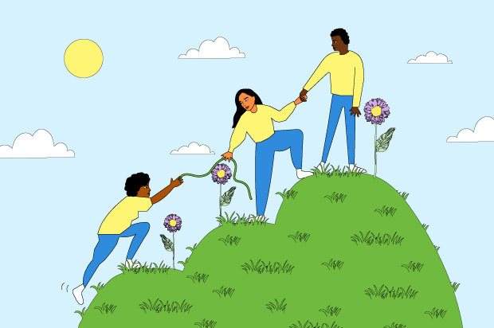

# ❤️ Project 1: Advocacy

## 📙 Prompt
Select a cause, set of values, or mission you care about. Through a 3D Unity URP game, advocate for that community through storytelling. Can you use your game to challenge beliefs, find purpose, uplift others, and spread compassion? In what form will that take? 

## 🎟️ Requirements
* Unity 3D URP
* Published as a WebGL build on a website
* Playable (Single player)
* Use assets and sound effects 
* Publish to [itch.io](https://itch.io/)

## 🧐 Questions
* Who is the video game made for?
* What are the takeaway lessons players will learn from your game?
* What is the moral message of your game?

## 💯 Grading
| Assignment | Percentage |
| :--------- | :--------- |
| Documentation | 10% |
| Peer Feedback | 10% |
| Checkpoint 1 | 30% |
| Published Website | 20% |
| Playtest during class | 30% |
| Total | 100% |

