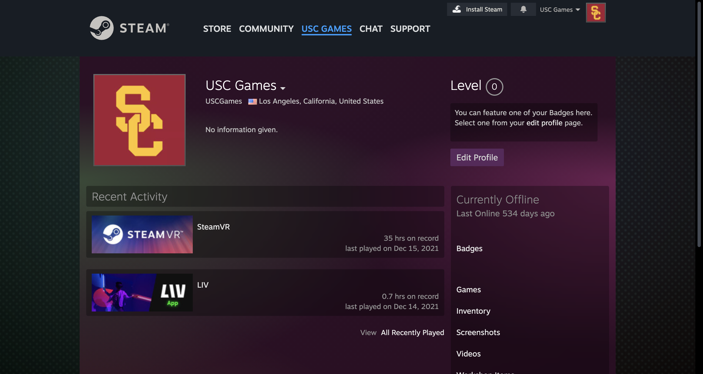

# 🧃 Project 2: Outside the Box

!!! tip "Important Dates"
    | Checkpoint | Play Test | Submission |
    | ---------  | --------- | ---------- |
    | **CP 1:** Wednesday, November 1st     In pairs, pull Perforce projects and pair program in Visual Studio Code. | **PT 1:** Monday, November 11th     You should have a working game by this day. We will be playtesting on your hardware. Fill out the provided Google Form to give and receive feedback. | **Final Presentation:** Wednesday, December 6th     In class presentation about your project. Students will have the opportunity to play your game while you present your work. Your presentation should consist of a research poster. |
    | **CP 2:** Monday, November 11th     Read your classmate's papers and give them constructive feedback in their Google Docs. | **PT 2:** Monday, December 4th     You should have a working game by this day. We will be playtesting on your hardware. Fill out the provided Google Form to give and receive feedback. | **Project Due:** Monday, December 11th     Your final submission should include a link to your published game, Overleaf link to your research paper, and 2 PDF files for your paper and poster. |
    | **CP 3:** Monday, November 27th     In pairs, host a code review with Perforce. | | |

<iframe src="https://giphy.com/embed/9age78wuTYN0tzfIR7" width="100%" height="100%" style="position:absolute" frameBorder="0" class="giphy-embed" allowFullScreen></iframe>

<a href="https://giphy.com/gifs/9age78wuTYN0tzfIR7">via GIPHY</a>

## 📙 Introduction

Fluency in the “what’s” and “how’s” through game design is important. But also the “why’s” that situate games as a cultural activity is essential as a contributor in the future of gaming but also to your career. The importance of innovation, research 

Take this final project as an opportunity to grow your soft skills of why you love and chose to learn game development. Find something you want to dive into that will challenge the state of the art and enable you to advance through your career. Here is the opportunity to create an experience that excites you with any game engine of your choice in addition to the mentorship of your instructors. Carefully consider what your needs are and what you are trying to accomplish when deciding to develop with Unreal, Godot, or Unity. 

**By the end of this project you will:**

* Participate in code reviews with [Perforce]()
* Create UI to bring your project together with [UI Toolkit]()
* Master UXML, USS, C# and/or HTML, CSS, and Javascript
* Collaborate and share builds with [GitHub repositories]()
* Pair programming in [Visual Studio Code]()
* Create an software experience that you are proud of - game, AR/VR experience, app, website, etc.
* Gain experience in what goes into publishing your projects and experiences
* Understand why you picked your selected platform and the ins and outs of it
* Work with your platform's respective SDKs 
* Have expertise and background knowledge in the hardware you are publishing to
* Have a published a game! 

!!! warning "Policy on Collaboration and Cheating"
    For this project, you must work individually or in teams! Please carefully read the [Policy on Collaboration and Cheating](https://ece-classes.usc.edu/ee591/pvs_sem/fall09/acad_integ.pdf) to see what this means exactly. In particular, do not look for solutions online, use game templates, and generate code with AI such as ChatGPT. 

!!! danger "Legal Licensing and Copyrights"
    For this project, you will be publishing a game, app, or other kind of software experience! Please make sure to read the copyrights when using templates, packages, and assets. Read [Unity's Terms of Service](https://unity.com/legal/as-terms) for reference.

## 🧐 Questions

* What is a digital and software experience that you find interesting? Is there anything you've always wanted to try making? Think of an idea that gets you excited and let's try to create it with Unity, Unreal, or Godot! 

* Art has a responsibility to contribute cultural and humanist dimensions to our definition of the future. How does the intersection of art and technology move us from ephemeral performance to sustainable innovation? Ideate on ideas for a project and then write about it in your research paper.

* How does your experience critically explore its social, cultural, and affective impact?

* What is your experience's potential use case in the releam of emerging digital technologies? How does it impact users and citizens? Does your experience confront any major challenges of our time?

## 👾 The Game

Pick the platform you want to build for and publish to intentionally. Tailor your experience to the platform you selected. In project 2, I would like you to try publishing your experience or game and experiment with how you can take it to market. Consider the most natural inputs for your experience. Please note that many of these platforms do require a fee; however, you are welcome to use the instructor's account at no additional cost. 

**Some examples:**

???+ example "PC"

    | Requirements |           Resources            |
    | ------------ | ------------------------------ | 
    | Create your own [Steamworks Account](https://partner.steamgames.com/). The instructor/class has their own account as well. | [How to publish your game on Steam](https://fungies.io/2023/03/04/how-to-publish-your-game-on-steam/) | 
    | $100 USD per game. This is a mandatory fee for each game unless you make $1,000 on your game | [ Joining Steamworks Distribution Program](https://partner.steamgames.com/steamdirect)| 
    | Make sure your game meets Steam's [Terms of Service](https://store.steampowered.com/eula/767560_eula_0#:~:text=You%20agree%20not%20to%20use,Terms%20of%20Use%20are%20reserved). | [Steamworks Documentation: Getting Started](https://partner.steamgames.com/doc/gettingstarted) |
    | Supports latest version of Windows. Make sure you have a Windows PC to test your game. | [Integrating Unity Games with Steamworks](https://blog.theknightsofunity.com/integrating-unity-game-steamworks/) |
    | Install [Steamworks SDK](https://docs.unity.com/ugs/manual/authentication/manual/platform-signin-steam) for your selected game engine. | [How to Launch a Game on Steam - Before Release](https://www.youtube.com/watch?v=CAQsIDxI7rU&ab_channel=CodeMonkey)

    

???+ example "Android Mobile"

    | Requirements |           Resources            |
    | ------------ | ------------------------------ | 
    | Create your own [Steamworks Account](https://partner.steamgames.com/). The instructor/class has their own account as well. | [How to publish your game on Steam](https://fungies.io/2023/03/04/how-to-publish-your-game-on-steam/) | 
    | $100 USD per game. This is a mandatory fee for each game unless you make $1,000 on your game | [ Joining Steamworks Distribution Program](https://partner.steamgames.com/steamdirect)| 
    | Make sure your game meets Steam's [Terms of Service](https://store.steampowered.com/eula/767560_eula_0#:~:text=You%20agree%20not%20to%20use,Terms%20of%20Use%20are%20reserved). | [Steamworks Documentation: Getting Started](https://partner.steamgames.com/doc/gettingstarted) |
    | Supports latest version of Windows. Make sure you have a Windows PC to test your game. | [Integrating Unity Games with Steamworks](https://blog.theknightsofunity.com/integrating-unity-game-steamworks/) |
    | Install [Steamworks SDK](https://docs.unity.com/ugs/manual/authentication/manual/platform-signin-steam) for your selected game engine. | [How to Launch a Game on Steam - Before Release](https://www.youtube.com/watch?v=CAQsIDxI7rU&ab_channel=CodeMonkey)
    

    

???+ example "iOS Mobile"

    Unity URP is the best overall pipeline for general purposes. URP has higher rendering quality compared to Unity 3D. Unity 3D is recommended for prototypes that don't require high quality graphics.* iMessage Game

    

???+ example "Microcontrollers"

    Unity URP is the best overall pipeline for general purposes. URP has higher rendering quality compared to Unity 3D. Unity 3D is recommended for prototypes that don't require high quality graphics.* iMessage Game

    

???+ example "Websites"

    Unity URP is the best overall pipeline for general purposes. URP has higher rendering quality compared to Unity 3D. Unity 3D is recommended for prototypes that don't require high quality graphics.* iMessage Game

    

???+ example "Twitch, YouTube, Discord Integrations"

    Unity URP is the best overall pipeline for general purposes. URP has higher rendering quality compared to Unity 3D. Unity 3D is recommended for prototypes that don't require high quality graphics.* iMessage Game

    

## 📝 The Paper

## 🎟️ Requirements
In short, the main requirement is to create a game and write a paper. 

- [x] Build and publish to a specific hardware and platform
- [x] Must include game user interface with [UI Toolkit]() or [ReactJS]()
- [x] Utilize Unity’s new [Input Management System]()
- [x] The experience must look and feel completed
- [x] Play and test game on your selected hardware
- [x] Research paper with [OverLeaf]()
- [x] Research poster with [Adobe InDesgin]()
- [x] Must code with C# and not node-based 

## 💯 Grading
We will be play testing your game during class!! Please make sure your game is published on itch.io by play test day and is 100% playable. 

| Assignment | Description | Percentage |
| :--------- | :--------- | :--------- |
| Peer Feedback | Please meet with your classmates to give and receive feedback. It is important to give verbal and written feedback. Collaborate on your projects and support each other. Please fill out the google form for each student you gave feedback to. | 10% |
| Checkpoints and Playtests | Check in with any instructor. Show they what you've been working on and ask them any questions you have. Participation is mandatory on playtest days and your game should be working and running on your selected hardware.| 10% |
| Research Paper | Spend some time writing taglines and descriptions for your project. Take some videos and screenshots that you can use for your portfolio and resume. The instructors will be giving you feedback on this project through your portfolio. | 20% |
| Game Design | By **Monday, October 9th (Playtest day)** you must have your game published on itch.io. | 30% |
| Published Game | It is important to be present in class on this day. Participation is important here in giving and receiving feedback. This is the day your game should be working! The instructors will begin grading your project on **Wednesday, October 11th**. | 30% |
| **Total** | | **100%** |

## 🦄 Support
Ask for help! Don't be afraid to reach out to us and ask for help. Work together with your classmates and schedule office hours with the instructors whenever you need help and support.

